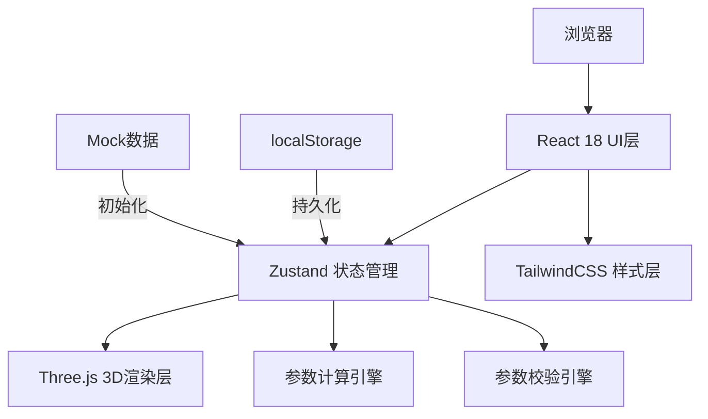
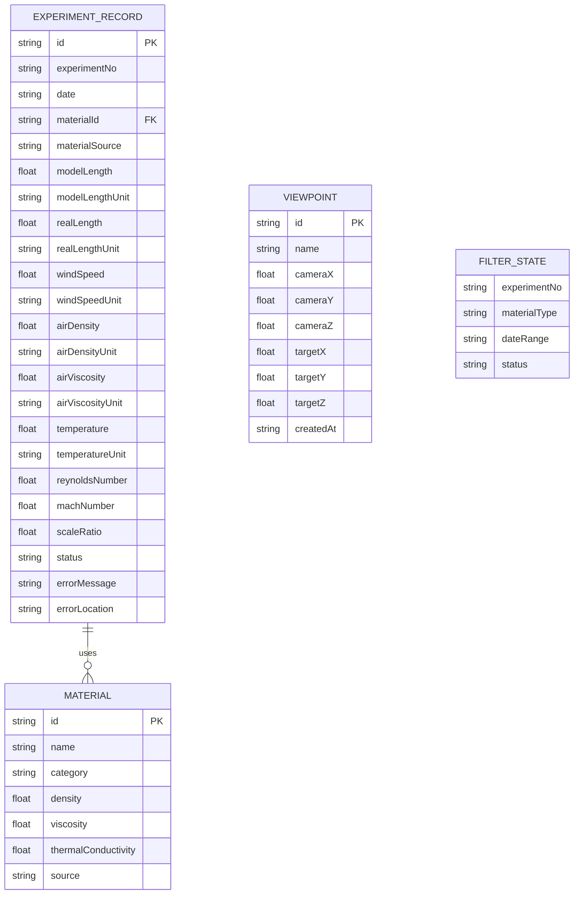

## 1. 架构设计

纯前端应用，无后端服务，数据存储在浏览器本地（localStorage）。



## 2. 技术描述

- **前端框架**：React@18 + TypeScript@5 + Vite@5
- **3D引擎**：three@0.160 + @react-three/fiber@8 + @react-three/drei@9 + @react-three/postprocessing@2
- **状态管理**：zustand@4
- **样式方案**：tailwindcss@3
- **图标库**：lucide-react@0.294
- **后端**：无（纯前端应用）
- **数据库**：localStorage + 内置Mock数据
- **初始化工具**：vite-init

## 3. 路由定义

| 路由 | 目的 |
|-------|---------|
| / | 主页面（3D视图 + 侧边栏）|

## 4. API 定义

无后端API，所有功能在前端实现。

## 5. 数据模型

### 5.1 数据模型定义



### 5.2 核心数据类型定义

```typescript
// 单位类型
type LengthUnit = 'm' | 'mm' | 'cm';
type SpeedUnit = 'm/s' | 'km/h' | 'ft/s';
type DensityUnit = 'kg/m³' | 'g/cm³';
type ViscosityUnit = 'Pa·s' | 'cP';
type TemperatureUnit = 'K' | '°C' | '°F';
type PressureUnit = 'Pa' | 'atm' | 'bar';

// 材料参数
interface Material {
  id: string;
  name: string;
  category: string;
  density: number;
  viscosity: number;
  thermalConductivity: number;
  source: string;
}

// 实验记录
interface ExperimentRecord {
  id: string;
  experimentNo: string;
  date: string;
  materialId: string;
  materialSource: string;
  
  // 几何参数
  modelLength: number;
  modelLengthUnit: LengthUnit;
  realLength: number;
  realLengthUnit: LengthUnit;
  
  // 流动参数
  windSpeed: number;
  windSpeedUnit: SpeedUnit;
  airDensity: number;
  airDensityUnit: DensityUnit;
  airViscosity: number;
  airViscosityUnit: ViscosityUnit;
  temperature: number;
  temperatureUnit: TemperatureUnit;
  
  // 计算结果
  reynoldsNumber: number | null;
  machNumber: number | null;
  scaleRatio: number | null;
  
  // 状态
  status: 'valid' | 'error' | 'warning';
  errors: ValidationError[];
}

// 校验错误
interface ValidationError {
  type: 'unit_mismatch' | 'reynolds_mismatch' | 'mach_mismatch' | 'invalid_value';
  severity: 'error' | 'warning';
  message: string;
  location: string; // 如 "材料: 铝合金-6061, 记录: EXP-2024-003"
  field: string;
}

// 视角
interface Viewpoint {
  id: string;
  name: string;
  camera: { x: number; y: number; z: number };
  target: { x: number; y: number; z: number };
  createdAt: string;
}

// 筛选条件
interface FilterState {
  experimentNo: string;
  materialType: string;
  dateRange: [string, string] | null;
  status: 'all' | 'valid' | 'error' | 'warning';
}

// 相似准则节点（3D可视化用）
interface CriterionNode {
  id: string;
  name: string;
  symbol: string;
  description: string;
  formula: string;
  value: number;
  position: [number, number, number];
  color: string;
  relatedRecordIds: string[];
}
```

### 5.3 核心计算公式

```typescript
// 雷诺数 Re = ρvL/μ
function calculateReynolds(
  density: number, 
  velocity: number, 
  length: number, 
  viscosity: number
): number {
  return (density * velocity * length) / viscosity;
}

// 马赫数 Ma = v/c, c = √(γRT)
function calculateMach(
  velocity: number, 
  temperature: number,
  gamma: number = 1.4,  // 空气比热比
  R: number = 287.058   // 空气气体常数 J/(kg·K)
): number {
  const speedOfSound = Math.sqrt(gamma * R * temperature);
  return velocity / speedOfSound;
}

// 尺度比 λ = L_model / L_real
function calculateScaleRatio(
  modelLength: number, 
  realLength: number
): number {
  return modelLength / realLength;
}

// 单位转换
function convertUnit(value: number, fromUnit: string, toUnit: string): number {
  // 实现长度、速度、密度、粘度、温度等单位转换逻辑
}
```
