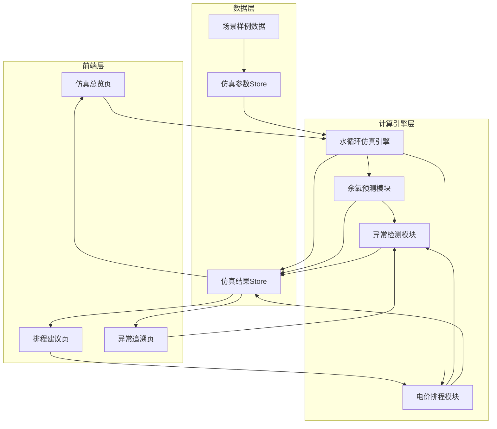

## 1. 架构设计



## 2. 技术说明

- 前端：React@18 + TailwindCSS@3 + Vite
- 初始化工具：Vite
- 后端：无（纯前端计算，所有仿真逻辑在浏览器运行）
- 数据库：无（使用内存状态管理 + Mock数据）
- 图表库：Recharts
- 导出：PapaParse（CSV导出）

## 3. 路由定义

| 路由 | 用途 |
|------|------|
| / | 仿真总览页：参数输入、运行仿真、指标卡片、时序图表 |
| /schedule | 排程建议页：电价排程、余氯补给建议、成本对比 |
| /anomaly | 异常追溯页：异常事件列表、追溯链路、报告导出 |

## 4. 数据模型

### 4.1 核心数据结构

```typescript
interface SimParams {
  poolVolume: number;
  pumpFlow: number;
  initialChlorine: number;
  chlorineDecayRate: number;
  chlorineDoseAmount: number;
  visitorCurve: number[];
}

interface ElectricityPeriod {
  hour: number;
  type: "peak" | "valley" | "flat";
  price: number;
}

interface HourlyResult {
  hour: number;
  chlorineLevel: number;
  pumpRunning: boolean;
  electricityType: "peak" | "valley" | "flat";
  electricityCost: number;
  circulationVolume: number;
  visitorCount: number;
  anomaly: AnomalyEvent | null;
}

interface AnomalyEvent {
  type: "low_chlorine" | "pump_shutdown" | "visitor_surge";
  hour: number;
  description: string;
  traceRef: {
    calculation: string;
    chlorinePrediction: string;
    scheduleAdvice: string;
  };
}

interface SimResult {
  params: SimParams;
  hourlyResults: HourlyResult[];
  summary: {
    totalCost: number;
    avgChlorine: number;
    minChlorine: number;
    cycleCount: number;
    anomalyCount: number;
    pumpFlowConclusion: string;
  };
}
```

### 4.2 场景样例

| 场景名 | 池体积(m³) | 泵流量(m³/h) | 初始余氯(mg/L) | 特殊设置 |
|--------|-----------|-------------|---------------|----------|
| 正常运行 | 500 | 60 | 1.5 | 标准客流曲线 |
| 余氯偏低 | 500 | 60 | 0.8 | 衰减率加倍 |
| 泵停机 | 500 | 60 | 1.5 | 10-14时泵停 |
| 客流突增 | 500 | 60 | 1.5 | 14-18时客流×3 |

### 4.3 电价时段定义

| 时段 | 小时 | 电价(元/kWh) |
|------|------|-------------|
| 峰时 | 8-11, 18-21 | 1.2 |
| 平时 | 7-8, 11-18, 21-23 | 0.8 |
| 谷时 | 23-7 | 0.4 |

## 5. 计算逻辑说明

### 5.1 水循环计算
- 每小时循环水量 = 泵流量 × 运行时间
- 循环周期 = 池体积 / 泵流量（小时）
- 日循环次数 = 24 / 循环周期

### 5.2 余氯预测
- 余氯衰减模型：C(t+1) = C(t) × (1 - decayRate) - visitorImpact × visitors(t)
- visitorImpact：每位泳客对余氯的消耗系数
- 补给逻辑：当余氯 < 阈值(0.5mg/L) 时自动投加 chlorineDoseAmount

### 5.3 电价排程
- 根据电价时段，优先在谷时运行泵
- 余氯低于阈值时强制运行，不计电价
- 排程建议输出每小时泵运行/停止建议及预估电费

### 5.4 异常检测
- 余氯 < 0.5 mg/L → low_chlorine
- 泵计划运行但实际停机 → pump_shutdown
- 客流 > 基线2倍 → visitor_surge

### 5.5 一致性保证
- 所有模块共享同一个 SimResult 对象
- 图表、指标卡片、异常说明、导出CSV均从同一结果读取
- 导出时使用 JSON.stringify 深拷贝确保快照一致
