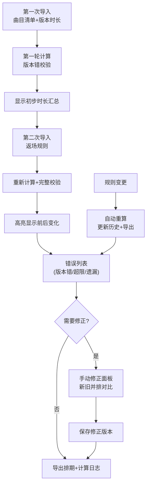

## 1. 产品概述

演出曲目时长控台是为乐队经纪人设计的专业时长管理工具，解决演出排期中曲目时长、版本差异和返场规则的复杂计算问题，确保演出时长精准可控。

- 核心问题：传统人工计算容易遗漏版本差异、返场超限和换场时间，导致演出超时或时间浪费
- 目标用户：乐队经纪人、演出策划人、舞台总监
- 产品价值：可视化时长汇总、智能规则校验、错误精准定位、版本可追溯，确保演出时长零误差

## 2. 核心特性

### 2.1 用户角色
| 角色 | 注册方式 | 核心权限 |
|------|----------|----------|
| 乐队经纪人 | 无需注册，本地应用 | 导入数据、配置规则、查看分析、手动修正、导出排期 |

### 2.2 功能模块
1. **数据导入模块**：曲目清单导入、版本时长导入、返场规则配置
2. **规则校验引擎**：时长版本错检测、返场超限检测、换场遗漏检测
3. **时长汇总控台**：实时时长计算、前后对比分析、样本级错误定位
4. **版本管理模块**：版本历史记录、规则变更追溯、新旧结果并排对比
5. **排期导出模块**：标准格式导出、计算日志附随

### 2.3 页面详情
| 页面名称 | 模块名称 | 功能描述 |
|---------|----------|----------|
| 时长控台主页 | 数据导入区 | 支持分阶段导入：第一次导入曲目清单+版本时长，第二次补录返场规则，系统自动对比前后变化 |
| 时长控台主页 | 时长汇总仪表盘 | 展示总时长、各部分占比、规则状态灯，点击数值可下钻到具体曲目 |
| 时长控台主页 | 规则校验结果区 | 分类展示时长版本错、返场超限、换场遗漏，每条错误可定位到具体样本 |
| 时长控台主页 | 版本历史区 | 记录每次规则变更，支持回滚和对比 |
| 时长控台主页 | 手动修正面板 | 经纪人可修改版本时长，系统实时计算并并排展示新旧结果 |
| 排期导出页 | 导出配置区 | 选择导出格式、包含内容、版本范围 |

## 3. 核心流程

### 3.1 主工作流
1. 经纪人第一次导入曲目清单和版本时长文件
2. 系统进行第一轮时长计算和版本错校验
3. 经纪人第二次补充返场规则（可多次调整）
4. 系统重新计算并高亮显示规则变化带来的时长差异
5. 经纪人查看错误列表，点击错误定位到具体曲目样本
6. 如需修正，进入手动修正模式，新旧结果并排对比
7. 确认无误后导出排期表和计算日志

### 3.2 流程图

## 4. 用户界面设计

### 4.1 设计风格
- **主色调**：深靛蓝 (#1a1a3e) 作为主背景，琥珀金 (#d4a84b) 作为强调色，体现专业演出的高端感
- **辅助色**：错误红 (#e74c3c)、警告橙 (#f39c12)、通过绿 (#27ae60) 用于状态指示
- **字体**：标题使用 "Playfair Display" 衬线字体，正文使用 "JetBrains Mono" 等宽字体确保时长数字对齐
- **布局风格**：模块化卡片布局，左侧导航+中央仪表盘+右侧详情面板的三栏结构
- **按钮风格**：微立体圆角按钮，悬停时有微妙的光影变化
- **图标风格**：线性简约图标，与音乐/演出相关的符号元素

### 4.2 页面设计概述
| 页面名称 | 模块名称 | UI元素 |
|---------|----------|--------|
| 时长控台主页 | 顶部导航栏 | 项目名称、版本切换、导出按钮、主题切换 |
| 时长控台主页 | 时长仪表盘 | 大号时长数字、环形进度条、状态指示灯、分段时长卡片 |
| 时长控台主页 | 曲目列表区 | 可展开的曲目表格，显示曲目名、多个版本时长、选中版本、换场时间 |
| 时长控台主页 | 规则配置区 | 返场规则表单、换场时间默认值、超时阈值设置 |
| 时长控台主页 | 错误详情区 | 错误分类标签、错误列表、点击展开显示样本详情和修正建议 |
| 时长控台主页 | 版本对比区 | 左右分栏布局，旧版本在左新版本在右，差异处高亮 |
| 时长控台主页 | 手动修正面板 | 可编辑时长输入框、实时预览、确认/取消按钮 |

### 4.3 响应式设计
- **桌面端优先**：三栏布局，充分利用大屏幕空间展示数据
- **平板适配**：折叠为左右两栏，错误详情改为底部抽屉
- **移动端**：单栏流式布局，通过标签页切换不同模块

### 4.4 交互与动画
- 页面加载：仪表盘数字从0滚动到实际值，环形进度条渐进填充
- 规则变化：高亮闪烁效果提示变化区域，时长数字平滑过渡
- 错误定位：被定位的行高亮闪烁，自动滚动到视口中央
- 版本对比：差异处使用背景色渐变过渡，箭头指示变化方向
- 数据导入：进度条动画，完成后展示成功/失败统计

## 5. 边界样例与测试数据

### 5.1 预置边界样例
1. **时长版本错样例**：同一曲目存在3个不同版本时长，当前选中版本与默认版本差异超过10%
2. **返场超限样例**：返场曲目总时长超出规则限制20%，包含3首返场曲
3. **换场遗漏样例**：连续5首曲目之间缺少换场时间配置
4. **重复性验证样例**：同一组数据连续计算两次，结果完全一致（使用固定随机种子）
