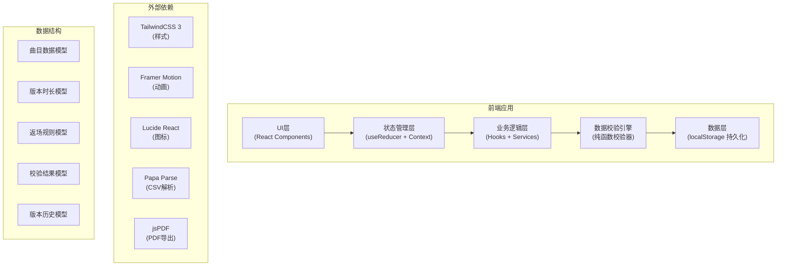
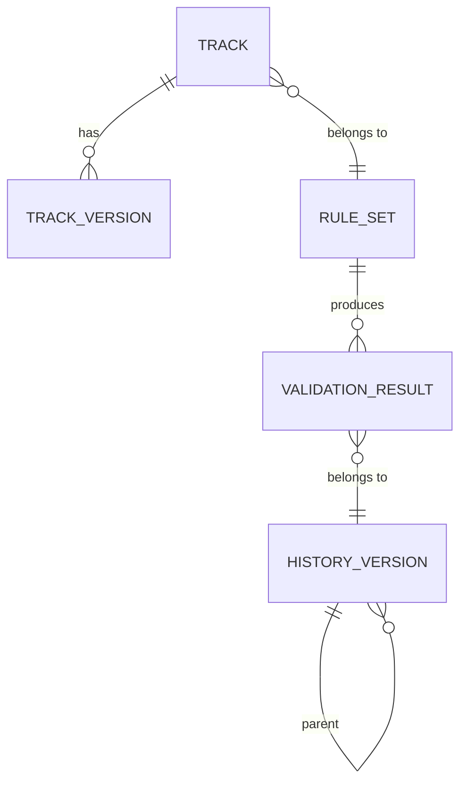

## 1. 架构设计



## 2. 技术描述

- **前端框架**: React@18 + TypeScript + Vite
- **样式方案**: TailwindCSS@3
- **状态管理**: React useReducer + Context API (避免过度设计，适合中型应用)
- **动画库**: Framer Motion
- **图标库**: Lucide React
- **数据解析**: Papa Parse (CSV导入)
- **导出库**: jsPDF (PDF导出)
- **数据持久化**: localStorage (无需后端，纯前端应用
- **开发工具**: ESLint + Prettier

## 3. 目录结构

```
src/
├── components/           # React组件
│   ├── dashboard/    # 仪表盘组件
│   ├── import/       # 数据导入组件
│   ├── tracklist/   # 曲目列表组件
│   ├── rules/       # 规则配置组件
│   ├── validation/  # 校验结果组件
│   ├── history/     # 版本历史组件
│   ├── compare/     # 对比面板组件
│   └── common/      # 通用组件
├── hooks/           # 自定义Hooks
├── services/        # 业务逻辑服务
│   ├── calculation.ts  # 时长计算引擎
│   ├── validation.ts # 规则校验引擎
│   ├── history.ts   # 版本管理
│   └── export.ts    # 导出服务
├── store/           # 状态管理
│   ├── reducer.ts
│   ├── context.ts
│   └── initialState.ts
├── types/           # TypeScript类型定义
├── data/            # 类型定义和常量
│   └── sampleData.ts  # 边界样例数据
├── utils/           # 工具函数
├── App.tsx
└── main.tsx
```

## 4. 路由定义

| 路由 | 页面 | 主要功能 |
|------|------|----------|
| / | 时长控台主页 | 仪表盘、曲目列表、规则配置、校验结果 |
| /compare | 版本对比页 | 新旧结果并排对比 |
| /export | 导出配置页 | 排期导出配置 |

## 5. 数据模型

### 5.1 实体关系图



### 5.2 数据模型定义

```typescript
// 曲目
interface Track {
  id: string;
  name: string;
  order: number;
  selectedVersionId: string;
  transitionTime: number | null;
  isEncore: boolean;
  versions: TrackVersion[];
}

// 曲目版本
interface TrackVersion {
  id: string;
  name: string;
  duration: number;
  isDefault: boolean;
  note?: string;
}

// 返场规则
interface EncoreRule {
  maxEncoreTracks: number;
  maxEncoreDuration: number;
  requiredTransitionTime: number;
  allowExtraEncore: boolean;
}

// 规则集
interface RuleSet {
  id: string;
  name: string;
  encore: EncoreRule;
  defaultTransitionTime: number;
  versionErrorThreshold: number;
}

// 校验错误
interface ValidationError {
  id: string;
  type: 'VERSION_MISMATCH' | 'ENCORE_OVERLIMIT' | 'TRANSITION_MISSING';
  severity: 'error' | 'warning';
  trackId?: string;
  message: string;
  details: Record<string, any>;
  suggestion: string;
}

// 校验结果
interface ValidationResult {
  totalDuration: number;
  mainDuration: number;
  encoreDuration: number;
  transitionDuration: number;
  errors: ValidationError[];
  trackBreakdown: TrackDurationBreakdown[];
}

// 曲目时长明细
interface TrackDurationBreakdown {
  trackId: string;
  trackName: string;
  versionName: string;
  duration: number;
  transitionTime: number;
  isEncore: boolean;
}

// 历史版本
interface HistoryVersion {
  id: string;
  timestamp: number;
  name: string;
  ruleSet: RuleSet;
  tracks: Track[];
  validationResult: ValidationResult;
  parentId?: string;
  changeDescription: string;
}

// 应用状态
interface AppState {
  tracks: Track[];
  ruleSet: RuleSet;
  currentValidation: ValidationResult | null;
  previousValidation: ValidationResult | null;
  history: HistoryVersion[];
  importPhase: 'INIT' | 'PHASE1' | 'PHASE2';
  selectedHistoryId: string | null;
  compareMode: boolean;
  compareVersionId: string | null;
}
```

## 6. 核心算法与规则校验引擎

### 6.1 时长计算算法（确定性算法，确保重复计算结果完全一致

```typescript
function calculateDuration(tracks: Track[], rules: RuleSet): ValidationResult {
  // 1. 按order排序曲目（使用稳定排序）
  const sortedTracks = [...tracks].sort((a, b) => a.order - b.order);
  
  // 2. 计算每首曲目时长
  let mainDuration = 0;
  let encoreDuration = 0;
  let transitionDuration = 0;
  const breakdown: TrackDurationBreakdown[] = [];
  
  sortedTracks.forEach((track, index) => {
    const version = track.versions.find(v => v.id === track.selectedVersionId);
    const duration = version ? version.duration : 0;
    
    // 计算换场时间
    const transition = track.transitionTime ?? rules.defaultTransitionTime;
    
    if (track.isEncore) {
      encoreDuration += duration;
    } else {
      mainDuration += duration;
    }
    
    // 除了最后一首，都要加换场时间
    if (index < sortedTracks.length - 1) {
      transitionDuration += transition;
    }
    
    breakdown.push({
      trackId: track.id,
      trackName: track.name,
      versionName: version?.name || '未知版本',
      duration,
      transitionTime: transition,
      isEncore: track.isEncore
    });
  });
  
  return {
    totalDuration: mainDuration + encoreDuration + transitionDuration,
    mainDuration,
    encoreDuration,
    transitionDuration,
    errors: [],
    trackBreakdown: breakdown
  };
}
```

### 6.2 规则校验引擎

```typescript
function validateRules(
  result: ValidationResult,
  tracks: Track[],
  rules: RuleSet
): ValidationError[] {
  const errors: ValidationError[] = [];
  
  // 校验1: 时长版本错
  tracks.forEach(track => {
    const selected = track.versions.find(v => v.id === track.selectedVersionId);
    const defaultV = track.versions.find(v => v.isDefault);
    if (selected && defaultV && selected.id !== defaultV.id) {
      const diff = Math.abs(selected.duration - defaultV.duration) / defaultV.duration;
      if (diff > rules.versionErrorThreshold) {
        errors.push({
          id: `version-${track.id}`,
          type: 'VERSION_MISMATCH',
          severity: 'warning',
          trackId: track.id,
          message: `曲目「${track.name}」时长版本差异${(diff * 100).toFixed(1)}%`,
          details: {
            defaultDuration: defaultV.duration,
            selectedDuration: selected.duration,
            diffPercent: diff
          },
          suggestion: `建议确认使用默认版本「${defaultV.name}」(${defaultV.duration}秒)，或调整为当前版本「${selected.name}」(${selected.duration}秒)的原因需要记录`
        });
      }
    }
  });
  
  // 校验2: 返场超限
  const encoreTracks = tracks.filter(t => t.isEncore);
  if (encoreTracks.length > rules.encore.maxEncoreTracks || result.encoreDuration > rules.encore.maxEncoreDuration) {
    errors.push({
      id: 'encore-overlimit',
      type: 'ENCORE_OVERLIMIT',
      severity: 'error',
      message: `返场超限：${encoreTracks.length}首/${rules.encore.maxEncoreTracks}首，${result.encoreDuration}秒/${rules.encore.maxEncoreDuration}秒`,
      details: {
        trackCount: encoreTracks.length,
        maxTracks: rules.encore.maxEncoreTracks,
        duration: result.encoreDuration,
        maxDuration: rules.encore.maxEncoreDuration
      },
      suggestion: '减少返场曲目数量或时长'
    });
  }
  
  // 校验3: 换场遗漏
  const sorted = [...tracks].sort((a, b) => a.order - b.order);
  let missingCount = 0;
  for (let i = 0; i < sorted.length - 1; i++) {
    if (sorted[i].transitionTime === null || sorted[i].transitionTime === undefined) {
      missingCount++;
    }
  }
  
  if (missingCount > 0) {
    errors.push({
      id: 'transition-missing',
      type: 'TRANSITION_MISSING',
      severity: 'warning',
      message: `${missingCount}处换场时间未设置`,
      details: { missingCount },
      suggestion: '为每首曲目设置换场时间，或使用默认换场时间'
    });
  }
  
  return errors;
}
```

## 7. 状态管理Action

```typescript
type Action =
  | { type: 'IMPORT_TRACKS'; payload: Track[] }
  | { type: 'IMPORT_VERSIONS'; payload: { trackId: string; versions: TrackVersion[] }[] }
  | { type: 'UPDATE_RULES'; payload: Partial<RuleSet> }
  | { type: 'SELECT_VERSION'; payload: { trackId: string; versionId: string } }
  | { type: 'UPDATE_TRACK'; payload: Partial<Track> & { id: string } }
  | { type: 'CALCULATE'; payload: null }
  | { type: 'SAVE_VERSION'; payload: string }
  | { type: 'LOAD_VERSION'; payload: string }
  | { type: 'TOGGLE_COMPARE'; payload: string | null }
  | { type: 'RESET'; payload: null };
```
