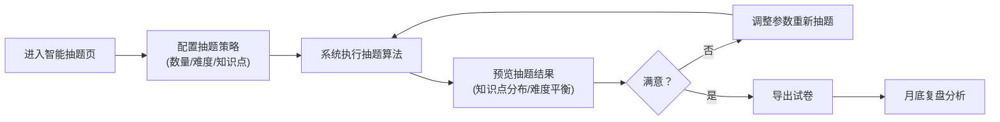
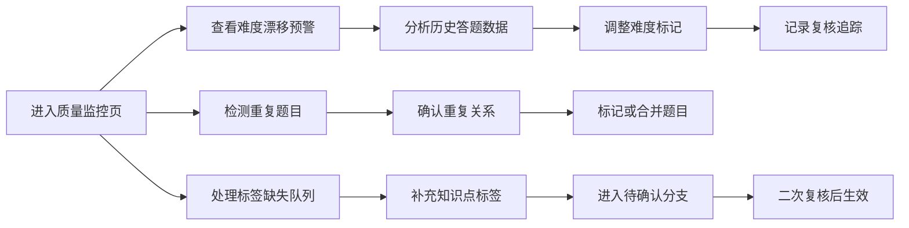

## 1. 产品概述

音乐课堂听辨题库是面向音乐教师和教研员的智能题库管理系统，解决听辨题目激增后的分层管理、智能抽题、难度监控和教学复盘问题。

- 核心用户：音乐教师（抽题组卷、学生答题管理）、音乐教研员（质量监控、难度漂移分析）
- 核心价值：通过标准化标签体系和智能算法实现均衡抽题，可视化追踪难度漂移，确保题库质量稳定

## 2. 核心功能

### 2.1 用户角色

| 角色 | 注册方式 | 核心权限 |
|------|----------|----------|
| 音乐教师 | 系统登录 | 题库浏览、智能抽题、试卷导出、学生答题补录 |
| 音乐教研员 | 系统登录 | 题目复核、难度分析、重复检测、标签管理、数据导出 |

### 2.2 功能模块

1. **题库总览页**：数据仪表盘、题目分层统计、快速筛选入口
2. **题库列表页**：多维度筛选、批量操作、重复识别标记、难度漂移预警
3. **题目详情页**：题目信息、知识点标签、复核记录、答题历史、变更追踪
4. **智能抽题页**：按节奏/和声/难度平衡配置、抽题预览、试卷生成
5. **质量监控页**：难度漂移分析、重复题目检测、标签缺失待确认队列
6. **答题补录页**：学生成绩录入、答题情况统计、结果反查标签

### 2.3 页面详情

| 页面名称 | 模块名称 | 功能描述 |
|-----------|-------------|---------------------|
| 题库总览 | 数据仪表盘 | 题目总量、各难度占比、标签覆盖率、本月抽题统计 |
| 题库总览 | 快速操作区 | 一键智能抽题、待复核题目提醒、难度漂移预警 |
| 题库列表 | 筛选面板 | 按知识点（节奏/和声/旋律等）、难度、标签状态、复核状态多维度筛选 |
| 题库列表 | 题目列表 | 展示题目预览、难度标签、知识点标签、状态标记，支持排序 |
| 题库列表 | 批量操作 | 批量标记重复、批量调整难度、批量导出 |
| 题目详情 | 基础信息 | 音频题目播放、题目文本、标准答案、创建时间 |
| 题目详情 | 知识点标签 | 节奏类型、和声功能、难度等级，支持编辑和历史记录 |
| 题目详情 | 复核追踪 | 每次复核的操作人、时间、变更内容、备注说明 |
| 题目详情 | 答题历史 | 学生答题记录、正确率统计、难度调整建议 |
| 题目详情 | 双向导航 | 从题目跳转相关知识点，从答题记录反查对应标签 |
| 智能抽题 | 策略配置 | 题目数量、难度分布（易/中/难比例）、知识点覆盖要求 |
| 智能抽题 | 抽题预览 | 展示抽题结果、知识点分布图表、难度平衡度评分 |
| 智能抽题 | 试卷导出 | 支持Word/PDF格式导出，包含题目、答题纸、参考答案 |
| 质量监控 | 难度漂移分析 | 各知识点难度变化趋势图、漂移预警列表、责任人指派 |
| 质量监控 | 重复检测 | 基于音频特征和内容的重复题目识别、合并建议 |
| 质量监控 | 待确认队列 | 标签缺失题目列表、批量补充标签入口 |
| 答题补录 | 成绩录入 | 按学生/按题目批量录入答题结果 |
| 答题补录 | 统计分析 | 各知识点正确率、难度反馈、标签关联分析 |

## 3. 核心流程

### 3.1 教师抽题组卷流程

### 3.2 教研员质量监控流程

### 3.3 答题补录与双向追踪流程

## 4. 用户界面设计

### 4.1 设计风格

- **设计理念**：音乐学院派风格，融合古典乐谱元素与现代数据可视化
- **主色调**：深靛蓝 (#1a237e) - 代表专业与深度
- **辅助色**：金色 (#ffd54f) - 代表音乐与品质，玫红 (#e91e63) - 代表警示与活力
- **中性色**：象牙白 (#fff8e1)、深灰 (#37474f)、暖灰 (#6d4c41)
- **按钮风格**：微立体圆角按钮，悬停时有轻微上浮和阴影变化
- **字体**：标题使用 "Noto Serif SC" 宋体体现学术感，正文使用 "Noto Sans SC" 保证可读性
- **布局风格**：卡片式布局配合微妙的五线谱纹理背景，导航栏使用乐谱装饰元素
- **图标风格**：线性图标配合音乐符号（高音谱号、音符、节拍器等）

### 4.2 页面设计概述

| 页面名称 | 模块名称 | UI元素 |
|-----------|-------------|-------------|
| 题库总览 | 数据仪表盘 | 卡片式统计、环形图难度分布、折线图趋势、微妙五线谱背景纹理 |
| 题库列表 | 筛选面板 | 可折叠侧边栏、标签云、滑块控件、多条件组合筛选 |
| 题库列表 | 题目列表 | 行式卡片、难度色标、标签徽章、状态指示灯、悬停展开详情 |
| 题目详情 | 信息展示 | 分栏布局、音频播放器、标签编辑区、时间轴式复核记录 |
| 智能抽题 | 策略配置 | 滑块配置难度比例、雷达图知识点覆盖、实时平衡度评分 |
| 质量监控 | 分析图表 | 热力图难度漂移、桑基图标签关联、时间轴变更记录 |
| 答题补录 | 数据录入 | 表格快速编辑、自动计算正确率、双向链接跳转 |

### 4.3 响应式

- 桌面优先设计（1280px+），侧边导航+主内容区布局
- 平板端（768-1279px）：侧边栏可收起，筛选面板改为顶部横向布局
- 移动端（<768px）：底部Tab导航，筛选使用抽屉式弹窗，列表优化为单列卡片
- 所有交互元素最小触摸尺寸 44x44px

### 4.4 动效设计

- 页面加载：卡片错落进入动画（staggered reveal），延迟50ms逐级显示
- 数据更新：数字滚动动画、图表渐进式绘制
- 筛选交互：平滑过渡动画，结果列表淡入淡出
- 复核操作：时间轴节点高亮脉冲动画
- 难度预警：呼吸灯效果警示标记
