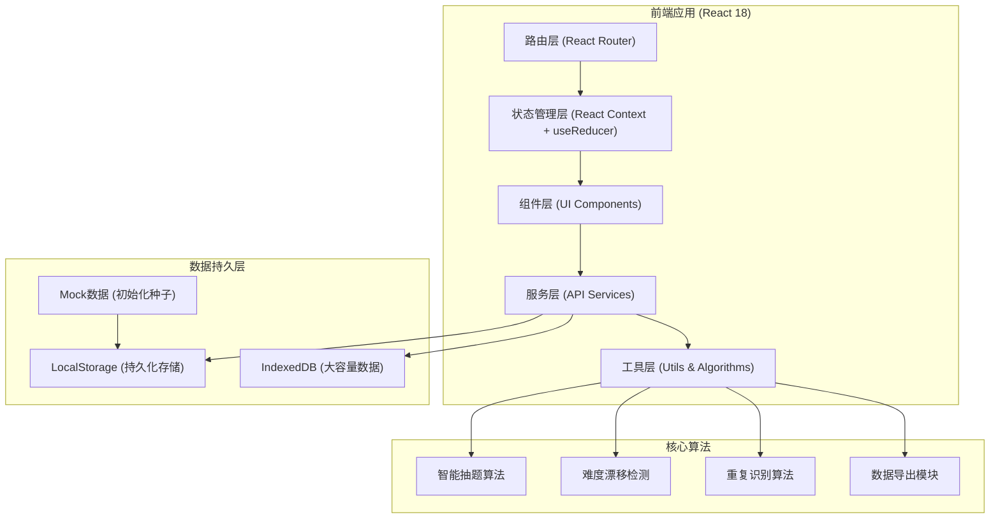
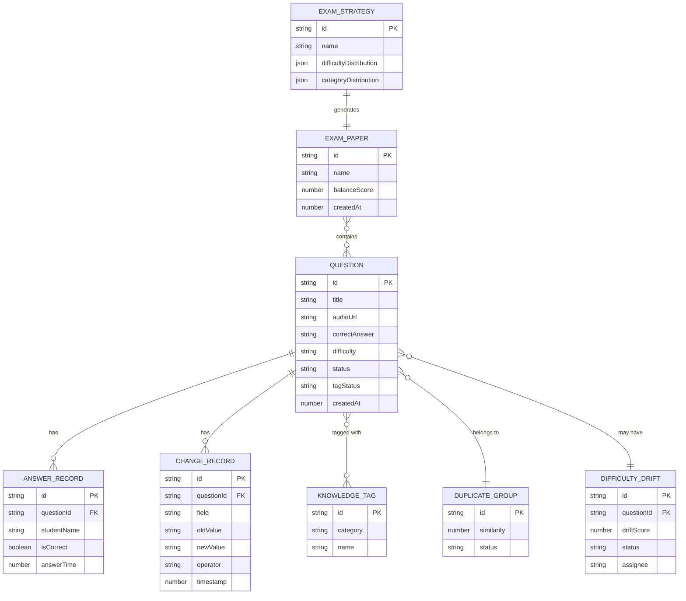

## 1. 架构设计



## 2. 技术描述

- **前端框架**: React 18.2 + TypeScript 5.3
- **构建工具**: Vite 5.0
- **状态管理**: React Context + useReducer（轻量级全局状态）
- **路由**: React Router 6.20
- **样式方案**: TailwindCSS 3.4 + SCSS Modules
- **图表可视化**: Recharts 2.10
- **图标**: Lucide React + 自定义音乐图标
- **数据持久化**: LocalStorage（主要数据）+ IndexedDB（音频Blob）
- **导出功能**: xlsx (Excel) + jspdf (PDF)
- **数据校验**: Zod
- **开发工具**: ESLint + Prettier

## 3. 路由定义

| Route | Page | Purpose |
|-------|------|---------|
| `/` | Dashboard | 题库总览 - 数据仪表盘和快速操作 |
| `/questions` | QuestionList | 题库列表 - 多维度筛选和管理 |
| `/questions/:id` | QuestionDetail | 题目详情 - 复核、标签编辑、历史追踪 |
| `/generator` | ExamGenerator | 智能抽题 - 策略配置和试卷生成 |
| `/quality` | QualityControl | 质量监控 - 难度漂移、重复检测、标签补全 |
| `/answers` | AnswerEntry | 答题补录 - 学生成绩录入和统计分析 |

## 4. 数据模型与类型定义

```typescript
// 知识点分类
type KnowledgeCategory = 'rhythm' | 'harmony' | 'melody' | 'interval' | 'chord';

// 难度等级
type DifficultyLevel = 'easy' | 'medium' | 'hard';

// 题目状态
type QuestionStatus = 'active' | 'pending_review' | 'duplicate' | 'deprecated';

// 标签状态
type TagStatus = 'confirmed' | 'pending' | 'missing';

// 知识点标签
interface KnowledgeTag {
  id: string;
  category: KnowledgeCategory;
  name: string;
  description: string;
}

// 题目变更记录
interface ChangeRecord {
  id: string;
  questionId: string;
  field: 'difficulty' | 'tags' | 'answer' | 'status';
  oldValue: string;
  newValue: string;
  operator: string;
  timestamp: number;
  remark: string;
}

// 答题记录
interface AnswerRecord {
  id: string;
  questionId: string;
  studentId: string;
  studentName: string;
  isCorrect: boolean;
  answerTime: number;
  score?: number;
}

// 重复题目组
interface DuplicateGroup {
  id: string;
  questionIds: string[];
  similarity: number;
  detectedAt: number;
  status: 'detected' | 'confirmed' | 'resolved';
}

// 难度漂移记录
interface DifficultyDrift {
  id: string;
  questionId: string;
  expectedDifficulty: DifficultyLevel;
  actualDifficulty: number; // 0-1 基于正确率计算
  driftScore: number; // 漂移程度
  detectedAt: number;
  assignee?: string;
  status: 'pending' | 'reviewed' | 'resolved';
}

// 抽题策略
interface ExamStrategy {
  id: string;
  name: string;
  totalQuestions: number;
  difficultyDistribution: {
    easy: number;
    medium: number;
    hard: number;
  };
  categoryDistribution: Record<KnowledgeCategory, number>;
  excludeQuestionIds: string[];
}

// 试卷
interface ExamPaper {
  id: string;
  name: string;
  createdAt: number;
  strategy: ExamStrategy;
  questions: Question[];
  balanceScore: number;
  exportedAt?: number;
}

// 题目主数据
interface Question {
  id: string;
  title: string;
  audioUrl: string;
  audioDuration: number;
  correctAnswer: string;
  options: string[];
  difficulty: DifficultyLevel;
  tags: string[]; // KnowledgeTag ids
  tagStatus: TagStatus;
  status: QuestionStatus;
  createdAt: number;
  updatedAt: number;
  createdBy: string;
  answerRecords: AnswerRecord[];
  changeHistory: ChangeRecord[];
  duplicateGroupId?: string;
  driftId?: string;
  // 计算属性
  correctRate?: number;
  totalAttempts?: number;
}

// 应用状态
interface AppState {
  questions: Question[];
  knowledgeTags: KnowledgeTag[];
  duplicateGroups: DuplicateGroup[];
  difficultyDrifts: DifficultyDrift[];
  examPapers: ExamPaper[];
  currentUser: {
    id: string;
    name: string;
    role: 'teacher' | 'researcher';
  };
  filters: {
    search: string;
    categories: KnowledgeCategory[];
    difficulties: DifficultyLevel[];
    tagStatus: TagStatus[];
    status: QuestionStatus[];
  };
}
```

## 5. 核心算法模块

### 5.1 智能抽题算法

```typescript
/**
 * 基于约束满足的智能抽题算法
 * 1. 按难度比例分层抽样
 * 2. 按知识点分布均衡覆盖
 * 3. 避免近期重复抽题
 * 4. 计算平衡度评分
 */
function generateExam(strategy: ExamStrategy, questions: Question[]): {
  selected: Question[];
  balanceScore: number;
} {
  // 实现分层抽题逻辑
}
```

### 5.2 难度漂移检测

```typescript
/**
 * 基于答题数据的难度漂移检测
 * 1. 计算各题目的实际正确率
 * 2. 与预期难度对比计算漂移值
 * 3. 漂移超过阈值触发预警
 */
function detectDifficultyDrift(questions: Question[]): DifficultyDrift[] {
  // easy: 预期正确率 0.8-1.0
  // medium: 预期正确率 0.5-0.8
  // hard: 预期正确率 0.2-0.5
}
```

### 5.3 重复识别算法

```typescript
/**
 * 基于内容特征的重复题目识别
 * 1. 标题文本相似度（编辑距离）
 * 2. 答案选项相似度
 * 3. 标签重合度
 * 4. 综合相似度评分
 */
function detectDuplicates(questions: Question[]): DuplicateGroup[] {
  // 综合相似度 = 0.4*文本相似度 + 0.3*选项相似度 + 0.3*标签重合度
  // 阈值 > 0.7 标记为疑似重复
}
```

## 6. 数据模型 ER 图



## 7. 数据初始化

```typescript
// 初始种子数据
const seedKnowledgeTags: KnowledgeTag[] = [
  { id: 't1', category: 'rhythm', name: '四分音符', description: '基础节奏型' },
  { id: 't2', category: 'rhythm', name: '切分节奏', description: '强弱位倒置' },
  { id: 't3', category: 'rhythm', name: '三连音', description: '三等分节奏' },
  { id: 't4', category: 'harmony', name: '大三和弦', description: '大三度+小三度' },
  { id: 't5', category: 'harmony', name: '小三和弦', description: '小三度+大三度' },
  { id: 't6', category: 'harmony', name: '属七和弦', description: '大小七和弦' },
  { id: 't7', category: 'melody', name: '级进', description: '相邻音进行' },
  { id: 't8', category: 'interval', name: '纯五度', description: '音程识别' },
];

// 初始化 30+ 样例题目
const seedQuestions: Question[] = [
  // 包含各种难度、各类知识点的样例题目
];
```

## 8. 存储策略

| 数据类型 | 存储方式 | 说明 |
|---------|----------|------|
| 题目数据 | LocalStorage | JSON 序列化，上限 ~5MB |
| 标签数据 | LocalStorage | 随主数据一并存储 |
| 答题记录 | LocalStorage | 按题目关联存储 |
| 变更历史 | LocalStorage | 完整审计追踪 |
| 音频文件 | IndexedDB | Blob 存储，支持大文件 |
| 导出试卷 | LocalStorage + 文件下载 | 生成后可下载为文件 |

**刷新保护机制**：
- 应用启动时自动从 LocalStorage 恢复状态
- 所有变更操作先写入状态再同步到持久化存储
- 提供数据导入/导出功能作为备份机制
- 关键操作前自动创建快照
