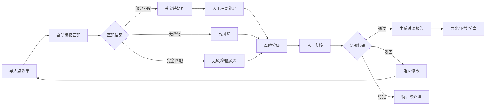

## 1. 产品概述

直播点歌版权过滤本地Web工作台，用于在开播前筛掉高风险曲目和授权不明片段，合并点歌单与曲库授权时展示冲突，确保版权合规。

- **核心目的**：解决主播点歌随意导致的版权风险问题，提供系统化的版权过滤、冲突处理和人工复核机制
- **目标用户**：直播运营人员、版权审核人员、点歌单维护人员、曲库授权维护人员
- **产品价值**：降低版权侵权风险，提高审核效率，留存审核历史便于复盘

## 2. 核心功能

### 2.1 用户角色
| 角色 | 登录方式 | 核心权限 |
|------|----------|----------|
| 运营人员 | 本地登录 | 点歌单管理、版权过滤、查看报告 |
| 审核人员 | 本地登录 | 人工复核、风险分级、导出清单 |
| 管理员 | 本地登录 | 曲库授权维护、系统配置 |

### 2.2 功能模块
1. **点歌单列表页**：点歌单导入、歌曲列表展示、批量操作、筛选搜索
2. **版权匹配详情页**：自动版权匹配结果、授权信息展示、风险标识
3. **冲突处理页**：点歌单与曲库授权冲突对比、人工选择、合并结果
4. **风险分级与复核页**：风险等级展示、人工复核、审核记录
5. **历史记录页**：审核历史、操作日志、版本对比
6. **导出下载页**：过滤报告导出、清单下载、报告分享

### 2.3 页面详情
| 页面名称 | 模块名称 | 功能描述 |
|----------|----------|----------|
| 点歌单列表 | 导入模块 | 支持Excel/CSV导入点歌单、手动添加歌曲 |
| 点歌单列表 | 列表展示 | 歌曲名称、歌手、时长、匹配状态、风险等级、操作列 |
| 点歌单列表 | 筛选搜索 | 按风险等级、匹配状态、歌手、歌名搜索筛选 |
| 版权匹配详情 | 匹配结果 | 自动匹配曲库、同名歌曲列表、授权地区限制 |
| 版权匹配详情 | 翻唱识别 | 标识翻唱版本、对比原唱、指向具体授权记录 |
| 冲突处理 | 冲突对比 | 左右分栏展示点歌单信息与曲库授权信息差异 |
| 冲突处理 | 人工选择 | 保留双方选择、自定义合并规则、冲突原因标注 |
| 风险分级 | 风险展示 | 四级风险（高/中/低/无）、风险原因说明 |
| 风险分级 | 人工复核 | 通过/驳回/待定、复核意见、审核人签名 |
| 历史记录 | 操作日志 | 所有操作时间、操作人、操作内容 |
| 历史记录 | 版本对比 | 同一歌曲不同审核版本的差异对比 |
| 导出下载 | 报告导出 | PDF格式过滤报告、包含风险分级口径说明 |
| 导出下载 | 清单导出 | Excel格式导出、支持自定义导出字段 |

## 3. 核心流程

## 4. 用户界面设计

### 4.1 设计风格
- **主色调**：深蓝 (#1e3a5f) - 专业稳重
- **辅助色**：
  - 高风险：深红 (#dc2626)
  - 中风险：橙色 (#f59e0b)
  - 低风险：黄色 (#eab308)
  - 无风险：绿色 (#10b981)
- **字体**：
  - 标题：Noto Sans SC - 清晰易读
  - 正文：Inter - 数据展示友好
- **布局风格**：左侧导航 + 顶部栏 + 主内容区卡片式布局
- **图标风格**：Lucide图标库，线性风格

### 4.2 页面设计概览
| 页面名称 | 模块名称 | UI元素 |
|----------|----------|--------|
| 点歌单列表 | 顶部工具栏 | 导入按钮、批量操作下拉、搜索框、筛选标签 |
| 点歌单列表 | 数据表格 | 斑马纹行、风险等级色标、悬浮高亮、可排序表头 |
| 版权匹配详情 | 头部信息区 | 歌曲卡片、风险徽章、匹配度进度条 |
| 版权匹配详情 | 匹配结果区 | 折叠面板、授权信息列表、地区限制标签 |
| 冲突处理 | 对比区 | 左右分栏布局、差异高亮标注、操作按钮组 |
| 风险分级 | 风险矩阵 | 四象限风险展示、原因说明折叠面板 |
| 导出下载 | 报告预览 | PDF预览缩略图、下载按钮、分享链接 |

### 4.3 响应式
- 桌面端优先设计（1280px+）
- 平板端适配（768px-1279px）：表格横向滚动、侧边栏收起
- 移动端兼容（<768px）：卡片式列表、底部导航

### 4.4 动效设计
- 页面加载：骨架屏渐显
- 风险标签：脉冲动画提示高风险项
- 表格行：hover背景色过渡
- 模态框：缩放进入动画
- 按钮：点击反馈微动画
