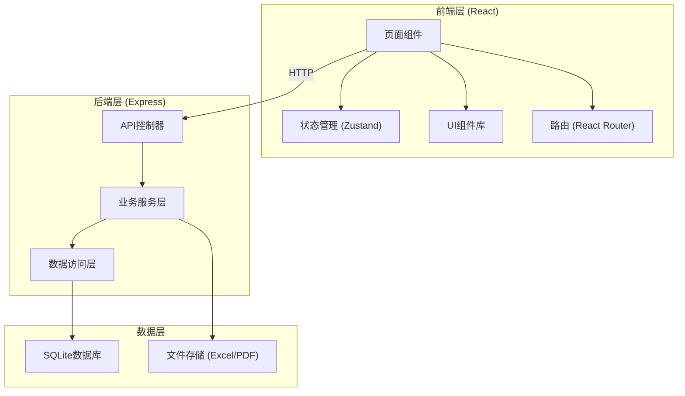
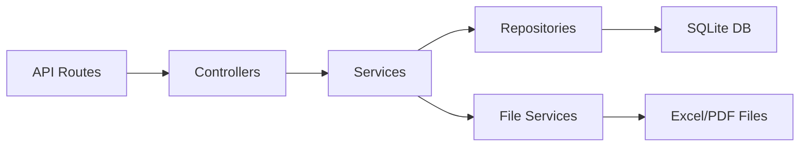
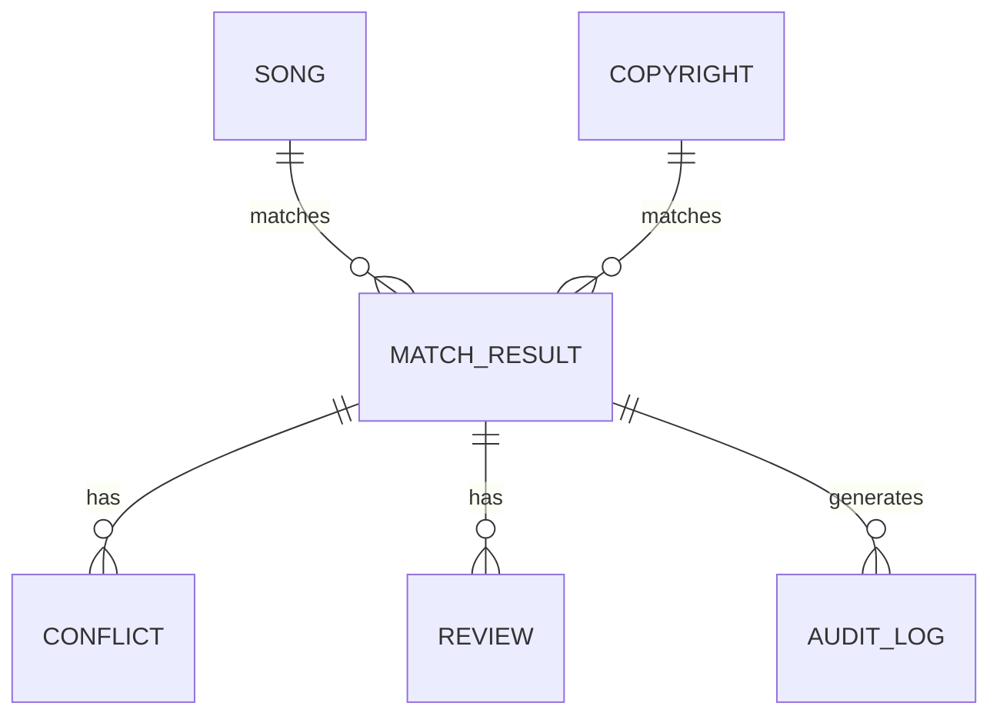

## 1. 架构设计



## 2. 技术描述

- **前端**：React@18 + TypeScript + Vite + TailwindCSS@3 + Zustand + React Router@6
- **后端**：Express@4 + TypeScript
- **数据库**：SQLite（本地文件存储，无需额外服务）
- **文件处理**：xlsx（Excel导入导出）、jspdf（PDF生成）
- **UI组件**：Lucide React（图标）
- **初始化工具**：vite-init

## 3. 路由定义

| 路由 | 页面 | 功能 |
|------|------|------|
| / | 点歌单列表 | 点歌单管理、歌曲列表展示 |
| /song/:id | 版权匹配详情 | 单首歌曲匹配结果查看 |
| /conflicts | 冲突处理 | 版权冲突列表与处理 |
| /review | 风险分级与复核 | 人工审核、风险标记 |
| /history | 历史记录 | 操作日志、版本对比 |
| /export | 导出下载 | 报告生成与下载 |

## 4. API 定义

### 4.1 TypeScript 类型定义

```typescript
// 歌曲信息
interface Song {
  id: string;
  name: string;
  artist: string;
  duration: number;
  source: 'playlist' | 'library';
  createdAt: string;
  updatedAt: string;
}

// 版权授权信息
interface Copyright {
  id: string;
  songId: string;
  songName: string;
  artist: string;
  authorizedRegions: string[];
  licenseType: 'exclusive' | 'non-exclusive' | 'cover';
  validFrom: string;
  validTo: string;
  isCover: boolean;
  originalArtist?: string;
}

// 匹配结果
interface MatchResult {
  id: string;
  playlistSongId: string;
  copyrightId: string | null;
  matchStatus: 'full' | 'partial' | 'none' | 'conflict';
  matchConfidence: number;
  riskLevel: 'high' | 'medium' | 'low' | 'none';
  riskReasons: string[];
  isCoverDetected: boolean;
  regionRestrictions: string[];
}

// 冲突记录
interface Conflict {
  id: string;
  matchResultId: string;
  type: 'name_mismatch' | 'artist_mismatch' | 'region_conflict' | 'license_expired';
  playlistData: Partial<Song>;
  copyrightData: Partial<Copyright>;
  status: 'pending' | 'resolved_playlist' | 'resolved_copyright' | 'resolved_custom';
  resolution: string;
  resolvedBy: string;
  resolvedAt: string;
}

// 审核记录
interface Review {
  id: string;
  matchResultId: string;
  reviewer: string;
  status: 'approved' | 'rejected' | 'pending';
  comments: string;
  riskLevelOverride?: 'high' | 'medium' | 'low' | 'none';
  createdAt: string;
}

// 操作日志
interface AuditLog {
  id: string;
  action: string;
  entityType: string;
  entityId: string;
  userId: string;
  details: string;
  timestamp: string;
}
```

### 4.2 API 端点

```typescript
// 点歌单
GET /api/songs - 获取歌曲列表
POST /api/songs - 添加歌曲
POST /api/songs/import - 导入Excel点歌单
DELETE /api/songs/:id - 删除歌曲

// 版权匹配
GET /api/matches - 获取匹配结果列表
GET /api/matches/:id - 获取单个匹配详情
POST /api/matches/run - 执行版权匹配

// 冲突处理
GET /api/conflicts - 获取冲突列表
PUT /api/conflicts/:id/resolve - 解决冲突

// 审核
GET /api/reviews - 获取审核列表
POST /api/reviews - 创建审核记录
PUT /api/reviews/:id - 更新审核

// 历史记录
GET /api/audit-logs - 获取操作日志

// 导出
GET /api/export/report - 生成过滤报告 (PDF)
GET /api/export/list - 导出清单 (Excel)
```

## 5. 服务端架构



## 6. 数据模型

### 6.1 ER 图



### 6.2 DDL 语句

```sql
-- 歌曲表（点歌单）
CREATE TABLE songs (
  id TEXT PRIMARY KEY,
  name TEXT NOT NULL,
  artist TEXT NOT NULL,
  duration INTEGER,
  source TEXT NOT NULL DEFAULT 'playlist',
  created_at TEXT NOT NULL,
  updated_at TEXT NOT NULL
);

-- 版权授权表（曲库）
CREATE TABLE copyrights (
  id TEXT PRIMARY KEY,
  song_name TEXT NOT NULL,
  artist TEXT NOT NULL,
  authorized_regions TEXT NOT NULL,
  license_type TEXT NOT NULL,
  valid_from TEXT NOT NULL,
  valid_to TEXT NOT NULL,
  is_cover INTEGER NOT NULL DEFAULT 0,
  original_artist TEXT,
  created_at TEXT NOT NULL,
  updated_at TEXT NOT NULL
);

-- 匹配结果表
CREATE TABLE match_results (
  id TEXT PRIMARY KEY,
  playlist_song_id TEXT NOT NULL,
  copyright_id TEXT,
  match_status TEXT NOT NULL,
  match_confidence REAL NOT NULL,
  risk_level TEXT NOT NULL,
  risk_reasons TEXT NOT NULL,
  is_cover_detected INTEGER NOT NULL DEFAULT 0,
  region_restrictions TEXT,
  created_at TEXT NOT NULL,
  updated_at TEXT NOT NULL,
  FOREIGN KEY (playlist_song_id) REFERENCES songs(id),
  FOREIGN KEY (copyright_id) REFERENCES copyrights(id)
);

-- 冲突记录表
CREATE TABLE conflicts (
  id TEXT PRIMARY KEY,
  match_result_id TEXT NOT NULL,
  type TEXT NOT NULL,
  playlist_data TEXT NOT NULL,
  copyright_data TEXT NOT NULL,
  status TEXT NOT NULL DEFAULT 'pending',
  resolution TEXT,
  resolved_by TEXT,
  resolved_at TEXT,
  created_at TEXT NOT NULL,
  FOREIGN KEY (match_result_id) REFERENCES match_results(id)
);

-- 审核记录表
CREATE TABLE reviews (
  id TEXT PRIMARY KEY,
  match_result_id TEXT NOT NULL,
  reviewer TEXT NOT NULL,
  status TEXT NOT NULL,
  comments TEXT,
  risk_level_override TEXT,
  created_at TEXT NOT NULL,
  FOREIGN KEY (match_result_id) REFERENCES match_results(id)
);

-- 操作日志表
CREATE TABLE audit_logs (
  id TEXT PRIMARY KEY,
  action TEXT NOT NULL,
  entity_type TEXT NOT NULL,
  entity_id TEXT NOT NULL,
  user_id TEXT NOT NULL,
  details TEXT NOT NULL,
  timestamp TEXT NOT NULL
);

-- 初始版权数据
INSERT INTO copyrights (id, song_name, artist, authorized_regions, license_type, valid_from, valid_to, is_cover, original_artist, created_at, updated_at) VALUES
('cpy_001', '夜曲', '周杰伦', '["CN", "HK", "TW"]', 'exclusive', '2020-01-01', '2027-12-31', 0, NULL, datetime('now'), datetime('now')),
('cpy_002', '稻香', '周杰伦', '["CN"]', 'non-exclusive', '2021-01-01', '2026-12-31', 0, NULL, datetime('now'), datetime('now')),
('cpy_003', '告白气球', '周杰伦', '["CN", "HK", "TW", "SG", "MY"]', 'exclusive', '2019-06-01', '2026-05-31', 0, NULL, datetime('now'), datetime('now')),
('cpy_004', '七里香', '周杰伦', '["CN", "HK"]', 'non-exclusive', '2020-01-01', '2025-12-31', 0, NULL, datetime('now'), datetime('now')),
('cpy_005', '晴天', '周杰伦', '["CN", "HK", "TW", "JP"]', 'exclusive', '2018-01-01', '2025-06-30', 0, NULL, datetime('now'), datetime('now')),
('cpy_006', '青花瓷', '周杰伦', '["CN", "HK", "TW", "US", "CA"]', 'exclusive', '2019-01-01', '2028-12-31', 0, NULL, datetime('now'), datetime('now')),
('cpy_007', '简单爱', '周杰伦', '["CN"]', 'non-exclusive', '2022-01-01', '2024-12-31', 0, NULL, datetime('now'), datetime('now')),
('cpy_008', '龙卷风', '邓紫棋', '["CN", "HK"]', 'cover', '2021-03-01', '2026-02-28', 1, '周杰伦', datetime('now'), datetime('now')),
('cpy_009', '默', '那英', '["CN", "HK", "TW"]', 'non-exclusive', '2015-01-01', '2025-12-31', 0, NULL, datetime('now'), datetime('now')),
('cpy_010', '小幸运', '田馥甄', '["CN", "HK", "TW", "SG", "MY"]', 'exclusive', '2015-07-01', '2027-06-30', 0, NULL, datetime('now'), datetime('now'));

-- 初始点歌单数据
INSERT INTO songs (id, name, artist, duration, source, created_at, updated_at) VALUES
('sng_001', '夜曲', '周杰伦', 225, 'playlist', datetime('now'), datetime('now')),
('sng_002', '稻香', '周杰伦', 210, 'playlist', datetime('now'), datetime('now')),
('sng_003', '告白气球', '周杰伦', 195, 'playlist', datetime('now'), datetime('now')),
('sng_004', '七里香', '周杰伦', 260, 'playlist', datetime('now'), datetime('now')),
('sng_005', '晴天', '周杰伦', 280, 'playlist', datetime('now'), datetime('now')),
('sng_006', '青花瓷', '周杰伦', 230, 'playlist', datetime('now'), datetime('now')),
('sng_007', '简单爱', '周杰伦', 240, 'playlist', datetime('now'), datetime('now')),
('sng_008', '龙卷风', '邓紫棋', 245, 'playlist', datetime('now'), datetime('now')),
('sng_009', '默', '周杰伦', 300, 'playlist', datetime('now'), datetime('now')),
('sng_010', '小幸运', '田馥甄', 270, 'playlist', datetime('now'), datetime('now')),
('sng_011', '演员', '薛之谦', 275, 'playlist', datetime('now'), datetime('now')),
('sng_012', '丑八怪', '薛之谦', 235, 'playlist', datetime('now'), datetime('now')),
('sng_013', '刚刚好', '薛之谦', 240, 'playlist', datetime('now'), datetime('now')),
('sng_014', '后来', '刘若英', 320, 'playlist', datetime('now'), datetime('now')),
('sng_015', '后来', '张智霖', 310, 'playlist', datetime('now'), datetime('now'));
```
