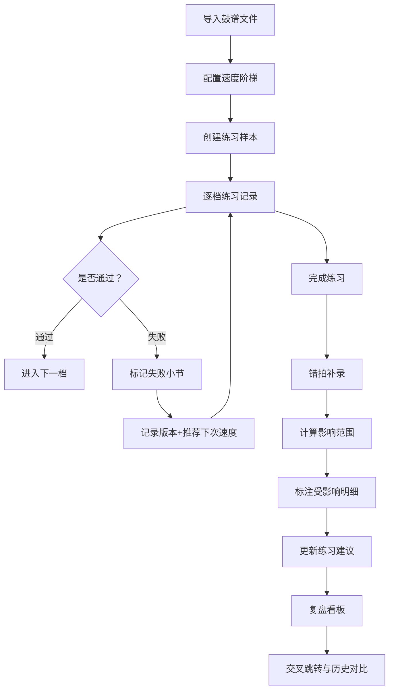

## 1. 产品概述

鼓谱练习速度阶梯是一款面向架子鼓教师与学生的练习复盘工具。核心解决"学生提速后节奏混乱"的痛点，通过按小节记录每次失败点与下次目标速度，形成可追溯的速度阶梯，让练习过程可量化、可复盘、可迭代。

- 目标用户：架子鼓教师（主导记录）、学生（查看建议）
- 核心价值：把"凭感觉练"变成"按数据练"，错拍补录后自动联动更新练习建议与历史对比

## 2. 核心功能

### 2.1 用户角色

| 角色 | 使用方式 | 核心权限 |
|------|----------|----------|
| 教师 | 本地单机使用 | 导入鼓谱、配置速度阶梯、记录练习、补录错拍、查看分析 |
| 学生 | 只读查看 | 查看练习建议、速度阶梯、历史对比 |

### 2.2 功能模块

1. **鼓谱与速度配置页**：导入鼓谱文件（JSON），配置速度档位阶梯
2. **练习记录页**：按小节记录通过/失败、失败点标记、下次速度建议
3. **错拍补录页**：第二次补录错拍位置与偏移，标注影响范围
4. **复盘看板页**：速度阶梯可视化、样本/版本/修正/指标互相跳转、历史对比

### 2.3 页面详情

| 页面名称 | 模块名称 | 功能描述 |
|----------|----------|----------|
| 鼓谱与速度配置 | 鼓谱导入区 | 导入 JSON 鼓谱文件，解析小节结构，展示小节预览 |
| 鼓谱与速度配置 | 速度阶梯配置 | 设置起止 BPM、档位间隔、跳档策略（逐档/自定义），生成速度阶梯列表 |
| 鼓谱与速度配置 | 样本管理 | 创建练习样本（学生+鼓谱+日期），列表展示与筛选 |
| 练习记录 | 速度阶梯执行 | 按阶梯顺序逐档练习，每档记录通过/失败，失败时标记小节 |
| 练习记录 | 失败点标记 | 点击小节标记失败，记录失败类型（节奏错/力度错/漏拍），自动推荐下次速度 |
| 练习记录 | 重复练习处理 | 同一档位可重复练习，每次生成独立版本，结果确定性保证 |
| 错拍补录 | 错拍位置录入 | 为已有练习记录补录错拍小节与偏移量（提前/延后几拍） |
| 错拍补录 | 影响范围标注 | 补录后自动标注受影响的明细行（速度建议变更、阶梯状态变化），高亮显示 |
| 错拍补录 | 变更日志 | 记录每次补录的前后差异，支持回溯 |
| 复盘看板 | 速度阶梯总览 | 横轴速度档位、纵轴通过率，可视化阶梯曲线 |
| 复盘看板 | 交叉跳转 | 点击样本→跳转版本列表，点击版本→跳转修正记录，点击指标→跳转对应明细 |
| 复盘看板 | 历史对比 | 选择两次练习记录并排对比，差异高亮 |
| 复盘看板 | 练习建议 | 基于错拍统计动态生成建议（推荐速度、重点小节），错拍变更后建议自动更新 |

## 3. 核心流程

### 3.1 首次导入流程

教师导入鼓谱文件 → 系统解析小节结构 → 教师配置速度阶梯（起止BPM、档位间隔）→ 创建练习样本 → 开始逐档练习 → 标记失败点 → 系统记录版本并推荐下次速度

### 3.2 二次补录流程

教师选择已有练习记录 → 补录错拍位置与偏移 → 系统计算影响范围 → 标注受影响明细 → 更新练习建议 → 记录变更日志

### 3.3 复盘流程

教师选择样本 → 查看速度阶梯看板 → 点击样本/版本/修正/指标互相跳转 → 选择两次记录对比 → 查看练习建议

## 4. 用户界面设计

### 4.1 设计风格

- 主色调：深色工业风（#1a1a2e 深蓝黑底 + #e94560 鼓红强调色 + #0f3460 中间蓝）
- 辅助色：#16213e 面板底色、#533483 紫色次强调
- 按钮风格：圆角 8px，hover 时发光效果
- 字体：DM Mono（数据/代码区）+ Noto Sans SC（中文正文），标题 24px/18px，正文 14px，数据 12px
- 布局：左侧导航 + 右侧内容区，卡片式面板
- 图标：Lucide 图标库

### 4.2 页面设计概览

| 页面名称 | 模块名称 | UI元素 |
|----------|----------|--------|
| 鼓谱与速度配置 | 鼓谱导入区 | 拖拽上传区、小节网格预览、解析状态指示 |
| 鼓谱与速度配置 | 速度阶梯配置 | 滑块（起止BPM）、数字输入（档位间隔）、阶梯列表、跳档开关 |
| 鼓谱与速度配置 | 样本管理 | 样本卡片列表、创建弹窗、筛选下拉 |
| 练习记录 | 速度阶梯执行 | 档位进度条、当前档高亮、通过/失败按钮组 |
| 练习记录 | 失败点标记 | 小节网格（可点击标记）、失败类型选择弹窗、下次速度推荐标签 |
| 练习记录 | 重复练习 | 版本标签页、历史版本列表、确定性状态徽标 |
| 错拍补录 | 错拍位置录入 | 小节时间轴、点击添加错拍标记、偏移量滑块 |
| 错拍补录 | 影响范围标注 | 受影响行高亮（红色边框+背景）、变更箭头指示 |
| 错拍补录 | 变更日志 | 时间线列表、前后值对比、回溯按钮 |
| 复盘看板 | 速度阶梯总览 | 折线图（BPM vs 通过率）、档位柱状图 |
| 复盘看板 | 交叉跳转 | 可点击的样本/版本/修正标签、跳转动画 |
| 复盘看板 | 历史对比 | 双列并排对比、差异高亮色块 |
| 复盘看板 | 练习建议 | 建议卡片列表、动态刷新指示、关联错拍标签 |

### 4.3 响应式

- 桌面优先设计（1280px+），内容区最小宽度 1024px
- 平板适配：导航折叠为汉堡菜单，卡片改为单列
- 触控优化：小节标记区域最小 44×44px 点击热区

## 5. 边界样例与确定性要求

### 5.1 速度跳档

- 支持自定义非等间隔阶梯（如 60→80→100→120→140）
- 跳档时系统自动插入过渡档位标记
- 失败后推荐速度不超过下一档，防止跳档过大

### 5.2 错拍偏移

- 偏移量支持正负值（提前/延后），精度到0.5拍
- 偏移量影响相邻小节判定，系统自动扩展影响范围

### 5.3 重复练习确定性

- 同一输入（鼓谱+速度+失败点）必须产生相同的通过/失败判定
- 使用纯函数评估引擎，无随机因素
- 版本快照机制：每次练习结果完整快照，不依赖外部状态
- 重复跑两遍结果必须一致

### 5.4 错拍补录联动

- 补录错拍后，速度阶梯状态可能从"通过"变为"需复查"
- 练习建议根据最新错拍统计重新计算
- 历史对比展示补录前后的差异
