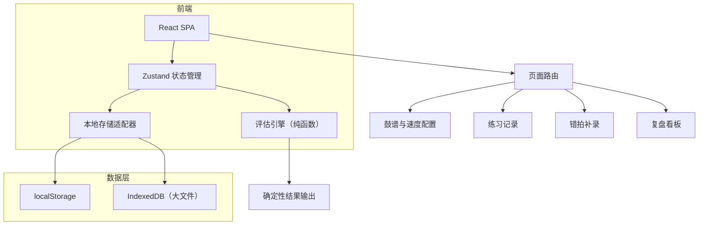
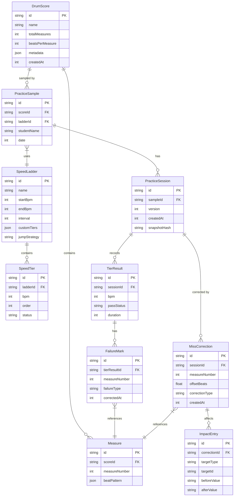

## 1. 架构设计



纯前端架构，无后端服务。所有数据存储在浏览器本地（localStorage + IndexedDB），评估引擎为纯函数保证确定性。

## 2. 技术说明

- 前端：React@18 + TypeScript + Tailwind CSS@3 + Vite
- 初始化工具：vite-init（react-ts 模板）
- 后端：无（纯前端应用）
- 数据库：localStorage（元数据） + IndexedDB（鼓谱文件、练习快照）
- 状态管理：Zustand
- 图表：Recharts
- 路由：react-router-dom@6

## 3. 路由定义

| 路由 | 用途 |
|------|------|
| / | 重定向到 /setup |
| /setup | 鼓谱与速度配置页 |
| /practice | 练习记录页 |
| /correction | 错拍补录页 |
| /review | 复盘看板页 |

## 4. 数据模型

### 4.1 数据模型定义



### 4.2 数据定义语言

```sql
-- 核心表结构（映射到 localStorage/IndexedDB 的 JSON 结构）

CREATE TABLE drum_score (
    id TEXT PRIMARY KEY,
    name TEXT NOT NULL,
    total_measures INTEGER NOT NULL,
    beats_per_measure INTEGER NOT NULL DEFAULT 4,
    metadata TEXT,
    created_at INTEGER NOT NULL
);

CREATE TABLE measure (
    id TEXT PRIMARY KEY,
    score_id TEXT NOT NULL REFERENCES drum_score(id),
    measure_number INTEGER NOT NULL,
    beat_pattern TEXT,
    UNIQUE(score_id, measure_number)
);

CREATE TABLE speed_ladder (
    id TEXT PRIMARY KEY,
    name TEXT NOT NULL,
    start_bpm INTEGER NOT NULL,
    end_bpm INTEGER NOT NULL,
    interval INTEGER NOT NULL DEFAULT 10,
    custom_tiers TEXT,
    jump_strategy TEXT NOT NULL DEFAULT 'stepwise'
);

CREATE TABLE speed_tier (
    id TEXT PRIMARY KEY,
    ladder_id TEXT NOT NULL REFERENCES speed_ladder(id),
    bpm INTEGER NOT NULL,
    tier_order INTEGER NOT NULL,
    status TEXT NOT NULL DEFAULT 'pending'
);

CREATE TABLE practice_sample (
    id TEXT PRIMARY KEY,
    score_id TEXT NOT NULL REFERENCES drum_score(id),
    ladder_id TEXT NOT NULL REFERENCES speed_ladder(id),
    student_name TEXT NOT NULL,
    date INTEGER NOT NULL
);

CREATE TABLE practice_session (
    id TEXT PRIMARY KEY,
    sample_id TEXT NOT NULL REFERENCES practice_sample(id),
    version INTEGER NOT NULL DEFAULT 1,
    created_at INTEGER NOT NULL,
    snapshot_hash TEXT NOT NULL
);

CREATE TABLE tier_result (
    id TEXT PRIMARY KEY,
    session_id TEXT NOT NULL REFERENCES practice_session(id),
    bpm INTEGER NOT NULL,
    pass_status TEXT NOT NULL CHECK(pass_status IN ('pass', 'fail', 'pending')),
    duration INTEGER
);

CREATE TABLE failure_mark (
    id TEXT PRIMARY KEY,
    tier_result_id TEXT NOT NULL REFERENCES tier_result(id),
    measure_number INTEGER NOT NULL,
    failure_type TEXT NOT NULL CHECK(failure_type IN ('rhythm', 'dynamics', 'miss')),
    corrected_at INTEGER
);

CREATE TABLE miss_correction (
    id TEXT PRIMARY KEY,
    session_id TEXT NOT NULL REFERENCES practice_session(id),
    measure_number INTEGER NOT NULL,
    offset_beats REAL NOT NULL DEFAULT 0,
    correction_type TEXT NOT NULL,
    created_at INTEGER NOT NULL
);

CREATE TABLE impact_entry (
    id TEXT PRIMARY KEY,
    correction_id TEXT NOT NULL REFERENCES miss_correction(id),
    target_type TEXT NOT NULL CHECK(target_type IN ('tier_result', 'practice_suggestion', 'ladder_status')),
    target_id TEXT NOT NULL,
    before_value TEXT NOT NULL,
    after_value TEXT NOT NULL
);
```

## 5. 确定性评估引擎设计

### 5.1 核心原则

评估引擎为纯函数：`evaluate(failures, ladder, corrections) => EvaluationResult`

- 输入相同 → 输出必然相同
- 无随机数、无时间戳参与计算、无外部状态依赖
- 每次练习结果生成 `snapshotHash`（内容哈希），用于验证确定性

### 5.2 评估函数签名

```typescript
interface EvaluationInput {
    failures: FailureMark[];
    ladder: SpeedLadder;
    corrections: MissCorrection[];
    tierResults: TierResult[];
}

interface EvaluationResult {
    tierStatuses: Map<string, 'pass' | 'fail' | 'review'>;
    suggestions: PracticeSuggestion[];
    impactMap: Map<string, ImpactEntry[]>;
    snapshotHash: string;
}

function evaluate(input: EvaluationInput): EvaluationResult;
```

### 5.3 补录联动逻辑

1. 补录错拍 → 重新执行 `evaluate()` → 对比前后 `EvaluationResult`
2. 变化的条目生成 `ImpactEntry`，记录 before/after
3. 练习建议根据新的 `suggestions` 更新
4. 历史对比基于 `snapshotHash` 追溯变化

## 6. 本地存储策略

| 数据类型 | 存储位置 | 原因 |
|----------|----------|------|
| 鼓谱元数据 | localStorage | 体积小，读取频繁 |
| 小节数据 | IndexedDB | 可能较大 |
| 速度阶梯配置 | localStorage | 体积小 |
| 练习样本/会话 | localStorage | 体积小，读取频繁 |
| 练习结果快照 | IndexedDB | 需要完整快照保证确定性 |
| 补录与影响记录 | localStorage | 体积小 |
