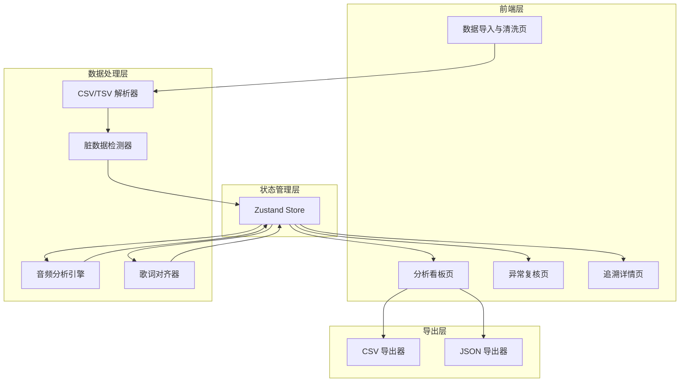

## 1. 架构设计



## 2. 技术说明

- 前端：React@18 + Tailwind CSS@3 + Vite
- 初始化工具：vite-init
- 后端：无（纯前端，数据在浏览器内处理）
- 数据库：无（使用 Zustand 管理内存状态，Mock 数据演示）
- 图表库：Recharts（轻量 React 图表库）
- 文件解析：PapaParse（CSV/TSV 解析）

## 3. 路由定义

| 路由 | 用途 |
|------|------|
| / | 数据导入与清洗页，上传录音数据和歌词文件 |
| /dashboard | 分析看板页，图表+明细+导出 |
| /review | 异常复核页，静音误判/歌词错位/长句超限 |
| /trace/:id | 追溯详情页，按结果 ID 追溯完整链路 |

## 4. API 定义

无后端 API，所有数据处理在前端完成。

### 4.1 核心数据类型

```typescript
interface RawDataRow {
  rowIndex: number
  timestamp: number
  pitch: number | null
  amplitude: number | null
  lyricsSegment: string | null
  practiceCount: number | null
  rawLine: string
}

interface CleanedRow {
  id: string
  timestamp: number
  pitch: number
  amplitude: number
  lyricsSegment: string
  practiceCount: number
  sourceRowIndex: number
}

interface BadRow {
  rowIndex: number
  rawLine: string
  reason: "empty" | "comment" | "missing_column"
  missingColumns: string[]
  recovered: boolean
}

interface BreathingPoint {
  id: string
  timestamp: number
  duration: number
  amplitudeBefore: number
  amplitudeAfter: number
  confidence: number
  source: "auto" | "manual"
}

interface SilenceSegment {
  id: string
  startTimestamp: number
  endTimestamp: number
  duration: number
  isMisjudgment: boolean
  misjudgmentReason?: string
}

interface LyricsAlignment {
  id: string
  lyricsSegment: string
  startTimestamp: number
  endTimestamp: number
  isMisaligned: boolean
  misalignmentDetail?: string
  isOverLong: boolean
  durationThreshold: number
}

interface TraceLink {
  resultId: string
  audioAnalysisRef: string
  lyricsAlignmentRef: string
  breathingAdviceRef: string
}

interface AnalysisResult {
  id: string
  studentName: string
  songTitle: string
  practiceIndex: number
  breathingPoints: BreathingPoint[]
  silenceSegments: SilenceSegment[]
  lyricsAlignments: LyricsAlignment[]
  melodyLine: { timestamp: number; pitch: number }[]
  traceLink: TraceLink
}
```

## 5. 服务器架构图

无后端，不适用。

## 6. 数据模型

### 6.1 数据模型定义

```mermaid
erDiagram
    "RawDataRow" {
        number rowIndex PK
        number timestamp
        number pitch "nullable"
        number amplitude "nullable"
        string lyricsSegment "nullable"
        number practiceCount "nullable"
        string rawLine
    }
    "CleanedRow" {
        string id PK
        number timestamp
        number pitch
        number amplitude
        string lyricsSegment
        number practiceCount
        number sourceRowIndex FK
    }
    "BadRow" {
        number rowIndex PK
        string rawLine
        string reason
        string missingColumns
        boolean recovered
    }
    "AnalysisResult" {
        string id PK
        string studentName
        string songTitle
        number practiceIndex
    }
    "BreathingPoint" {
        string id PK
        number timestamp
        number duration
        number confidence
        string source
        string resultId FK
    }
    "SilenceSegment" {
        string id PK
        number startTimestamp
        number endTimestamp
        boolean isMisjudgment
        string resultId FK
    }
    "LyricsAlignment" {
        string id PK
        string lyricsSegment
        number startTimestamp
        number endTimestamp
        boolean isMisaligned
        boolean isOverLong
        string resultId FK
    }
    "TraceLink" {
        string resultId PK FK
        string audioAnalysisRef
        string lyricsAlignmentRef
        string breathingAdviceRef
    }
    "AnalysisResult" ||--o{ "BreathingPoint" : "contains"
    "AnalysisResult" ||--o{ "SilenceSegment" : "contains"
    "AnalysisResult" ||--o{ "LyricsAlignment" : "contains"
    "AnalysisResult" ||--|| "TraceLink" : "has"
    "CleanedRow" }o--|| "RawDataRow" : "derived from"
```

### 6.2 数据定义语言

本项目为纯前端应用，不使用数据库，数据在浏览器内存中通过 Zustand Store 管理。Mock 数据用于演示。
