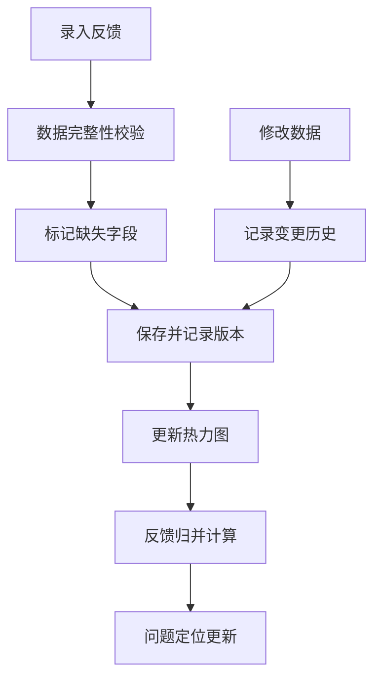

## 1. 产品概述
演唱会座位音效反馈系统，用于替代手工台账，整合观众反馈、座位区域和曲目段落，支持完整的变更历史追溯。
- 解决问题：替代手工台账，处理不完整数据，提供精准的音效问题定位
- 目标用户：场馆运营人员、音效技术人员
- 核心价值：数据驱动的音效质量改进，完整的审计追溯能力

## 2. 核心 Features

### 2.1 用户角色
| 角色 | 注册方式 | 核心权限 |
|------|----------|----------|
| 场馆运营 | 系统内置 | 录入反馈、查看热力图、修改数据、查看变更历史 |
| 音效技术 | 系统内置 | 查看分析报告、导出数据、标记问题解决 |

### 2.2 功能模块
1. **反馈管理主页**：座位热力图、反馈列表、快速录入
2. **反馈详情页**：单条反馈完整信息、变更历史、关联段落
3. **曲目段落管理**：段落维护、缺失检测、延迟补录
4. **数据分析面板**：区域对比、段落对比、问题定位

### 2.3 页面详情
| 页面名称 | 模块名称 | 功能描述 |
|---------|---------|----------|
| 反馈管理主页 | 座位热力图 | 可视化展示各区域反馈密度，支持点击下钻 |
| 反馈管理主页 | 反馈列表 | 筛选、搜索、批量操作、数据质量提示 |
| 反馈管理主页 | 快速录入 | 支持不完整数据录入，自动标记缺失字段 |
| 反馈详情页 | 基本信息 | 座位、曲目、反馈内容、备注展示 |
| 反馈详情页 | 变更历史 | 完整记录每次修改的来源、前后值、时间、操作人 |
| 反馈详情页 | 数据质量提示 | 座位错填明确标注、重复反馈提醒、段落缺失建议 |
| 曲目段落管理 | 段落列表 | 曲目分段、延迟补录、缺失检测 |
| 数据分析面板 | 区域对比 | 多区域音效对比、热力变化追踪 |
| 数据分析面板 | 段落对比 | 不同曲目段落的反馈分布对比 |
| 数据分析面板 | 问题定位 | 基于反馈归并的精准问题定位，随数据更新动态调整 |

## 3. 核心流程

### 3.1 反馈录入流程
运营人员录入反馈 → 系统自动校验数据完整性 → 标记缺失字段（座位/段落）→ 保存并记录初始版本 → 展示在热力图和列表中

### 3.2 数据修改流程
用户修改反馈数据 → 系统记录修改来源 → 保存前后值对比 → 更新分析结果（热力图/归并）→ 保留旧版本供追溯

### 3.3 反馈归并流程
新反馈录入/修改 → 触发区域归并计算 → 更新热力图数据 → 重新计算段落对比 → 动态调整问题定位 → 所有历史版本可追溯

## 4. 用户界面设计

### 4.1 设计风格
- **主色调**：深靛蓝 (#1e3a5f) 搭配琥珀金 (#d4a574)，营造专业场馆氛围
- **辅助色**：警示红 (#e74c3c) 用于数据问题，成功绿 (#27ae60) 用于正常状态
- **按钮风格**：圆角矩形，微妙阴影，hover时有轻微上浮效果
- **字体**：标题使用 Noto Serif SC（典雅），正文使用 Noto Sans SC（清晰易读）
- **布局风格**：卡片式布局，左侧导航 + 主内容区，数据看板采用网格系统
- **图标风格**：线性图标，统一2px描边，配合微妙的场馆元素（座位、音符、声波）

### 4.2 页面设计概述
| 页面名称 | 模块名称 | UI元素 |
|---------|---------|--------|
| 反馈管理主页 | 座位热力图 | 交互式场馆座位图，颜色渐变表示反馈密度，hover显示详情 |
| 反馈管理主页 | 反馈列表 | 表格展示，数据质量问题行高亮显示，操作列悬浮按钮 |
| 反馈管理主页 | 快速录入 | 侧边滑入表单，分步引导，缺失字段实时提示 |
| 反馈详情页 | 变更历史 | 时间轴布局，前后值对比高亮，来源标签清晰标注 |
| 反馈详情页 | 数据质量卡片 | 彩色标签明确标注问题类型，附带可操作的修正建议 |
| 数据分析面板 | 区域对比 | 并排柱状图，支持多选对比，时间范围滑块 |
| 数据分析面板 | 段落对比 | 雷达图展示各段落反馈分布，动画过渡效果 |

### 4.3 响应式
- 桌面端优先设计（1280px+）
- 平板端（768px-1279px）：热力图自适应缩放，侧边导航收起
- 移动端（<768px）：列表优先展示，热力图简化为概览卡片

### 4.4 动效设计
- 页面加载：卡片依次淡入，热力图颜色渐变浮现
- 数据变更：变更条目高亮闪烁后渐隐
- 热力图更新：颜色平滑过渡动画
- 悬停交互：卡片轻微上浮，按钮背景色渐变
