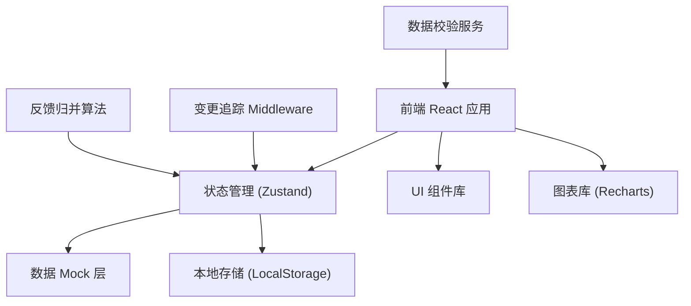
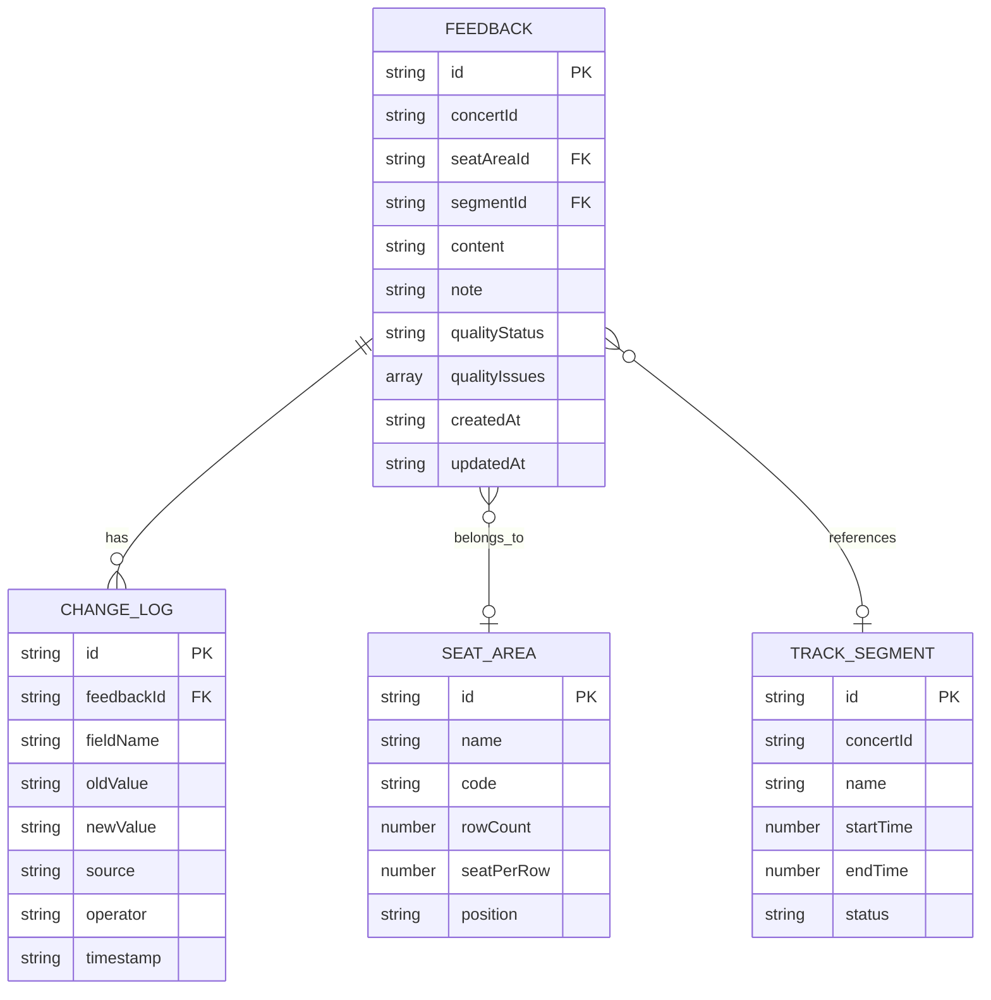

## 1. 架构设计



## 2. 技术描述
- **前端**: React@18 + TypeScript + Vite
- **样式**: TailwindCSS@3 + 自定义主题
- **状态管理**: Zustand + Immer (支持不可变更新和变更追踪)
- **图表**: Recharts (热力图、柱状图、雷达图)
- **路由**: React Router v6
- **数据持久化**: LocalStorage (模拟后端存储)
- **表单**: React Hook Form
- **图标**: Lucide React

## 3. 路由定义
| 路由 | 用途 |
|------|------|
| / | 反馈管理主页（热力图 + 反馈列表） |
| /feedback/:id | 反馈详情页（变更历史 + 数据质量） |
| /segments | 曲目段落管理 |
| /analytics | 数据分析面板 |

## 4. 数据模型

### 4.1 数据模型定义



### 4.2 核心数据类型定义

```typescript
// 反馈数据
interface Feedback {
  id: string;
  concertId: string;
  seatAreaId?: string;
  segmentId?: string;
  content: string;
  note?: string;
  qualityStatus: 'complete' | 'incomplete' | 'invalid';
  qualityIssues: QualityIssue[];
  createdAt: string;
  updatedAt: string;
}

// 数据质量问题
interface QualityIssue {
  type: 'seat_missing' | 'segment_missing' | 'seat_invalid' | 'duplicate';
  severity: 'warning' | 'error';
  message: string;
  suggestion: string;
}

// 变更记录
interface ChangeLog {
  id: string;
  feedbackId: string;
  fieldName: string;
  oldValue: string | null;
  newValue: string | null;
  source: 'user_edit' | 'auto_correct' | 'batch_import';
  operator: string;
  timestamp: string;
}

// 座位区域
interface SeatArea {
  id: string;
  name: string;
  code: string;
  rowCount: number;
  seatPerRow: number;
  position: 'front' | 'middle' | 'back' | 'left' | 'right';
}

// 曲目段落
interface TrackSegment {
  id: string;
  concertId: string;
  name: string;
  startTime: number;
  endTime: number;
  status: 'pending' | 'confirmed';
}
```

## 5. 核心模块设计

### 5.1 变更追踪模块
- 使用 Zustand middleware 监听状态变化
- 自动记录每次修改的前后值、来源、时间戳
- 支持按反馈ID查询变更历史
- 变更数据持久化到 LocalStorage

### 5.2 数据质量校验模块
- 座位区域校验：验证区域代码是否存在，不存在时给出明确错误
- 段落缺失检测：标记未关联段落的反馈，提供补录建议
- 重复反馈检测：基于内容相似度和座位信息检测重复
- 校验结果随数据变更实时更新

### 5.3 反馈归并算法
- 按座位区域聚合反馈数量
- 按曲目段落统计问题分布
- 动态计算热力图权重
- 数据变更时自动触发重新计算

### 5.4 热力图组件
- SVG 绘制场馆座位布局
- 颜色映射：反馈密度 → 颜色深浅
- 支持点击下钻查看区域详情
- 数据更新时平滑过渡动画

## 6. Mock 数据规划

### 6.1 初始数据
- 5个座位区域（A区前、B区中、C区后、D区左、E区右）
- 15-20条示例反馈数据，包含不同质量状态
- 8-10个曲目段落，部分标记为延迟补录
- 每个反馈包含3-5条变更历史记录

### 6.2 测试场景数据
- 包含座位错填的反馈（用于验证明确错误提示）
- 包含段落缺失的反馈（用于验证修正建议）
- 包含疑似重复的反馈（用于验证重复检测）
- 包含完整变更历史的反馈（用于验收测试）
