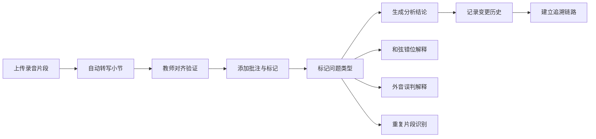

## 1. 产品概述

即兴Solo结构分析系统，专为爵士音乐教学设计，解决学生即兴录音分析中动机发展、和声外音、停顿等关键要素难以追踪和对账的问题。

- 核心问题：替代手工台账，解决录音、转写、批注的对齐和对账难题
- 目标用户：爵士音乐教师、音乐院校学生
- 产品价值：建立可追溯的分析链条，支持和弦错位、外音误判、片段重复等复杂情况的解释

## 2. 核心 Features

### 2.1 用户角色

| 角色 | 注册方式 | 核心权限 |
|------|----------|----------|
| 爵士教师 | 本地登录 | 上传录音、添加批注、查看变更历史、追溯分析链 |
| 学生 | 邀请加入 | 查看分析结果、聆听批注示例 |

### 2.2 Feature Module

1. **分析工作台**：录音播放、小节转写、批注录入、实时对齐
2. **变更历史**：操作来源记录、前后变化对比、审计追踪
3. **问题诊断**：和弦错位标记、外音误判解释、片段重复识别
4. **追溯链路**：从分析结果跳转至转写对齐、动机分析、外音标注

### 2.3 Page Details

| 页面名称 | 模块名称 | Feature Description |
|----------|----------|---------------------|
| 分析工作台 | 录音播放器 | 波形可视化、时间轴定位、循环播放、变速播放 |
| 分析工作台 | 小节转写区 | 五线谱/简谱显示、和弦标记、小节编号、对齐线 |
| 分析工作台 | 老师批注面板 | 时间锚定批注、问题分类（和弦错位/外音误判/重复片段）、修正建议 |
| 变更历史 | 操作日志 | 操作人、时间戳、修改类型、前后数值对比 |
| 追溯视图 | 分析链路图 | 节点式展示：录音片段 → 转写对齐 → 动机分析 → 外音标注 → 最终结论 |
| 样例展示 | 成功/失败案例 | 顺利通过样例、和弦错位样例、外音误判样例、重复片段样例 |

## 3. 核心流程

## 4. 用户界面设计

### 4.1 设计风格

- **主色调**：深酒红色 #8B2635（爵士乐的优雅与深沉）+ 墨黑色 #1A1A1A
- **辅助色**：金色 #D4AF37（高亮重要标记）+ 淡蓝色 #4A90D9（外音标注）
- **按钮风格**：微圆角、轻微悬浮效果、哑光质感
- **字体**：标题使用 Playfair Display（优雅衬线），正文使用 Source Code Pro（等宽适合乐谱）
- **布局风格**：三栏布局，左侧波形+播放器，中间转写+乐谱，右侧批注+历史
- **图标风格**：线性简约图标，使用音乐符号元素

### 4.2 页面设计概览

| 页面名称 | 模块名称 | UI Elements |
|----------|----------|-------------|
| 分析工作台 | 波形播放器 | 深色背景波形、时间轴刻度、循环标记手柄 |
| 分析工作台 | 乐谱转写区 | 网格对齐、和弦标签悬浮、问题区域高亮 |
| 分析工作台 | 批注面板 | 时间戳标签、问题类型徽章、可折叠层级 |
| 变更历史 | 对比视图 | 分栏显示、删除线/下划线标记变化、颜色区分增删 |
| 追溯视图 | 链路图 | 节点卡片、连接线动画、点击跳转详情 |

### 4.3 Responsiveness

- Desktop-first 设计，主视图1280px以上
- 平板端自适应为上下布局
- 移动端优先保证播放器和核心批注功能
- 触摸优化：增大按钮点击区域，支持手势缩放波形

### 4.4 动效设计

- 波形随播放进度平滑滚动
- 问题标记添加时弹性动画出现
- 变更历史展开/收起的过渡动画
- 追溯链路节点悬停放大效果
