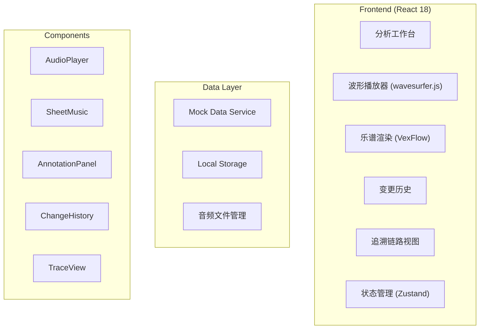
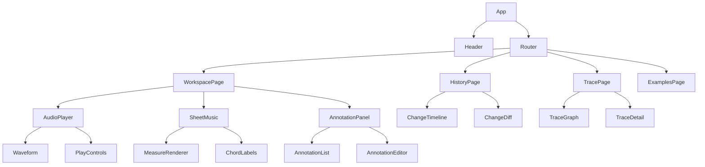

## 1. 架构设计



## 2. Technology Description

- **Frontend**: React@18 + TypeScript + tailwindcss@3 + vite
- **音频处理**: wavesurfer.js (波形可视化)
- **乐谱渲染**: VexFlow
- **状态管理**: Zustand
- **路由**: React Router
- **图标**: Lucide React
- **数据**: Mock数据 + LocalStorage持久化

## 3. Route Definitions

| Route | Purpose |
|-------|---------|
| / | 分析工作台主页面 |
| /workspace | 工作台 |
| /history | 变更历史页面 |
| /trace/:id | 追溯链路视图 |
| /examples | 样例展示页面 |

## 4. 前端数据模型

### 4.1 Type Definitions

```typescript
// 录音片段
interface AudioClip {
  id: string;
  name: string;
  url: string;
  duration: number;
  bpm: number;
  timeSignature: string;
}

// 小节转写
interface Measure {
  id: string;
  audioClipId: string;
  measureNumber: number;
  startTime: number;
  endTime: number;
  chord: string;
  notes: Note[];
  isHighlighted?: boolean;
  problemType?: 'chord-mismatch' | 'wrong-accidental' | 'repetitive';
}

// 音符
interface Note {
  pitch: string;
  duration: string;
  startTime: number;
  isAccidental: boolean;
  accidentalType?: 'passing' | 'neighbor' | 'escape' | 'suspension';
}

// 老师批注
interface Annotation {
  id: string;
  measureId: string;
  startTime: number;
  endTime: number;
  type: 'correction' | 'suggestion' | 'praise' | 'question';
  content: string;
  author: string;
  timestamp: number;
}

// 变更记录
interface ChangeRecord {
  id: string;
  entityType: 'measure' | 'annotation' | 'chord';
  entityId: string;
  fieldName: string;
  oldValue: any;
  newValue: any;
  source: 'manual' | 'auto-correct' | 'import';
  operator: string;
  timestamp: number;
}

// 追溯链路节点
interface TraceNode {
  id: string;
  type: 'audio' | 'transcription' | 'motif' | 'accidental' | 'conclusion';
  title: string;
  data: any;
  children: TraceNode[];
}
```

## 5. 组件结构



## 6. 核心功能实现方案

### 6.1 音频对齐
- 使用wavesurfer.js实现波形显示和时间定位
- 小节与音频时间戳绑定
- 点击小节自动跳转对应音频位置

### 6.2 变更追踪
- 状态变化时自动记录oldValue和newValue
- 记录操作来源和时间戳
- 支持回滚到历史版本

### 6.3 问题标记系统
- 和弦错位：高亮显示错位区域，显示期望和弦与实际演奏对比
- 外音误判：标记外音类型（经过音/邻音/逃逸音/延留音，标注正确与错误判断对比
- 片段重复：识别重复动机，标记重复起始位置
