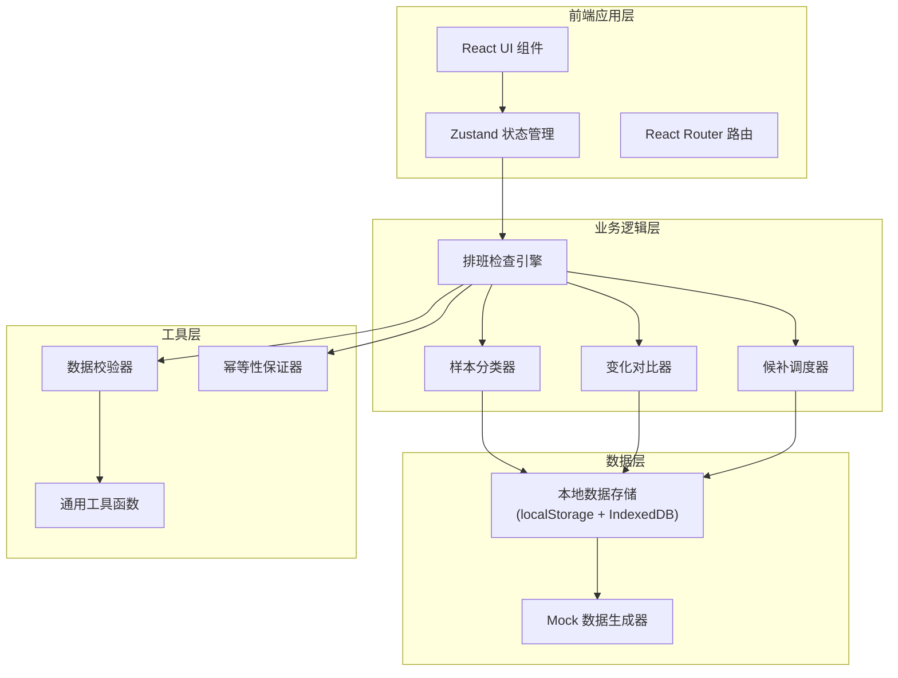
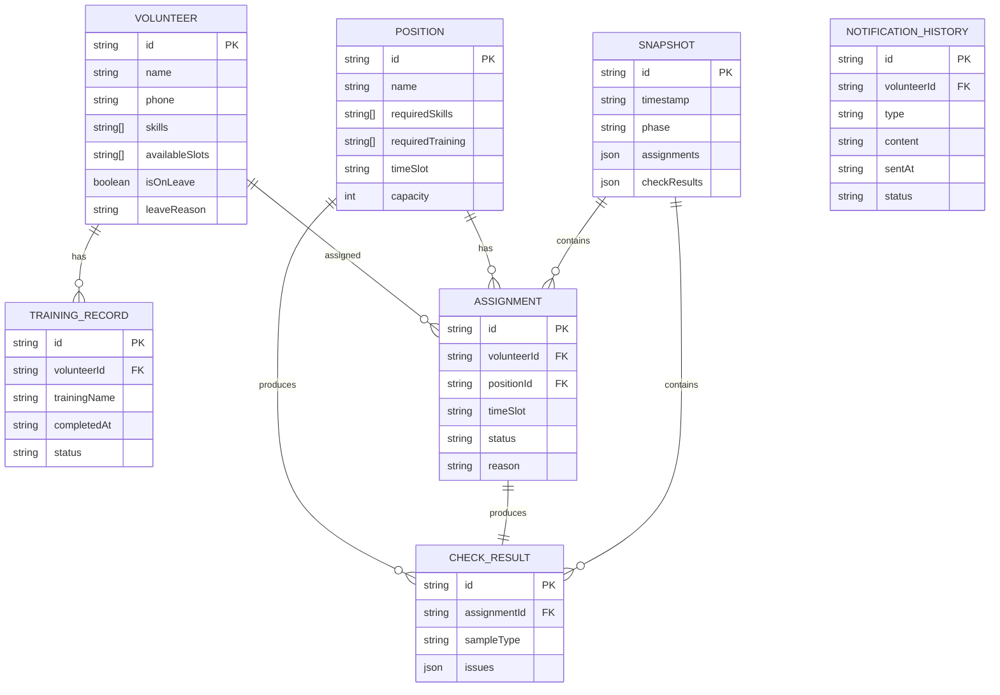

## 1. 架构设计



## 2. 技术描述

- **前端框架**: React@18 + TypeScript
- **构建工具**: Vite@5
- **样式方案**: TailwindCSS@3
- **状态管理**: Zustand
- **路由管理**: React Router@6
- **图表库**: Recharts（用于统计图表）
- **图标库**: Lucide React
- **数据存储**: localStorage（持久化） + IndexedDB（大数据量）
- **数据**: 内置Mock数据，无需后端服务

## 3. 路由定义

| 路由 | 页面组件 | 用途 |
|------|----------|------|
| / | Dashboard | 仪表盘概览 |
| /import | DataImport | 数据导入（两阶段） |
| /check | ScheduleCheck | 排班检查结果 |
| /compare | ChangeCompare | 变化对比 |
| /boundary | BoundarySamples | 边界样例库 |
| /manual | ManualCorrection | 手动修正工作台 |
| /history | DispatchHistory | 调度历史 |

## 4. 核心类型定义

```typescript
// 志愿者
interface Volunteer {
  id: string;
  name: string;
  phone: string;
  skills: string[];
  availableSlots: string[];
  isOnLeave: boolean;
  leaveReason?: string;
}

// 岗位
interface Position {
  id: string;
  name: string;
  requiredSkills: string[];
  requiredTraining: string[];
  timeSlot: string;
  capacity: number;
}

// 培训记录
interface TrainingRecord {
  volunteerId: string;
  trainingId: string;
  trainingName: string;
  completedAt: string;
  status: 'passed' | 'failed' | 'pending';
}

// 排班分配
interface Assignment {
  id: string;
  volunteerId: string;
  positionId: string;
  timeSlot: string;
  status: 'assigned' | 'backup' | 'rejected';
  reason?: string;
}

// 检查结果
interface CheckResult {
  assignment: Assignment;
  sampleType: 'normal' | 'boundary' | 'bad';
  issues: CheckIssue[];
}

interface CheckIssue {
  type: 'conflict' | 'missing_training' | 'leave' | 'capacity' | 'skill';
  severity: 'error' | 'warning' | 'info';
  message: string;
}

// 快照（用于对比）
interface Snapshot {
  id: string;
  timestamp: string;
  phase: 'phase1' | 'phase2' | 'corrected';
  assignments: Assignment[];
  checkResults: CheckResult[];
  metadata: Record<string, any>;
}
```

## 5. 数据模型

### 5.1 数据模型ER图



### 5.2 存储结构

```typescript
// 排班检查引擎核心接口
interface IScheduleEngine {
  // 执行检查
  check(
    volunteers: Volunteer[],
    positions: Position[],
    trainingRecords: TrainingRecord[],
    existingAssignments?: Assignment[]
  ): CheckResult[];
  
  // 分类样本
  classify(results: CheckResult[]): {
    normal: CheckResult[];
    boundary: CheckResult[];
    bad: CheckResult[];
  };
  
  // 对比快照
  compareSnapshots(
    before: Snapshot,
    after: Snapshot
  ): ComparisonResult;
  
  // 候补调度
  rescheduleBackup(
    results: CheckResult[],
    volunteers: Volunteer[]
  ): Assignment[];
  
  // 生成幂等ID
  generateIdempotencyKey(params: any): string;
}
```

## 6. 核心算法设计

### 6.1 约束检查规则

```
1. 岗位冲突检查
   - 同一志愿者同一时段不能分配多个岗位
   - 检查志愿者时段重叠

2. 培训缺失检查
   - 岗位要求的培训项必须已完成
   - 培训状态必须为 'passed'

3. 临时请假检查
   - 志愿者isOnLeave为true时不能排班
   - 请假时段与排班时段不能重叠

4. 技能匹配检查
   - 志愿者技能必须包含岗位要求技能

5. 容量检查
   - 岗位分配人数不能超过capacity

6. 可用时段检查
   - 志愿者availableSlots必须包含岗位timeSlot
```

### 6.2 样本分类规则

| 样本类型 | 判定条件 |
|----------|----------|
| **正常样本** | 所有约束都满足，无任何问题 |
| **边界样本** | 存在warning级别的问题，但不影响排班（如培训即将过期、可替代技能匹配等） |
| **异常样本** | 存在error级别的问题，必须修复（如培训缺失、岗位冲突、临时请假） |

### 6.3 幂等性保证

- 每次检查基于输入参数生成哈希key
- 相同输入必须产生相同输出
- 随机数使用固定种子
- 排序算法稳定

## 7. 关键设计模式

- **快照模式**: 每次操作前保存快照用于对比
- **观察者模式**: 岗位变化时通知候补调度和通知历史
- **策略模式**: 不同约束检查规则可插拔
