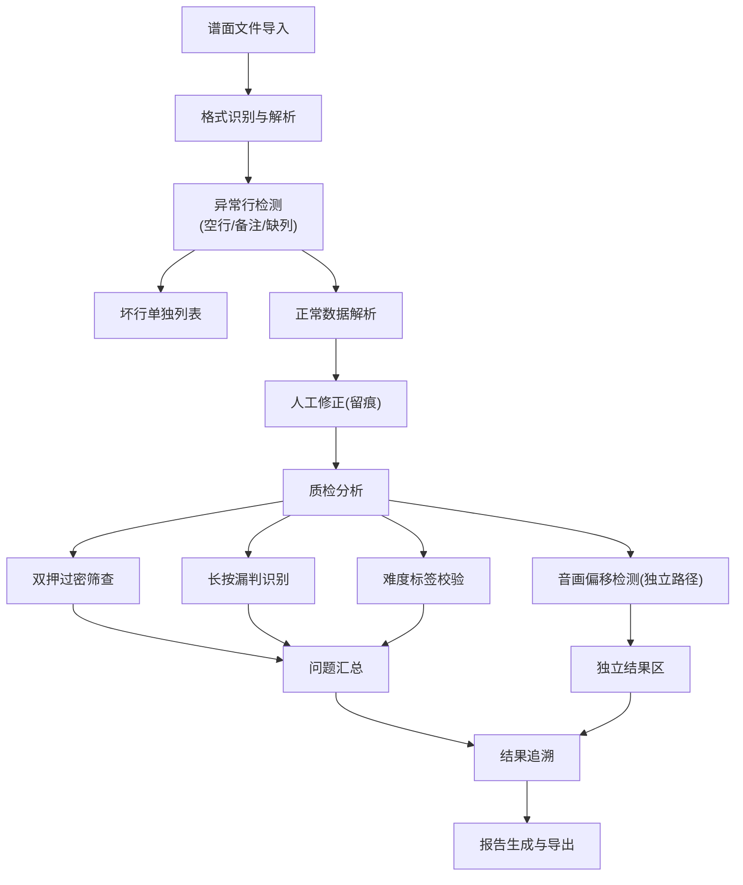

## 1. 产品概述

节奏游戏谱面质检系统是面向独立游戏制作人的专业工具，解决谱面文件批量质检时的人工疏漏问题，支持从导入、解析、修正到报告输出的全流程追溯。

- 核心目标：自动化检测音画偏移、双押过密、长按漏判等问题，保留人工修正痕迹，提供可追溯的质检链路
- 目标用户：独立游戏制作人、节奏游戏谱面师、QA质检人员

## 2. 核心功能

### 2.1 用户角色

| 角色 | 说明 | 核心权限 |
|------|------|----------|
| 独立游戏制作人 | 系统主要使用者 | 完整质检流程、结果追溯、报告导出 |
| 谱面师 | 谱面制作人员 | 查看质检结果、修正反馈 |

### 2.2 功能模块

1. **谱面导入页**：文件上传、样例导入、目录选择、格式解析
2. **数据解析页**：谱面内容展示、坏行列表、空行/备注/缺列处理、人工修正留痕
3. **质检分析页**：音画偏移检测、双押过密筛查、长按漏判识别、难度标签校验
4. **结果追溯页**：从单条问题追溯解析过程、节奏对齐记录、难度统计数据
5. **报告输出页**：质检报告生成、失败路径高亮、多格式导出

### 2.3 页面详情

| 页面名称 | 模块名称 | 功能描述 |
|-----------|-------------|---------------------|
| 谱面导入页 | 文件上传区 | 拖拽上传、目录选择、支持多格式谱面文件 |
| 谱面导入页 | 样例导入 | 内置测试样例一键导入，含音画偏移场景 |
| 谱面导入页 | 导入预览 | 解析前文件内容预览、格式识别 |
| 数据解析页 | 谱面内容展示 | 结构化展示note信息、时间轴、难度标签 |
| 数据解析页 | 坏行处理 | 单独列出空行、备注、缺列等异常行 |
| 数据解析页 | 修正留痕 | 记录人工修改内容、修改人、修改时间 |
| 质检分析页 | 音画偏移检测 | 独立检测模块，结果不混入正常列表 |
| 质检分析页 | 双押过密筛查 | 可配置时间阈值，筛选密押问题 |
| 质检分析页 | 长按漏判识别 | 检测首尾时间不匹配、意外截断的长按 |
| 质检分析页 | 难度标签校验 | 检查标签完整性、格式正确性 |
| 结果追溯页 | 问题溯源 | 从单条结果跳转至谱面解析、节奏对齐、难度统计 |
| 结果追溯页 | 链路可视化 | 展示完整质检处理链路，高亮失败路径 |
| 报告输出页 | 报告生成 | 汇总质检结果，按问题类型分类 |
| 报告输出页 | 失败路径高亮 | 单独展示音画偏移等严重问题的处理路径 |
| 报告输出页 | 多格式导出 | 支持JSON、CSV、PDF导出 |

## 3. 核心流程

用户从导入谱面文件开始，系统自动解析并识别异常行，人工可进行修正并留痕；随后进行多维度质检分析，音画偏移等严重问题单独处理；所有结果支持追溯到原始解析过程，最终生成完整质检报告。

## 4. 用户界面设计

### 4.1 设计风格

- **主色调**：深靛蓝 #1E3A5F（专业、精准），配合荧光绿 #00FF88 作为成功指示，珊瑚红 #FF6B6B 作为错误警告
- **按钮风格**：微扁平设计，圆角 4px，悬停时有微妙的阴影变化
- **字体**：标题使用 JetBrains Mono（等宽字体，体现技术感），正文使用 PingFang SC
- **布局风格**：左右分栏+顶部导航，卡片式内容块，左侧为导航/数据列表，右侧为详情展示
- **图标风格**：线性图标，简洁现代，使用 Remix Icon 图标库

### 4.2 页面设计概述

| 页面名称 | 模块名称 | UI元素 |
|-----------|-------------|-------------|
| 谱面导入页 | 文件上传区 | 拖拽区域虚线边框，悬停高亮，文件图标动态效果 |
| 数据解析页 | 坏行列表 | 红色背景警示，行号高亮，悬浮显示错误详情 |
| 质检分析页 | 音画偏移卡片 | 橙色边框强调，独立区域展示，失败路径用红色连接线 |
| 结果追溯页 | 链路可视化 | 时间轴样式，可点击节点跳转，失败节点闪烁提示 |
| 报告输出页 | 问题分类标签 | 颜色编码标签，数字角标，点击筛选对应问题 |

### 4.3 响应式

- 桌面端优先（1920px），适配 1440px、1024px
- 平板端调整为上下布局，左侧导航折叠为侧边栏
- 移动端简化展示，核心功能优先，详细数据可展开

### 4.4 交互细节

- 页面加载时使用骨架屏，避免空白
- 数据解析进度条带步骤提示
- 追溯链路节点悬停显示详情预览
- 修正留痕使用时间线展示，支持展开/折叠
