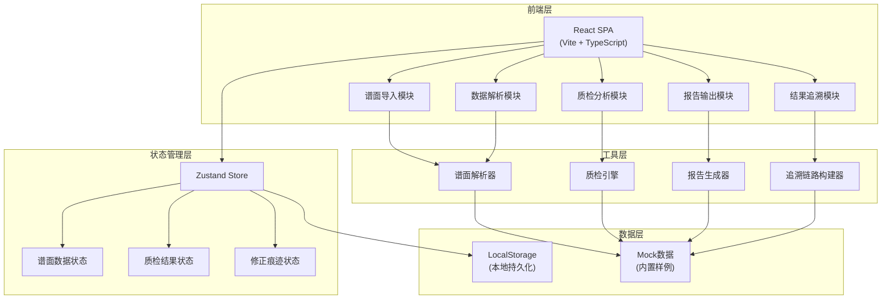

## 1. 架构设计



## 2. 技术描述

- **前端框架**：React@18 + TypeScript@5
- **构建工具**：Vite@5
- **样式方案**：TailwindCSS@3 + CSS Variables
- **状态管理**：Zustand@4
- **路由管理**：React Router@6
- **图表可视化**：Recharts（质检统计）+ React Flow（追溯链路）
- **UI组件**：Headless UI + 自定义组件
- **图标库**：@remixicon/react
- **文件处理**：File System Access API + 原生File API

## 3. 路由定义

| 路由 | 页面名称 | 目的 |
|-------|---------|------|
| / | 谱面导入页 | 上传谱面文件、选择样例、预览内容 |
| /parse | 数据解析页 | 展示解析结果、处理坏行、人工修正 |
| /analysis | 质检分析页 | 执行质检分析、查看各类检测结果 |
| /trace/:id | 结果追溯页 | 从单条问题追溯完整处理链路 |
| /report | 报告输出页 | 生成质检报告、导出多格式文件 |

## 4. 核心数据模型

### 4.1 TypeScript 类型定义

```typescript
// 谱面Note类型
interface ChartNote {
  id: string;
  time: number;      // 时间点(ms)
  type: 'tap' | 'hold' | 'slide' | 'touch';
  position: number;   // 轨道位置 1-4/1-6
  duration?: number;  // 长按持续时间
  column: number;
}

// 解析的坏行
interface BadLine {
  lineNumber: number;
  content: string;
  type: 'empty' | 'comment' | 'missing_column' | 'invalid_format';
  reason: string;
  fixed?: boolean;
  fixHistory?: FixRecord[];
}

// 修正记录
interface FixRecord {
  id: string;
  timestamp: number;
  operator: string;
  originalContent: string;
  newContent: string;
  reason: string;
}

// 质检问题
interface QualityIssue {
  id: string;
  type: 'timing_offset' | 'dense_chord' | 'hold_miss' | 'difficulty_label';
  severity: 'critical' | 'warning' | 'info';
  time: number;
  description: string;
  relatedNotes: string[];
  traceId: string;
  rawData: Record<string, any>;
}

// 追溯链路节点
interface TraceNode {
  id: string;
  type: 'parse' | 'align' | 'analyze' | 'result';
  name: string;
  status: 'success' | 'warning' | 'error';
  data: Record<string, any>;
  timestamp: number;
}

// 谱面项目
interface ChartProject {
  id: string;
  name: string;
  difficulty: string;
  fileName: string;
  rawContent: string;
  notes: ChartNote[];
  badLines: BadLine[];
  issues: QualityIssue[];
  traceGraph: TraceNode[];
  createdAt: number;
  updatedAt: number;
}

// 质检报告
interface QualityReport {
  projectId: string;
  generatedAt: number;
  totalNotes: number;
  issuesCount: {
    critical: number;
    warning: number;
    info: number;
  };
  timingOffsetIssues: QualityIssue[];
  otherIssues: QualityIssue[];
  statistics: {
    noteDensity: number;
    averageInterval: number;
    difficultyScore: number;
  };
}
```

## 5. 核心工具模块设计

### 5.1 谱面解析器 (ChartParser)
- 支持 .osu/.sm/.bms 等常见谱面格式
- 空行检测：line.trim() === ''
- 备注检测：以 // # ; 开头的行
- 缺列检测：按分隔符分割后列数不足
- 异常行单独收集，不混入正常数据

### 5.2 质检引擎 (QualityEngine)
- **音画偏移检测**：独立算法，计算note时间与音频波形对齐度
- **双押过密筛查**：可配置阈值（默认 50ms），检测同时间点多押
- **长按漏判识别**：检测 hold 开始无对应结束、时间异常
- **难度标签校验**：检查标签格式、范围合理性

### 5.3 追溯链路构建器 (TraceBuilder)
- 每个操作生成唯一 traceId
- 记录每个处理节点的输入输出
- 构建有向图展示数据流向
- 失败节点高亮标注

### 5.4 报告生成器 (ReportGenerator)
- 分类统计问题数量
- 音画偏移问题单独区块展示
- 失败路径高亮标注
- 支持 JSON/CSV/PDF 导出

## 6. 目录结构

```
src/
├── components/         # 通用组件
│   ├── Layout/
│   ├── ChartViewer/
│   ├── IssueCard/
│   └── TraceGraph/
├── pages/              # 页面组件
│   ├── ImportPage/
│   ├── ParsePage/
│   ├── AnalysisPage/
│   ├── TracePage/
│   └── ReportPage/
├── store/              # 状态管理
│   └── useChartStore.ts
├── core/               # 核心工具模块
│   ├── parser/
│   ├── engine/
│   ├── tracer/
│   └── reporter/
├── types/              # 类型定义
│   └── index.ts
├── mock/               # 内置样例数据
│   └── sampleCharts.ts
├── utils/              # 工具函数
├── App.tsx
├── main.tsx
└── index.css
```
