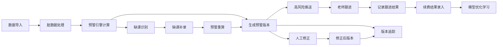

## 1. 产品概述
音乐课程续费预警系统是一款面向教培校长的AI/ML复盘工具，解决"老师到退费前才发现学生缺课、练习少、家长反馈变差"的核心痛点。系统支持样本、版本、人工修正和分组指标四维度互相跳转，处理脏数据（学员备注、缺字段上课记录、晚到打卡），提供明确的缺课补录结论和可操作的续费建议。

- 目标用户：教培校长、教学主管、课程顾问
- 核心价值：提前7-14天识别续费风险，将被动退费转为主动跟进

## 2. 核心功能

### 2.1 用户角色

| 角色 | 注册方式 | 核心权限 |
|------|----------|----------|
| 校长/管理员 | 本地账号登录 | 查看全局预警、版本对比、分组统计、数据导入导出 |
| 教学主管 | 校长分配 | 查看所带班级预警、人工修正归因、记录跟进结果 |
| 课程顾问 | 校长分配 | 查看负责学员预警、记录续费沟通结果 |

### 2.2 功能模块

1. **预警仪表盘**：风险学员概览、评分分布、预警趋势、跟进状态统计
2. **学员样本页**：学员档案、上课记录、练习打卡、家长反馈、预警详情
3. **版本追踪页**：预警版本列表、评分变化对比、归因变化追踪
4. **人工修正页**：修正记录列表、修正前后对比、修正效果统计
5. **分组指标页**：按教师/课程/年龄段/续费周期分组对比
6. **缺课补录页**：缺课记录补录、补录后预警重算、补录结论导出
7. **数据导入页**：Excel/CSV批量导入、脏数据预览、字段映射

### 2.3 页面详情

| 页面名称 | 模块名称 | 功能描述 |
|----------|----------|----------|
| 预警仪表盘 | 风险概览卡 | 红/黄/绿三级预警学员数量统计，点击跳转对应学员列表 |
| 预警仪表盘 | 趋势图表 | 近30天预警数量变化曲线，可按分组筛选 |
| 预警仪表盘 | 待跟进列表 | 高风险学员TOP10，显示最近一次跟进时间 |
| 学员样本页 | 学员信息卡 | 基本信息、档案备注、课程类型、剩余课时 |
| 学员样本页 | 行为时间线 | 上课/缺课/打卡/反馈时间轴，异常点高亮标记 |
| 学员样本页 | 预警详情卡 | 当前评分、各维度得分、与上次版本对比、归因说明 |
| 学员样本页 | 跟进记录 | 老师跟进历史，支持新增跟进记录 |
| 版本追踪页 | 版本列表 | 每次数据变动生成的预警版本，带时间戳和版本号 |
| 版本追踪页 | 版本对比 | 选择两个版本对比评分变化、归因变化、学员数量变化 |
| 版本追踪页 | 归因追溯 | 点击某个学员的评分变化，查看具体是哪些数据变动导致 |
| 人工修正页 | 修正列表 | 所有人工修正记录，含修正人、修正时间、修正原因 |
| 人工修正页 | 修正操作 | 对自动预警评分进行加减分、调整归因、标记特殊情况 |
| 人工修正页 | 效果统计 | 修正后学员续费转化率对比，验证修正准确性 |
| 分组指标页 | 分组选择器 | 按教师/课程/年龄段/续费周期等维度分组 |
| 分组指标页 | 指标对比表 | 各组预警率、续费率、缺课率、练习完成率对比 |
| 分组指标页 | 异常组识别 | 自动标记指标显著偏离均值的组 |
| 缺课补录页 | 待补录列表 | 识别缺课但未标注原因的记录，高亮显示 |
| 缺课补录页 | 补录表单 | 录入缺课原因（病假/事假/厌学/其他）、补课前/后情况、家长沟通记录 |
| 缺课补录页 | 预警重算 | 补录后立即重算该学员预警评分，显示变化量 |
| 缺课补录页 | 补录结论 | 生成明确结论："补课后风险降低"/"需持续跟进"/"建议重点沟通" |
| 数据导入页 | 文件上传 | 支持Excel/CSV格式，拖拽上传 |
| 数据导入页 | 脏数据预览 | 缺字段、格式错误、异常值高亮显示，可单独处理 |
| 数据导入页 | 字段映射 | 自动匹配常用字段，支持手动调整映射关系 |

## 3. 核心流程

### 3.1 日常预警流程
1. 数据定时导入（上课记录、练习打卡、家长反馈）
2. 系统自动清洗脏数据，标记异常
3. 预警引擎计算所有学员评分，生成新版本
4. 高风险学员推送到待跟进列表
5. 老师查看详情，联系家长，记录跟进
6. 续费结果录入，系统自动学习优化模型

### 3.2 缺课补录流程
1. 系统识别缺课但无原因的记录
2. 老师在补录页录入缺课原因和沟通情况
3. 系统触发预警重算，显示评分变化
4. 生成明确补录结论，指导后续动作
5. 补录记录归档，可在版本历史中追溯

### 3.3 人工修正流程
1. 老师发现自动预警与实际情况不符
2. 在人工修正页调整评分或归因，填写修正理由
3. 修正记录与自动版本关联，可随时对比
4. 系统记录修正效果，用于后续模型优化

## 4. 用户界面设计

### 4.1 设计风格
- 主色调：深邃海军蓝 `#0A2540`（专业、信任），辅以琥珀橙 `#F59E0B`（预警、行动号召）
- 辅助色：风险红 `#EF4444`、警告黄 `#F59E0B`、健康绿 `#10B981`，三色用于预警等级标识
- 按钮风格：方中带圆（border-radius: 6px），实心按钮带微妙阴影，悬停有轻微上浮效果
- 字体：标题使用 Playfair Display（优雅、教育感），正文使用 Noto Sans SC（清晰易读）
- 布局风格：卡片式布局，信息密度适中，左侧固定导航，主内容区可横向滚动查看多维度数据
- 图标风格：线性图标为主，关键动作使用填充图标，统一16px/20px/24px三档尺寸

### 4.2 页面设计概述

| 页面名称 | 模块名称 | UI元素 |
|----------|----------|--------|
| 预警仪表盘 | 风险概览卡 | 三色渐变卡片，大号数字，底部趋势箭头，点击跳转动画 |
| 预警仪表盘 | 趋势图表 | 平滑折线图，预警阈值虚线标注，hover显示详情tooltip |
| 预警仪表盘 | 待跟进列表 | 斑马纹表格，高风险行红色背景闪烁提示，一键跳转学员页 |
| 学员样本页 | 行为时间线 | 垂直时间轴，不同事件用不同颜色标记，异常事件带脉冲动画 |
| 学员样本页 | 预警评分卡 | 半圆形仪表盘动画，各维度进度条对比，版本切换下拉选择 |
| 版本追踪页 | 版本列表 | 横向时间轴卡片，版本号+时间戳，点击展开详情 |
| 版本追踪页 | 对比视图 | 左右分栏对比，差异点红色高亮标注，支持联动滚动 |
| 人工修正页 | 修正表单 | 侧滑抽屉表单，修正前后数值对比预览，理由必填校验 |
| 分组指标页 | 指标对比表 | 可排序表格，异常值背景色标注，支持多列筛选 |
| 缺课补录页 | 补录表单 | 分步向导，原因选择+详情填写+结论预览，必填项星标 |
| 数据导入页 | 脏数据预览 | 表格行高亮，错误原因tooltip，单条/批量修复按钮 |

### 4.3 响应式设计
- 桌面端（>1280px）：左侧导航固定240px，主内容区多栏布局，四维度导航横向排列
- 平板端（768px-1280px）：左侧导航可折叠，主内容区双栏布局，四维度导航可横向滚动
- 移动端（<768px）：底部标签导航，单栏流式布局，关键数据卡片优先展示
- 触摸优化：所有可点击区域≥44x44px，支持下拉刷新、左右滑动切换维度

### 4.4 动效设计
- 页面加载：骨架屏渐入，内容卡片按序上浮（staggered animation）
- 预警评分：半圆形仪表盘从0到目标值的动画（1.2s ease-out）
- 时间线：滚动触发，节点逐个淡入
- 版本切换：数据交叉溶解（cross-fade）过渡
- 按钮点击：轻微缩放+涟漪效果
- 高风险提示：呼吸灯动画（pulse），每秒一次
