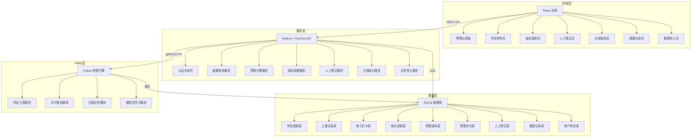
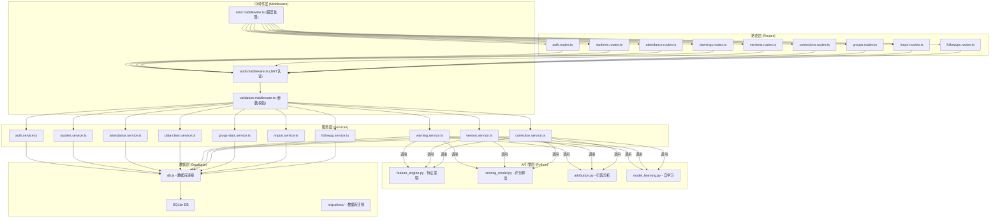
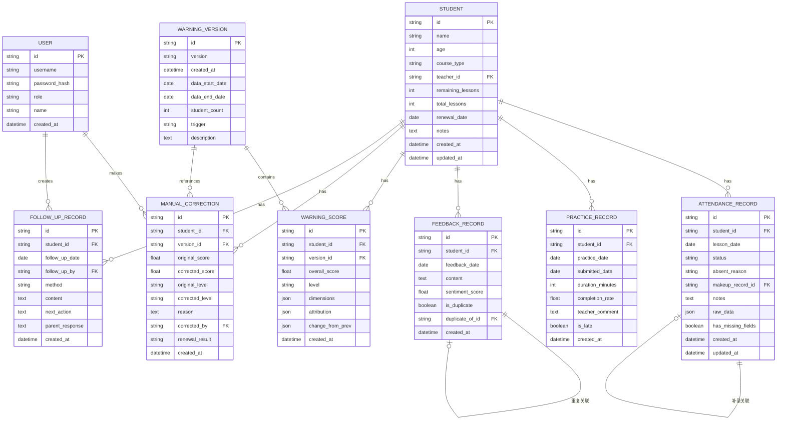

## 1. 架构设计



## 2. 技术描述

- **前端**：React@18 + TypeScript + Vite + TailwindCSS@3 + Recharts + React Router@6
- **后端**：Node.js + Express@4 + TypeScript
- **AI/ML引擎**：Python@3.10 + scikit-learn + pandas + numpy
- **数据库**：SQLite3（本地部署，零配置）
- **数据导入**：xlsx（Excel解析）+ csv-parse（CSV解析）+ multer（文件上传）
- **跨进程通信**：Node.js通过child_process调用Python脚本，使用JSON格式传递数据
- **初始化工具**：Vite 脚手架初始化前端项目，Express Generator 初始化后端项目

## 3. 路由定义

| 路由 | 页面/用途 |
|------|----------|
| `/` | 重定向到 `/dashboard` |
| `/dashboard` | 预警仪表盘 |
| `/students` | 学员样本列表页 |
| `/students/:id` | 学员详情页（含预警、跟进、历史） |
| `/versions` | 版本追踪列表页 |
| `/versions/compare` | 版本对比页 |
| `/corrections` | 人工修正列表页 |
| `/groups` | 分组指标页 |
| `/makeup` | 缺课补录页 |
| `/import` | 数据导入页 |
| `/login` | 登录页 |
| `/api/*` | API接口前缀 |

## 4. API 定义

```typescript
// 通用响应结构
interface ApiResponse<T> {
  success: boolean;
  data?: T;
  error?: string;
  message?: string;
}

// 学员相关类型
interface Student {
  id: string;
  name: string;
  age: number;
  courseType: string;
  teacherId: string;
  remainingLessons: number;
  totalLessons: number;
  renewalDate: string;
  notes: string;
  createdAt: string;
  updatedAt: string;
}

// 上课记录类型
interface AttendanceRecord {
  id: string;
  studentId: string;
  lessonDate: string;
  status: 'attended' | 'absent' | 'late' | 'makeup';
  absentReason?: 'sick' | 'leave' | 'tired' | 'other' | null;
  makeupRecordId?: string;
  notes?: string;
  rawData?: Record<string, any>; // 存储原始脏数据
  hasMissingFields: boolean;
}

// 练习打卡类型
interface PracticeRecord {
  id: string;
  studentId: string;
  practiceDate: string;
  submittedDate: string; // 可能晚于practiceDate
  durationMinutes: number;
  completionRate: number;
  teacherComment?: string;
  isLate: boolean;
}

// 家长反馈类型
interface FeedbackRecord {
  id: string;
  studentId: string;
  feedbackDate: string;
  content: string;
  sentimentScore: number; // -1 到 1
  isDuplicate: boolean;
  duplicateOfId?: string;
}

// 预警版本类型
interface WarningVersion {
  id: string;
  version: string; // 如 v2024.05.31.1
  createdAt: string;
  dataDateRange: { start: string; end: string };
  studentCount: number;
  trigger: 'auto' | 'manual' | 'makeup' | 'correction';
  description: string;
}

// 预警评分类型
interface WarningScore {
  id: string;
  studentId: string;
  versionId: string;
  overallScore: number; // 0-100，越高风险越大
  level: 'red' | 'yellow' | 'green';
  dimensions: {
    absence: number;
    practice: number;
    feedback: number;
    lessonProgress: number;
  };
  attribution: string[]; // 主要归因
  changeFromPrev?: {
    scoreDiff: number;
    reasons: string[];
  };
}

// 人工修正类型
interface ManualCorrection {
  id: string;
  studentId: string;
  versionId: string;
  originalScore: number;
  correctedScore: number;
  originalLevel: string;
  correctedLevel: string;
  reason: string;
  correctedBy: string;
  createdAt: string;
  renewalResult?: 'renewed' | 'not_renewed' | 'pending';
}

// 跟进记录类型
interface FollowUpRecord {
  id: string;
  studentId: string;
  followUpDate: string;
  followUpBy: string;
  method: 'phone' | 'wechat' | 'in_person' | 'other';
  content: string;
  nextAction?: string;
  parentResponse?: string;
}

// API 端点列表
interface APIRoutes {
  // 认证
  'POST /api/auth/login': { req: { username: string; password: string }; res: { token: string; user: User } };
  
  // 学员
  'GET /api/students': { req: QueryParams; res: { list: Student[]; total: number } };
  'GET /api/students/:id': { req: null; res: Student & { latestScore: WarningScore } };
  'POST /api/students': { req: Partial<Student>; res: Student };
  
  // 上课记录
  'GET /api/students/:id/attendance': { req: null; res: AttendanceRecord[] };
  'PATCH /api/attendance/:id': { req: Partial<AttendanceRecord>; res: AttendanceRecord };
  
  // 缺课补录
  'GET /api/makeup/pending': { req: null; res: AttendanceRecord[] };
  'POST /api/makeup': { req: MakeupRequest; res: { record: AttendanceRecord; newScore: WarningScore; conclusion: string } };
  
  // 预警
  'GET /api/warnings/current': { req: QueryParams; res: { list: WarningScore[]; total: number } };
  'GET /api/warnings/student/:id': { req: { versionId?: string }; res: WarningScore[] };
  'POST /api/warnings/recalculate': { req: { studentId?: string; reason: string }; res: WarningVersion };
  
  // 版本
  'GET /api/versions': { req: QueryParams; res: { list: WarningVersion[]; total: number } };
  'GET /api/versions/:id': { req: null; res: WarningVersion & { scores: WarningScore[] } };
  'GET /api/versions/compare/:v1/:v2': { req: null; res: VersionComparison };
  
  // 人工修正
  'GET /api/corrections': { req: QueryParams; res: { list: ManualCorrection[]; total: number } };
  'POST /api/corrections': { req: CreateCorrectionRequest; res: ManualCorrection };
  'GET /api/corrections/effectiveness': { req: null; res: CorrectionEffectiveness };
  
  // 分组统计
  'GET /api/groups': { req: { dimension: string }; res: GroupStats[] };
  
  // 数据导入
  'POST /api/import/upload': { req: FormData; res: ImportPreview };
  'POST /api/import/confirm': { req: ImportConfirm; res: ImportResult };
  
  // 跟进记录
  'GET /api/students/:id/followups': { req: null; res: FollowUpRecord[] };
  'POST /api/followups': { req: FollowUpRecord; res: FollowUpRecord };
}
```

## 5. 服务端架构图



## 6. 数据模型

### 6.1 数据模型ER图



### 6.2 DDL 语句

```sql
-- 用户表
CREATE TABLE users (
    id TEXT PRIMARY KEY,
    username TEXT UNIQUE NOT NULL,
    password_hash TEXT NOT NULL,
    role TEXT NOT NULL CHECK (role IN ('admin', 'teacher', 'consultant')),
    name TEXT NOT NULL,
    created_at DATETIME DEFAULT CURRENT_TIMESTAMP
);

-- 学员表
CREATE TABLE students (
    id TEXT PRIMARY KEY,
    name TEXT NOT NULL,
    age INTEGER,
    course_type TEXT,
    teacher_id TEXT REFERENCES users(id),
    remaining_lessons INTEGER DEFAULT 0,
    total_lessons INTEGER DEFAULT 0,
    renewal_date DATE,
    notes TEXT,
    created_at DATETIME DEFAULT CURRENT_TIMESTAMP,
    updated_at DATETIME DEFAULT CURRENT_TIMESTAMP
);

-- 上课记录表
CREATE TABLE attendance_records (
    id TEXT PRIMARY KEY,
    student_id TEXT NOT NULL REFERENCES students(id),
    lesson_date DATE NOT NULL,
    status TEXT NOT NULL CHECK (status IN ('attended', 'absent', 'late', 'makeup')),
    absent_reason TEXT CHECK (absent_reason IN ('sick', 'leave', 'tired', 'other', NULL)),
    makeup_record_id TEXT REFERENCES attendance_records(id),
    notes TEXT,
    raw_data TEXT, -- JSON格式存储原始数据
    has_missing_fields BOOLEAN DEFAULT FALSE,
    created_at DATETIME DEFAULT CURRENT_TIMESTAMP,
    updated_at DATETIME DEFAULT CURRENT_TIMESTAMP
);

-- 练习打卡表
CREATE TABLE practice_records (
    id TEXT PRIMARY KEY,
    student_id TEXT NOT NULL REFERENCES students(id),
    practice_date DATE NOT NULL,
    submitted_date DATE NOT NULL,
    duration_minutes INTEGER DEFAULT 0,
    completion_rate REAL DEFAULT 0,
    teacher_comment TEXT,
    is_late BOOLEAN DEFAULT FALSE,
    created_at DATETIME DEFAULT CURRENT_TIMESTAMP
);

-- 家长反馈表
CREATE TABLE feedback_records (
    id TEXT PRIMARY KEY,
    student_id TEXT NOT NULL REFERENCES students(id),
    feedback_date DATE NOT NULL,
    content TEXT NOT NULL,
    sentiment_score REAL DEFAULT 0,
    is_duplicate BOOLEAN DEFAULT FALSE,
    duplicate_of_id TEXT REFERENCES feedback_records(id),
    created_at DATETIME DEFAULT CURRENT_TIMESTAMP
);

-- 预警版本表
CREATE TABLE warning_versions (
    id TEXT PRIMARY KEY,
    version TEXT NOT NULL UNIQUE,
    created_at DATETIME DEFAULT CURRENT_TIMESTAMP,
    data_start_date DATE NOT NULL,
    data_end_date DATE NOT NULL,
    student_count INTEGER NOT NULL,
    trigger TEXT NOT NULL CHECK (trigger IN ('auto', 'manual', 'makeup', 'correction')),
    description TEXT
);

-- 预警评分表
CREATE TABLE warning_scores (
    id TEXT PRIMARY KEY,
    student_id TEXT NOT NULL REFERENCES students(id),
    version_id TEXT NOT NULL REFERENCES warning_versions(id),
    overall_score REAL NOT NULL,
    level TEXT NOT NULL CHECK (level IN ('red', 'yellow', 'green')),
    dimensions TEXT NOT NULL, -- JSON
    attribution TEXT NOT NULL, -- JSON
    change_from_prev TEXT, -- JSON
    created_at DATETIME DEFAULT CURRENT_TIMESTAMP,
    UNIQUE(student_id, version_id)
);

-- 人工修正表
CREATE TABLE manual_corrections (
    id TEXT PRIMARY KEY,
    student_id TEXT NOT NULL REFERENCES students(id),
    version_id TEXT NOT NULL REFERENCES warning_versions(id),
    original_score REAL NOT NULL,
    corrected_score REAL NOT NULL,
    original_level TEXT NOT NULL,
    corrected_level TEXT NOT NULL,
    reason TEXT NOT NULL,
    corrected_by TEXT NOT NULL REFERENCES users(id),
    renewal_result TEXT CHECK (renewal_result IN ('renewed', 'not_renewed', 'pending')),
    created_at DATETIME DEFAULT CURRENT_TIMESTAMP
);

-- 跟进记录表
CREATE TABLE follow_up_records (
    id TEXT PRIMARY KEY,
    student_id TEXT NOT NULL REFERENCES students(id),
    follow_up_date DATE NOT NULL,
    follow_up_by TEXT NOT NULL REFERENCES users(id),
    method TEXT NOT NULL CHECK (method IN ('phone', 'wechat', 'in_person', 'other')),
    content TEXT NOT NULL,
    next_action TEXT,
    parent_response TEXT,
    created_at DATETIME DEFAULT CURRENT_TIMESTAMP
);

-- 索引
CREATE INDEX idx_attendance_student ON attendance_records(student_id);
CREATE INDEX idx_attendance_date ON attendance_records(lesson_date);
CREATE INDEX idx_attendance_status ON attendance_records(status);
CREATE INDEX idx_practice_student ON practice_records(student_id);
CREATE INDEX idx_practice_date ON practice_records(practice_date);
CREATE INDEX idx_feedback_student ON feedback_records(student_id);
CREATE INDEX idx_warning_score_student ON warning_scores(student_id);
CREATE INDEX idx_warning_score_version ON warning_scores(version_id);
CREATE INDEX idx_warning_score_level ON warning_scores(level);
CREATE INDEX idx_correction_student ON manual_corrections(student_id);
CREATE INDEX idx_followup_student ON follow_up_records(student_id);

-- 初始数据 - 默认管理员账号
INSERT INTO users (id, username, password_hash, role, name) VALUES 
('admin-001', 'admin', '$2b$10$default_password_hash_change_me', 'admin', '系统管理员');
```
