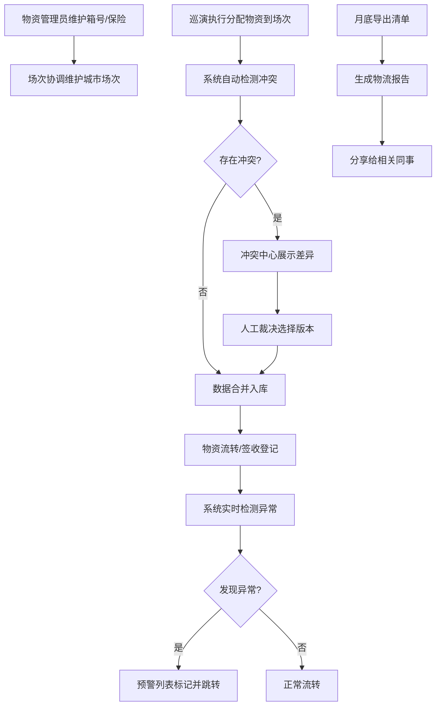

## 1. 产品概述

乐团巡演物流清单系统，用于替代手工台账，解决城市场次与签收照片数据不一致、物资追踪混乱的问题。核心目标是围绕物资追踪主线，实现操作留痕、冲突可视化、异常预警和月度复盘。

- 主要用途：管理乐团巡演物资流转、城市场次安排、签收记录、保险信息
- 目标用户：巡演执行人员、物资管理员、场次协调人员、财务/保险负责人
- 核心价值：数据来源可追溯、冲突透明化、异常实时预警、报表可直接共享

## 2. 核心功能

### 2.1 用户角色

| 角色 | 注册方式 | 核心权限 |
|------|----------|----------|
| 巡演执行 | 内部账号 | 维护物资清单、查看所有数据、导出报告 |
| 物资管理员 | 内部账号 | 维护物资箱号、签收记录、保险信息 |
| 场次协调 | 内部账号 | 维护城市场次信息、查看物资状态 |
| 只读用户 | 内部账号 | 查看物流报告、城市状态 |

### 2.2 功能模块

1. **物资清单管理**：箱号管理、物资明细、保险信息、状态追踪
2. **城市场次管理**：城市列表、演出日期、场地信息、场次状态
3. **变更历史**：所有操作留痕、来源记录、前后变化对比
4. **冲突中心**：物资与场次数据冲突展示、人工裁决、合并记录
5. **异常预警**：箱号重复检测、签收缺失提醒、保险过期预警
6. **物流报告**：城市状态汇总、可分享报告、月度导出清单

### 2.3 页面详情

| 页面名称 | 模块名称 | 功能描述 |
|----------|----------|----------|
| 物资清单首页 | 总览仪表盘 | 物资总览、异常统计、今日待办、快速入口 |
| 物资清单首页 | 箱号列表 | 箱号查询、筛选、批量操作、重复标记 |
| 物资详情 | 基本信息 | 箱号、物资明细、重量、体积、保险信息 |
| 物资详情 | 流转记录 | 每个城市的到达/签收时间、照片、操作人 |
| 物资详情 | 变更历史 | 每次修改的来源、前后值对比、时间戳 |
| 城市场次 | 场次列表 | 城市、日期、场地、状态、关联物资 |
| 城市场次 | 场次编辑 | 场次信息维护、关联物资分配 |
| 冲突中心 | 冲突列表 | 待处理冲突、冲突类型、涉及数据对比 |
| 冲突中心 | 冲突裁决 | 选择保留版本、备注、合并记录 |
| 异常预警 | 预警列表 | 箱号重复、签收缺失、保险过期，带记录跳转 |
| 物流报告 | 报告生成 | 按城市/时间范围生成报告、状态口径说明 |
| 物流报告 | 导出分享 | PDF/Excel导出、一键分享链接 |

## 3. 核心流程

## 4. 用户界面设计

### 4.1 设计风格
- **主色调**：深邃藏青 (#0F3460) - 代表专业与信任
- **辅助色**：警示橙 (#FF6B35) - 异常预警；确认绿 (#2ECC71) - 正常状态；冲突红 (#E74C3C) - 需处理
- **中性色**：米白背景 (#FAFAF7)、深灰文字 (#2C3E50)、浅灰边框 (#E0E0E0)
- **按钮风格**：微圆角 (4px)、轻微阴影、悬停时颜色加深
- **字体**：标题用 Noto Serif SC（稳重印刷感），正文用 Source Han Sans CN（清晰易读）
- **布局风格**：左侧导航 + 右侧内容区，卡片式分组，数据表格带斑马纹
- **图标风格**：线性图标，统一 20px 尺寸，颜色与功能状态对应

### 4.2 页面设计概览

| 页面名称 | 模块名称 | UI 元素 |
|----------|----------|----------|
| 物资清单首页 | 总览仪表盘 | 统计卡片带微动画、异常计数醒目显示、状态色标 |
| 物资清单首页 | 箱号列表 | 斑马纹表格、重复箱号红底高亮、可展开行 |
| 物资详情 | 变更历史 | 左右对比布局、删除线显示旧值、绿色高亮新值 |
| 冲突中心 | 冲突列表 | 三列对比（物资版/场次版/合并后）、裁决按钮 |
| 异常预警 | 预警列表 | 分类标签、直达记录链接、处理状态切换 |
| 物流报告 | 报告页面 | 状态口径说明固定在顶部、可折叠章节、打印优化 |

### 4.3 响应式
- 桌面优先设计，最小支持 1280px 宽度
- 平板端：导航折叠为图标，表格支持横向滚动
- 移动端：卡片堆叠布局，关键数据优先展示
- 所有表格支持触摸滑动，按钮最小 44px 触摸区域

### 4.4 交互细节
- 页面加载：顶部进度条 + 内容淡入
- 表格行：悬停时背景微亮，点击展开详情
- 冲突对比：差异字符级高亮
- 异常提醒：顶部 Toast 通知 + 导航角标
- 导出操作：进度条 + 完成后下载提示
