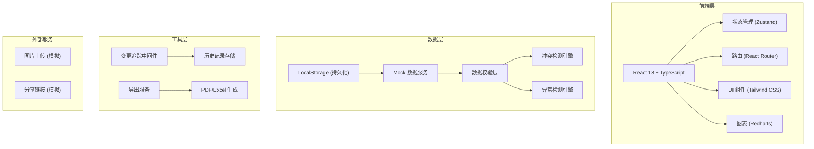
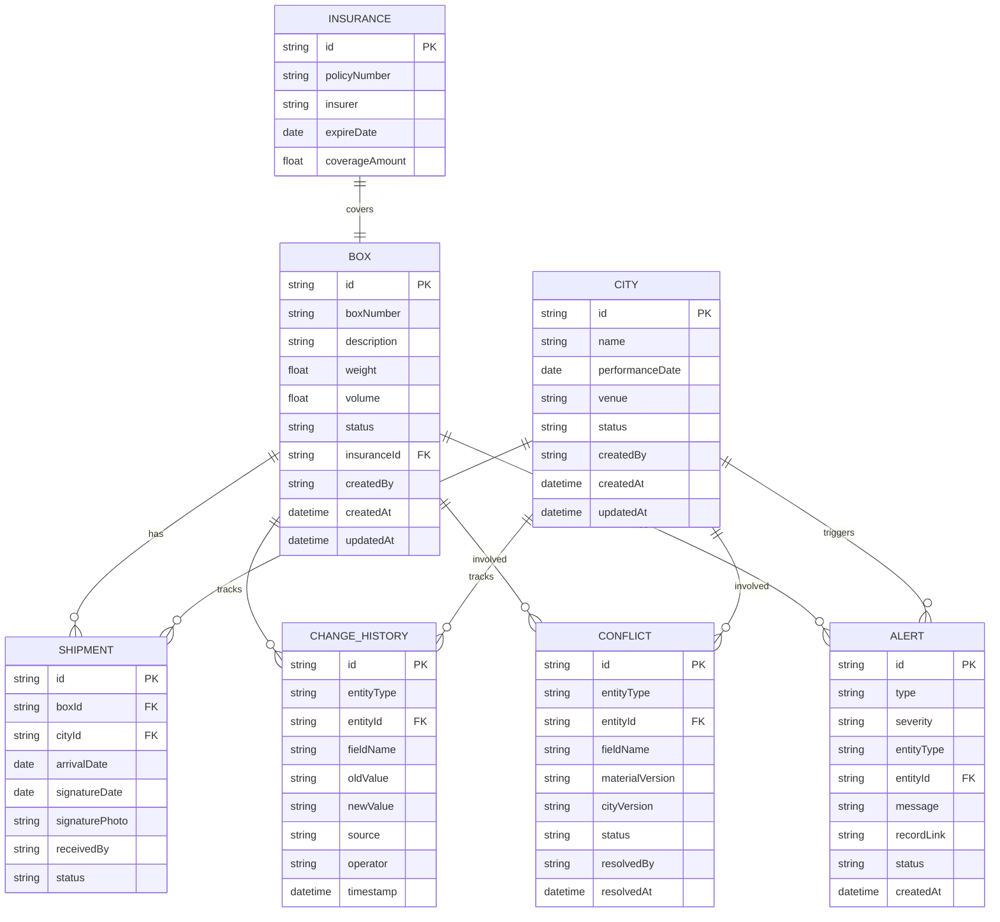

## 1. 架构设计



## 2. 技术描述

- **前端框架**: React@18 + TypeScript@5
- **构建工具**: Vite@5
- **样式方案**: TailwindCSS@3
- **状态管理**: Zustand@4 (轻量、支持中间件、适合变更追踪)
- **路由**: React Router@6
- **图标**: Lucide React (线性图标，符合设计风格)
- **表格**: TanStack Table@8 (高性能、支持展开行)
- **图表**: Recharts@2 (仪表盘统计图表)
- **导出**: SheetJS (Excel) + jsPDF (PDF)
- **日期处理**: date-fns@3
- **数据持久化**: LocalStorage + 自定义中间件
- **后端**: 无（纯前端实现，Mock 数据 + LocalStorage）

## 3. 路由定义

| 路由 | 页面 | 说明 |
|------|------|------|
| `/` | 仪表盘 | 物资总览、异常统计、快速入口 |
| `/boxes` | 物资清单 | 箱号列表、筛选、批量操作 |
| `/boxes/:id` | 物资详情 | 基本信息、流转记录、变更历史 |
| `/cities` | 城市场次 | 场次列表、状态管理 |
| `/cities/:id` | 场次详情 | 场次信息、关联物资 |
| `/conflicts` | 冲突中心 | 冲突列表、裁决操作 |
| `/alerts` | 异常预警 | 预警列表、处理状态 |
| `/reports` | 物流报告 | 报告生成、导出分享 |

## 4. 数据模型

### 4.1 ER 图



### 4.2 核心类型定义

```typescript
// 物资箱
interface Box {
  id: string;
  boxNumber: string;
  description: string;
  weight: number;
  volume: number;
  status: 'pending' | 'transit' | 'arrived' | 'signed';
  insurance?: Insurance;
  createdBy: string;
  createdAt: Date;
  updatedAt: Date;
}

// 城市场次
interface City {
  id: string;
  name: string;
  performanceDate: Date;
  venue: string;
  status: 'scheduled' | 'in-progress' | 'completed';
  createdBy: string;
  createdAt: Date;
  updatedAt: Date;
}

// 流转记录
interface Shipment {
  id: string;
  boxId: string;
  cityId: string;
  arrivalDate?: Date;
  signatureDate?: Date;
  signaturePhoto?: string;
  receivedBy?: string;
  status: 'pending' | 'arrived' | 'signed';
}

// 变更历史
interface ChangeRecord {
  id: string;
  entityType: 'box' | 'city' | 'shipment';
  entityId: string;
  fieldName: string;
  oldValue: any;
  newValue: any;
  source: 'material-admin' | 'city-coordinator' | 'tour-executive' | 'system';
  operator: string;
  timestamp: Date;
}

// 数据冲突
interface Conflict {
  id: string;
  entityType: 'box' | 'city';
  entityId: string;
  fieldName: string;
  materialVersion: {
    value: any;
    source: string;
    timestamp: Date;
  };
  cityVersion: {
    value: any;
    source: string;
    timestamp: Date;
  };
  status: 'pending' | 'resolved-material' | 'resolved-city' | 'resolved-custom';
  resolvedValue?: any;
  resolvedBy?: string;
  resolvedAt?: Date;
}

// 异常预警
interface Alert {
  id: string;
  type: 'duplicate-box' | 'missing-signature' | 'insurance-expiring' | 'shipment-delay';
  severity: 'high' | 'medium' | 'low';
  entityType: 'box' | 'city' | 'shipment';
  entityId: string;
  message: string;
  recordLink: string;
  status: 'active' | 'dismissed' | 'resolved';
  createdAt: Date;
}
```

## 5. 核心模块设计

### 5.1 变更追踪中间件

```typescript
// Zustand middleware 自动记录所有状态变更
const changeTrackerMiddleware = (config) => (set, get, api) => {
  return config(
    (partial, replace) => {
      const oldState = get();
      set(partial, replace);
      const newState = get();
      detectAndRecordChanges(oldState, newState);
    },
    get,
    api
  );
};
```

### 5.2 冲突检测引擎

```typescript
// 检测物资与场次数据冲突
function detectConflicts(boxes: Box[], cities: City[]): Conflict[] {
  const conflicts: Conflict[] = [];
  
  // 检测同一箱号在不同场次的日期冲突
  // 检测物资状态与场次状态不一致
  // 检测分配的物资在对应城市无流转记录
  
  return conflicts;
}
```

### 5.3 异常检测引擎

```typescript
// 实时检测异常
function detectAnomalies(data: { boxes: Box[], shipments: Shipment[] }): Alert[] {
  const alerts: Alert[] = [];
  
  // 1. 箱号重复检测
  const boxNumbers = new Map<string, string[]>();
  data.boxes.forEach(box => {
    if (!boxNumbers.has(box.boxNumber)) {
      boxNumbers.set(box.boxNumber, []);
    }
    boxNumbers.get(box.boxNumber)!.push(box.id);
  });
  
  boxNumbers.forEach((ids, number) => {
    if (ids.length > 1) {
      alerts.push({
        type: 'duplicate-box',
        severity: 'high',
        entityType: 'box',
        entityId: ids[0],
        message: `箱号 "${number}" 重复出现 ${ids.length} 次`,
        recordLink: `/boxes?id=${ids.join(',')}`,
        status: 'active',
        createdAt: new Date()
      });
    }
  });
  
  // 2. 签收缺失检测
  // 3. 保险过期检测
  
  return alerts;
}
```

## 6. 状态管理结构

```typescript
interface AppState {
  // 数据
  boxes: Box[];
  cities: City[];
  shipments: Shipment[];
  changeHistory: ChangeRecord[];
  conflicts: Conflict[];
  alerts: Alert[];
  
  // UI 状态
  currentUser: User;
  loading: boolean;
  filters: Filters;
  
  // 操作
  addBox: (box: Omit<Box, 'id' | 'createdAt' | 'updatedAt'>) => void;
  updateBox: (id: string, updates: Partial<Box>) => void;
  resolveConflict: (conflictId: string, resolution: 'material' | 'city' | 'custom', customValue?: any) => void;
  dismissAlert: (alertId: string) => void;
  exportReport: (format: 'pdf' | 'excel', filters: ReportFilters) => Promise<void>;
}
```
