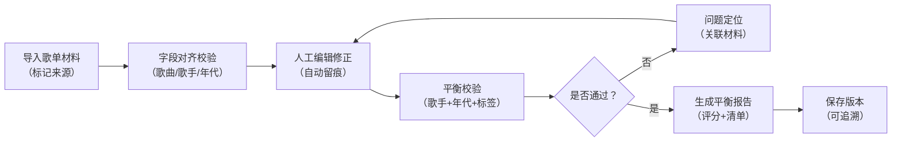
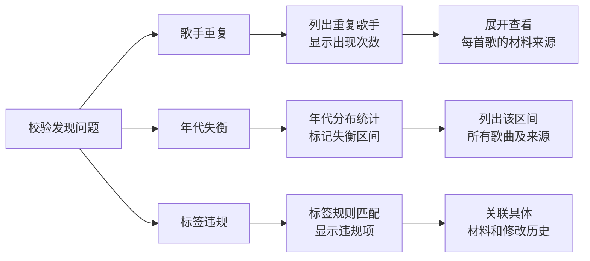

## 1. 产品概述

音乐电台歌单平衡器是面向电台编导的专业工具，解决歌单制作中歌手重复、年代失衡等核心痛点。从样例导入到报告输出全流程留痕，确保每一次人工修改都可追溯，每一次平衡校验都能准确定位问题来源。

### 1.1 核心问题
- 歌手重复和年代失衡是电台歌单最容易引发争议的问题
- 人工修正历史容易丢失，旧结论被悄悄覆盖
- 处理失败时无法指出具体卡在哪份材料
- 录入表单多但缺少实际的对齐和平衡能力

### 1.2 目标用户
- 电台编导：日常制作歌单、平衡风格配比
- 音乐编辑：审核歌单质量、追溯修改历史
- 节目总监：抽查歌单合规性、查看平衡报告

### 1.3 产品目标
- 跑稳三大核心：歌单约束、平衡评分、播放历史
- 问题醒目：歌手重复、年代失衡高亮显示
- 全流程留痕：导入→修正→校验→输出每一步都有记录
- 精准定位：问题直接关联到具体材料来源

---

## 2. 核心功能

### 2.1 用户角色

| 角色 | 注册方式 | 核心权限 |
|------|----------|----------|
| 电台编导 | 本地账号 | 导入歌单、编辑修正、平衡校验、导出报告 |
| 音乐编辑 | 本地账号 | 审核歌单、查看修改历史、锁定版本 |
| 节目总监 | 本地账号 | 查看所有歌单、导出汇总报告、设置约束规则 |

### 2.2 功能模块

1. **歌单导入页**：样例导入、材料来源标记、字段对齐校验
2. **歌单编辑页**：歌曲列表、歌手标签、年代对齐、人工修正留痕
3. **平衡校验页**：歌手重复检测、年代分布计算、约束规则匹配、问题定位
4. **历史记录页**：修改时间线、版本对比、操作人追溯
5. **报告输出页**：平衡评分、问题清单、导出PDF/Excel

### 2.3 页面详情

| 页面名称 | 模块名称 | 功能描述 |
|----------|----------|----------|
| 歌单导入页 | 材料上传 | 支持CSV/Excel导入，标记每份材料来源 |
| 歌单导入页 | 字段对齐 | 自动识别歌曲名、歌手、年代、标签字段，支持手动映射 |
| 歌单导入页 | 数据预览 | 导入前预览，标记缺失字段和格式问题 |
| 歌单编辑页 | 歌曲列表 | 表格展示，支持排序、筛选、批量编辑 |
| 歌单编辑页 | 标签管理 | 歌手标签（流派、语言、地区）、年代区间维护 |
| 歌单编辑页 | 修正留痕 | 每次修改自动记录：修改人、时间、前后值、备注 |
| 平衡校验页 | 歌手检测 | 统计每位歌手出现次数，超阈值醒目红标，关联来源材料 |
| 平衡校验页 | 年代分析 | 柱状图展示年代分布，失衡区间高亮，列出具体歌曲 |
| 平衡校验页 | 约束规则 | 可配置：单歌手最多N首、年代区间占比范围、标签配比 |
| 平衡校验页 | 平衡评分 | 0-100分制，分项扣分，给出优化建议 |
| 历史记录页 | 时间线 | 按时间展示所有修改，支持筛选操作人和修改类型 |
| 历史记录页 | 版本对比 | 任意两个版本并排对比，高亮差异 |
| 报告输出页 | 评分概览 | 总评分、各维度得分、雷达图展示 |
| 报告输出页 | 问题清单 | 按严重程度排序，每项问题关联具体歌曲和材料来源 |
| 报告输出页 | 导出功能 | 支持PDF报告和Excel数据导出 |

---

## 3. 核心流程

### 3.1 主工作流程

### 3.2 问题定位流程

---

## 4. 用户界面设计

### 4.1 设计风格

**整体风格：专业编辑风（Editorial）+ 警示醒目**
- 主色调：深海军蓝 `#0A2463`（专业、可信）
- 警示色：亮红 `#E63946`（问题高亮，绝对醒目）
- 警告色：琥珀黄 `#F4A261`（需注意）
- 通过色：森林绿 `#2A9D8F`（正常）
- 背景色：米白 `#F8F4E3`（减少眼部疲劳，适合长时间编辑）
- 中性色：深灰 `#264653`、中灰 `#6D6875`、浅灰 `#E9E3E6`

**字体选择：**
- 标题字体：`Noto Serif SC`（有衬线，专业编辑感）
- 正文字体：`Noto Sans SC`（清晰易读）
- 数据字体：`JetBrains Mono`（数字等宽，便于比对）

**交互特点：**
- 问题行使用红底白字 + 左侧粗红边框，绝对醒目
- 修改痕迹使用淡蓝色背景 + 悬浮显示修改详情
- 年代分布柱状图使用渐变色，失衡部分使用红色渐变
- 所有表格支持固定表头，滚动时保持上下文

### 4.2 页面设计概览

| 页面名称 | 模块名称 | UI元素 |
|----------|----------|--------|
| 歌单导入页 | 材料上传区 | 拖拽上传、文件列表、来源标签输入框 |
| 歌单导入页 | 字段映射区 | 左右两列：源字段→目标字段，下拉选择映射 |
| 歌单导入页 | 数据预览表 | 前10行数据预览，问题单元格黄色标记 |
| 歌单编辑页 | 顶部工具栏 | 操作按钮（保存、校验、撤销）、版本选择器 |
| 歌单编辑页 | 歌曲表格 | 可编辑单元格，修改后有蓝色痕迹标记，行首显示材料来源标签 |
| 歌单编辑页 | 侧边面板 | 选中歌曲详情、修改历史、标签编辑 |
| 平衡校验页 | 评分卡片 | 大字号总分、分项得分条、雷达图 |
| 平衡校验页 | 问题列表面板 | 按严重程度分组，红色条目最醒目，点击展开详情，显示关联材料 |
| 平衡校验页 | 年代分布图 | 柱状图，X轴年代区间，Y轴数量，失衡区间红色填充 |
| 平衡校验页 | 歌手统计表 | 表格，歌手名、歌曲数、阈值、状态（正常/超标），超标行红底 |
| 历史记录页 | 时间线 | 垂直时间线，每条记录：时间、操作人、操作类型、前后值对比 |
| 历史记录页 | 版本对比 | 左右分栏，相同背景灰色，新增绿色，删除红色，修改黄色 |
| 报告输出页 | 报告预览 | A4尺寸模拟，分页显示 |
| 报告输出页 | 导出按钮 | PDF/Excel格式选择，导出进度条 |

### 4.3 关键交互细节

**问题醒目设计：**
- 歌手重复：整行红底 `#E63946` 白字，行首显示 `⚠️ 重复 X次`，点击展开显示所有重复歌曲及其来源材料
- 年代失衡：年代区间柱状图中，失衡区间使用红色渐变填充，下方列出具体歌曲，每首歌后标注材料来源
- 标签违规：标签名称红色闪烁动画，悬浮显示违规原因

**留痕设计：**
- 编辑过的单元格：浅蓝色背景 `#E7F0FF`，右上角蓝色小三角标记
- 悬浮修改单元格：显示tooltip：「修改人：XXX，时间：YYYY-MM-DD HH:MM，原值：AAA → 新值：BBB，备注：...」
- 历史面板：可筛选查看某首歌的所有修改记录

### 4.4 响应式

- **Desktop-first**：1280px以上最优，支持1920px大屏扩展
- 平板（768-1279px）：侧边面板改为底部抽屉，表格支持横向滚动
- 移动端（<768px）：卡片式布局，重点展示问题列表和评分，编辑功能简化为只读

---

## 5. 数据安全与版本控制

### 5.1 版本管理
- 每次保存自动创建新版本，版本号递增
- 支持版本命名（如「初审版」「终审版」）
- 支持版本锁定，锁定后不可修改
- 版本对比功能，高亮差异

### 5.2 操作留痕
- 所有增删改操作记录：操作人、时间、IP、操作类型、前后值
- 不可删除历史记录
- 支持导出操作日志

### 5.3 材料溯源
- 每首歌记录来源材料（文件名+行号）
- 问题定位时直接关联到原始材料
- 支持查看原始材料内容
