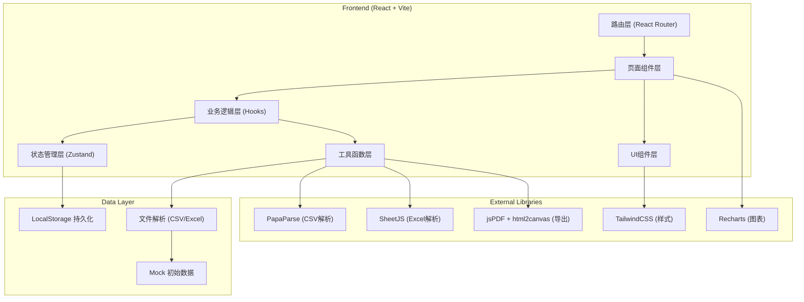

## 1. 架构设计



---

## 2. 技术描述

### 2.1 前端技术栈
- **框架**: React 18 + TypeScript
- **构建工具**: Vite 5
- **路由**: React Router DOM 6
- **状态管理**: Zustand（轻量，适合本地数据场景）
- **样式**: TailwindCSS 3 + PostCSS
- **图标**: Lucide React

### 2.2 核心库
- **文件解析**: 
  - `papaparse` — CSV文件解析
  - `xlsx` (SheetJS) — Excel文件解析
- **图表可视化**: `recharts` — 柱状图、雷达图、饼图
- **导出功能**:
  - `jspdf` — PDF生成
  - `html2canvas` — 页面截图转PDF
- **日期处理**: `date-fns` — 日期格式化和计算

### 2.3 数据存储
- **持久化**: LocalStorage（歌单数据、操作日志、约束规则）
- **内存状态**: Zustand store
- **导入导出**: JSON格式备份

---

## 3. 路由定义

| 路由 | 页面组件 | 功能描述 |
|------|----------|----------|
| `/` | PlaylistListPage | 歌单列表首页，展示所有歌单摘要和评分 |
| `/import` | ImportPage | 歌单导入页，文件上传、字段映射 |
| `/playlist/:id` | PlaylistEditPage | 歌单编辑页，歌曲列表、标签编辑、修正留痕 |
| `/playlist/:id/validate` | ValidatePage | 平衡校验页，歌手检测、年代分析、评分 |
| `/playlist/:id/history` | HistoryPage | 历史记录页，时间线、版本对比 |
| `/playlist/:id/report` | ReportPage | 报告输出页，预览、导出 |
| `/settings` | SettingsPage | 约束规则配置页 |

---

## 4. 状态管理与数据模型

### 4.1 Zustand Store 结构

```typescript
// types/index.ts

export interface Song {
  id: string;
  title: string;
  artist: string;
  year: number;
  tags: string[];
  genre: string;
  language: string;
  region: string;
  source: {
    filename: string;
    rowNumber: number;
    importBatchId: string;
  };
  createdAt: string;
  updatedAt: string;
}

export interface Playlist {
  id: string;
  name: string;
  description: string;
  songs: Song[];
  version: number;
  versionName: string;
  isLocked: boolean;
  createdAt: string;
  updatedAt: string;
  createdBy: string;
}

export interface OperationLog {
  id: string;
  playlistId: string;
  songId?: string;
  operationType: 'create' | 'update' | 'delete' | 'import' | 'export' | 'lock' | 'unlock';
  field?: string;
  oldValue?: string;
  newValue?: string;
  remark?: string;
  operator: string;
  timestamp: string;
  ip?: string;
}

export interface ValidationRule {
  id: string;
  name: string;
  type: 'artist_max_count' | 'decade_range' | 'tag_ratio' | 'genre_balance';
  params: Record<string, any>;
  enabled: boolean;
  weight: number;
}

export interface ValidationResult {
  score: number;
  details: {
    artistScore: number;
    decadeScore: number;
    tagScore: number;
    genreScore: number;
  };
  issues: ValidationIssue[];
}

export interface ValidationIssue {
  id: string;
  severity: 'error' | 'warning' | 'info';
  type: string;
  message: string;
  ruleId: string;
  songIds: string[];
  sourceFiles: string[];
  suggestion: string;
}
```

### 4.2 Store 切片

```typescript
// store/index.ts
interface AppState {
  // 歌单相关
  playlists: Playlist[];
  currentPlaylist: Playlist | null;
  
  // 操作日志
  operationLogs: OperationLog[];
  
  // 校验规则
  validationRules: ValidationRule[];
  
  // 当前用户
  currentUser: string;
  
  // Actions
  createPlaylist: (name: string, songs: Song[], source: string) => Playlist;
  updatePlaylist: (id: string, updates: Partial<Playlist>) => void;
  deletePlaylist: (id: string) => void;
  lockPlaylist: (id: string) => void;
  unlockPlaylist: (id: string) => void;
  
  addSong: (playlistId: string, song: Omit<Song, 'id' | 'createdAt' | 'updatedAt'>) => void;
  updateSong: (playlistId: string, songId: string, updates: Partial<Song>, remark?: string) => void;
  deleteSong: (playlistId: string, songId: string, remark?: string) => void;
  
  validatePlaylist: (playlistId: string) => ValidationResult;
  exportReport: (playlistId: string, format: 'pdf' | 'excel') => void;
  
  addOperationLog: (log: Omit<OperationLog, 'id' | 'timestamp'>) => void;
  
  updateValidationRule: (id: string, updates: Partial<ValidationRule>) => void;
}
```

---

## 5. 核心算法

### 5.1 平衡评分算法

```typescript
// utils/validation.ts

/**
 * 歌手重复检测
 * 扣分规则：每超出阈值1首，扣 (权重 / 阈值) 分
 */
function calculateArtistScore(songs: Song[], rule: ValidationRule): {
  score: number;
  issues: ValidationIssue[];
} {
  const maxCount = rule.params.maxCount;
  const weight = rule.weight;
  
  const artistCounts: Record<string, Song[]> = {};
  songs.forEach(song => {
    if (!artistCounts[song.artist]) artistCounts[song.artist] = [];
    artistCounts[song.artist].push(song);
  });
  
  let score = 100;
  const issues: ValidationIssue[] = [];
  
  Object.entries(artistCounts).forEach(([artist, artistSongs]) => {
    if (artistSongs.length > maxCount) {
      const overCount = artistSongs.length - maxCount;
      score -= (overCount / maxCount) * weight;
      
      issues.push({
        id: generateId(),
        severity: 'error',
        type: 'artist_repeat',
        message: `歌手「${artist}」出现 ${artistSongs.length} 次，超出阈值 ${maxCount} 次`,
        ruleId: rule.id,
        songIds: artistSongs.map(s => s.id),
        sourceFiles: [...new Set(artistSongs.map(s => s.source.filename))],
        suggestion: `建议移除 ${overCount} 首 ${artist} 的歌曲`
      });
    }
  });
  
  return { score: Math.max(0, score), issues };
}

/**
 * 年代分布检测
 * 扣分规则：区间占比超出允许范围时，按超出比例扣分
 */
function calculateDecadeScore(songs: Song[], rule: ValidationRule): {
  score: number;
  issues: ValidationIssue[];
} {
  const ranges = rule.params.ranges as { min: number; max: number; minRatio: number; maxRatio: number }[];
  const weight = rule.weight;
  const total = songs.length;
  
  let score = 100;
  const issues: ValidationIssue[] = [];
  
  ranges.forEach(range => {
    const rangeSongs = songs.filter(s => s.year >= range.min && s.year <= range.max);
    const ratio = rangeSongs.length / total;
    
    if (ratio < range.minRatio) {
      const deficit = range.minRatio - ratio;
      score -= deficit * weight * 2;
      
      issues.push({
        id: generateId(),
        severity: 'warning',
        type: 'decade_deficit',
        message: `${range.min}-${range.max}年代占比 ${(ratio * 100).toFixed(1)}%，低于要求 ${(range.minRatio * 100).toFixed(1)}%`,
        ruleId: rule.id,
        songIds: rangeSongs.map(s => s.id),
        sourceFiles: [...new Set(rangeSongs.map(s => s.source.filename))],
        suggestion: `建议增加 ${Math.ceil((range.minRatio - ratio) * total)} 首 ${range.min}-${range.max}年代的歌曲`
      });
    } else if (ratio > range.maxRatio) {
      const excess = ratio - range.maxRatio;
      score -= excess * weight;
      
      issues.push({
        id: generateId(),
        severity: 'error',
        type: 'decade_excess',
        message: `${range.min}-${range.max}年代占比 ${(ratio * 100).toFixed(1)}%，高于上限 ${(range.maxRatio * 100).toFixed(1)}%`,
        ruleId: rule.id,
        songIds: rangeSongs.map(s => s.id),
        sourceFiles: [...new Set(rangeSongs.map(s => s.source.filename))],
        suggestion: `建议移除 ${Math.ceil((ratio - range.maxRatio) * total)} 首 ${range.min}-${range.max}年代的歌曲`
      });
    }
  });
  
  return { score: Math.max(0, score), issues };
}

/**
 * 综合平衡评分
 * 总分 = 各维度加权平均
 */
export function calculateBalanceScore(playlist: Playlist, rules: ValidationRule[]): ValidationResult {
  const enabledRules = rules.filter(r => r.enabled);
  const totalWeight = enabledRules.reduce((sum, r) => sum + r.weight, 0);
  
  let artistScore = 100;
  let decadeScore = 100;
  let tagScore = 100;
  let genreScore = 100;
  const allIssues: ValidationIssue[] = [];
  
  enabledRules.forEach(rule => {
    switch (rule.type) {
      case 'artist_max_count': {
        const result = calculateArtistScore(playlist.songs, rule);
        artistScore = result.score;
        allIssues.push(...result.issues);
        break;
      }
      case 'decade_range': {
        const result = calculateDecadeScore(playlist.songs, rule);
        decadeScore = result.score;
        allIssues.push(...result.issues);
        break;
      }
      // ... 其他规则
    }
  });
  
  const totalScore = (
    artistScore * 30 +
    decadeScore * 30 +
    tagScore * 20 +
    genreScore * 20
  ) / 100;
  
  return {
    score: Math.round(totalScore),
    details: { artistScore, decadeScore, tagScore, genreScore },
    issues: allIssues.sort((a, b) => {
      const severityOrder = { error: 0, warning: 1, info: 2 };
      return severityOrder[a.severity] - severityOrder[b.severity];
    })
  };
}
```

---

## 6. 文件结构

```
src/
├── components/
│   ├── layout/
│   │   ├── Header.tsx
│   │   ├── Sidebar.tsx
│   │   └── PageContainer.tsx
│   ├── ui/
│   │   ├── Button.tsx
│   │   ├── Table.tsx
│   │   ├── Modal.tsx
│   │   ├── Tabs.tsx
│   │   └── Toast.tsx
│   ├── playlist/
│   │   ├── SongTable.tsx
│   │   ├── SongRow.tsx
│   │   ├── TagEditor.tsx
│   │   └── SourceBadge.tsx
│   ├── validation/
│   │   ├── ScoreCard.tsx
│   │   ├── IssueList.tsx
│   │   ├── ArtistStatTable.tsx
│   │   ├── DecadeChart.tsx
│   │   └── RadarChart.tsx
│   └── history/
│       ├── Timeline.tsx
│       └── VersionDiff.tsx
├── pages/
│   ├── PlaylistListPage.tsx
│   ├── ImportPage.tsx
│   ├── PlaylistEditPage.tsx
│   ├── ValidatePage.tsx
│   ├── HistoryPage.tsx
│   ├── ReportPage.tsx
│   └── SettingsPage.tsx
├── store/
│   └── index.ts
├── types/
│   └── index.ts
├── utils/
│   ├── validation.ts
│   ├── fileParser.ts
│   ├── exporter.ts
│   └── helpers.ts
├── data/
│   └── mockData.ts
├── hooks/
│   ├── usePlaylist.ts
│   ├── useValidation.ts
│   └── useOperationLog.ts
├── App.tsx
├── main.tsx
└── index.css
```

---

## 7. 约束规则默认配置

```typescript
// data/defaultRules.ts

export const defaultValidationRules: ValidationRule[] = [
  {
    id: 'rule-1',
    name: '歌手重复限制',
    type: 'artist_max_count',
    params: { maxCount: 2 },
    enabled: true,
    weight: 40
  },
  {
    id: 'rule-2',
    name: '年代分布均衡',
    type: 'decade_range',
    params: {
      ranges: [
        { min: 1980, max: 1989, minRatio: 0.1, maxRatio: 0.25 },
        { min: 1990, max: 1999, minRatio: 0.15, maxRatio: 0.3 },
        { min: 2000, max: 2009, minRatio: 0.2, maxRatio: 0.35 },
        { min: 2010, max: 2019, minRatio: 0.15, maxRatio: 0.3 },
        { min: 2020, max: 2029, minRatio: 0.1, maxRatio: 0.25 }
      ]
    },
    enabled: true,
    weight: 35
  },
  {
    id: 'rule-3',
    name: '标签配比',
    type: 'tag_ratio',
    params: {
      requiredTags: ['华语', '欧美', '日韩'],
      minRatio: 0.2,
      maxRatio: 0.5
    },
    enabled: true,
    weight: 15
  },
  {
    id: 'rule-4',
    name: '流派均衡',
    type: 'genre_balance',
    params: {
      maxGenreRatio: 0.4
    },
    enabled: true,
    weight: 10
  }
];
```

---

## 8. 开发优先级

### 第一阶段（核心功能）
1. ✅ 项目初始化 + 基础框架搭建
2. ✅ 歌单列表页
3. ✅ 歌单导入页（CSV/Excel解析）
4. ✅ 歌单编辑页（表格、增删改、留痕）
5. ✅ 平衡校验页（歌手检测、年代分析、评分）

### 第二阶段（完整功能）
6. ⬜ 历史记录页（时间线、版本对比）
7. ⬜ 报告输出页（预览、PDF/Excel导出）
8. ⬜ 约束规则设置页

### 第三阶段（体验优化）
9. ⬜ 响应式适配
10. ⬜ 动画和交互细节
11. ⬜ Mock数据完善
