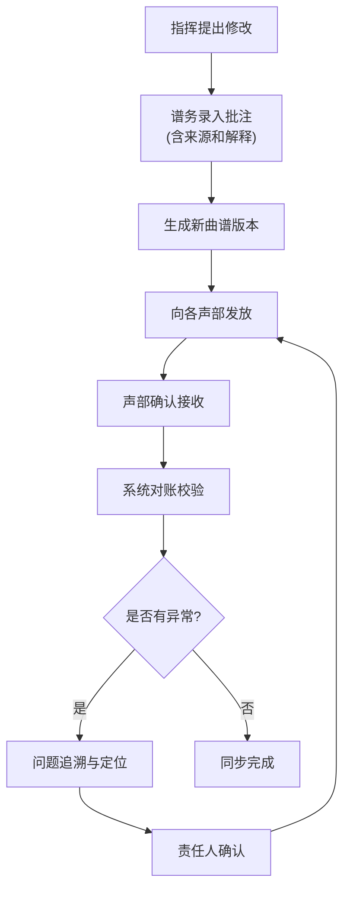

## 1. 产品概述

曲谱排练批注同步系统是为管弦乐团谱务设计的专业管理工具，解决指挥修改弓法、力度和页码后各声部纸谱版本混乱的问题。通过统一的批注来源追踪、版本校验和发放状态管理，实现曲谱、批注、声部状态的一体化对账。

- 核心目标：消除旧版混入、页码错位、批注重复等版本混乱问题
- 目标用户：管弦乐团谱务、指挥、乐手
- 产品价值：提供可追溯的批注同步链路，出问题时可快速定位责任人

## 2. 核心功能

### 2.1 用户角色
| 角色 | 注册方式 | 核心权限 |
|------|----------|----------|
| 谱务管理员 | 系统账号 | 全部功能：曲谱管理、批注录入、发放登记、对账检查、导出 |
| 指挥 | 系统账号 | 批注录入、版本确认 |
| 声部首席 | 系统账号 | 查看本声部曲谱状态、确认接收 |

### 2.2 功能模块
1. **分析看板**：同步状态总览、问题统计、版本分布
2. **批注管理**：批注录入、来源记录、解释说明、版本关联
3. **声部对账**：发放状态检查、版本校验、异常识别
4. **追溯查询**：从结果追溯批注同步、版本、声部状态的完整链路
5. **导出功能**：声部清单、对账报告、问题明细的文件导出

### 2.3 页面详情
| 页面名称 | 模块名称 | 功能描述 |
|----------|----------|------------|
| 分析看板 | 状态总览 | 同步完成率、异常数量、声部状态分布图 |
| 分析看板 | 问题列表 | 页码错位、旧版混入、批注重复等异常清单 |
| 批注管理 | 批注列表 | 所有批注记录，含来源、解释、关联曲谱版本 |
| 批注管理 | 批注录入 | 新增批注，选择曲谱页码、弓法/力度类型、填写解释 |
| 声部对账 | 声部清单 | 各声部的发放状态、持有的版本号、最后确认时间 |
| 声部对账 | 对账检查 | 自动识别版本不一致、未发放、未确认等问题 |
| 追溯查询 | 追溯面板 | 输入声部或批注ID，展示完整同步链路 |
| 导出中心 | 文件导出 | 下载声部清单、对账报告，保证与界面数据一致 |

## 3. 核心流程

谱务管理员录入指挥的批注 → 系统生成带版本号的新曲谱版本 → 向各声部发放新曲谱 → 声部确认接收 → 系统进行对账校验 → 发现问题时可追溯完整链路

## 4. 用户界面设计

### 4.1 设计风格
- 主色调：专业深蓝（#1e3a5f），代表专业与信任
- 辅助色：警示橙（#f59e0b）用于异常，成功绿（#10b981）用于正常状态
- 按钮风格：圆角8px，悬停时轻微上浮阴影
- 字体：标题使用 Playfair Display 体现艺术感，正文使用 Noto Sans SC 保证可读性
- 布局风格：卡片式布局，清晰的信息层级
- 图标风格：Lucide 线性图标，简洁专业

### 4.2 页面设计概述
| 页面名称 | 模块名称 | UI元素 |
|----------|----------|---------|
| 分析看板 | 状态总览 | 统计卡片、进度环形图、状态标签、渐变色背景 |
| 分析看板 | 问题列表 | 表格、状态徽章、展开详情、追溯按钮 |
| 批注管理 | 批注列表 | 时间线布局、来源标签、解释气泡 |
| 声部对账 | 声部清单 | 分组卡片、版本对比标识、确认状态 |
| 追溯查询 | 追溯面板 | 链路流程图、时间戳、操作人信息 |

### 4.3 响应式
- Desktop-first 设计，支持1280px及以上
- 平板端自适应调整卡片布局
- 移动端简化视图，优先展示核心数据

### 4.4 动效设计
- 页面加载：渐入动画，元素按层级依次出现
- 状态变化：版本更新时的高亮闪烁提示
- 悬停效果：卡片轻微上浮，阴影加深
- 追溯链路：节点连线的动态绘制效果
