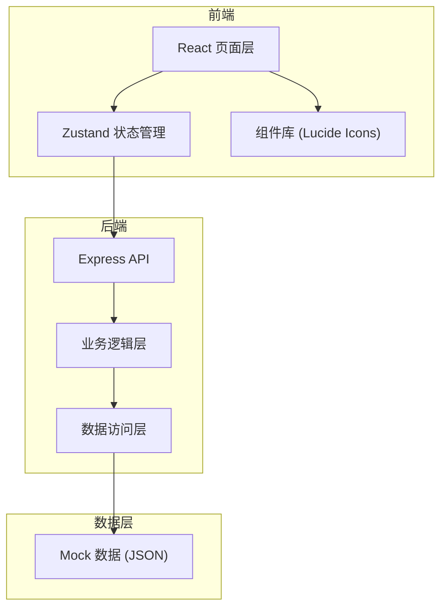
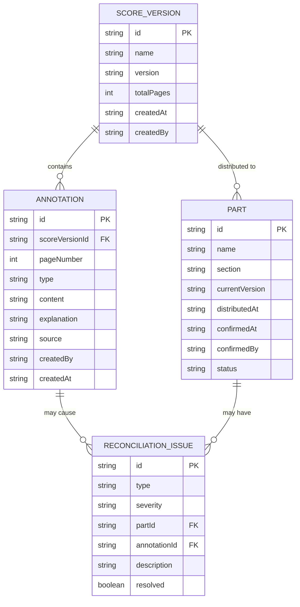

## 1. 架构设计



## 2. 技术描述
- 前端：React@18 + TypeScript + tailwindcss@3 + Vite
- 状态管理：Zustand
- 后端：Express@4 + TypeScript
- 图标：lucide-react
- 数据存储：Mock JSON 数据（前端内置，便于演示）
- 导出功能：jsPDF（PDF导出）+ xlsx（Excel导出）

## 3. 路由定义
| 路由 | 用途 |
|------|------|
| /dashboard | 分析看板 - 状态总览与问题列表 |
| /annotations | 批注管理 - 批注列表与录入 |
| /parts | 声部对账 - 声部清单与对账检查 |
| /trace | 追溯查询 - 同步链路追溯 |
| /export | 导出中心 - 文件导出 |

## 4. API 定义

```typescript
// 曲谱版本
interface ScoreVersion {
  id: string;
  name: string;
  version: string;
  totalPages: number;
  createdAt: string;
  createdBy: string;
}

// 批注记录
interface Annotation {
  id: string;
  scoreVersionId: string;
  pageNumber: number;
  type: 'bowing' | 'dynamics' | 'page';
  content: string;
  explanation: string;
  source: string;
  createdBy: string;
  createdAt: string;
}

// 声部
interface Part {
  id: string;
  name: string;
  section: 'string' | 'woodwind' | 'brass' | 'percussion';
  currentVersion: string;
  distributedAt: string | null;
  confirmedAt: string | null;
  confirmedBy: string | null;
  status: 'distributed' | 'confirmed' | 'outdated' | 'pending';
}

// 对账问题
interface ReconciliationIssue {
  id: string;
  type: 'page_mismatch' | 'old_version' | 'duplicate_annotation' | 'unconfirmed';
  severity: 'high' | 'medium' | 'low';
  partId: string;
  annotationId?: string;
  description: string;
  resolved: boolean;
}

// API 响应
interface ApiResponse<T> {
  success: boolean;
  data: T;
  message?: string;
}
```

## 5. 数据模型

### 5.1 ER图


### 5.2 Mock 数据结构
```typescript
// mockData.ts
export const mockScoreVersions: ScoreVersion[] = [...];
export const mockAnnotations: Annotation[] = [...];
export const mockParts: Part[] = [...];
export const mockIssues: ReconciliationIssue[] = [...];
```

## 6. 核心业务逻辑

### 6.1 版本校验
- 对比各声部 currentVersion 与最新版本号
- 识别持有旧版本的声部
- 生成 old_version 类型问题

### 6.2 页码对齐检查
- 检查批注 pageNumber 是否在曲谱总页数范围内
- 检测同一页是否有重复批注
- 生成 page_mismatch 或 duplicate_annotation 问题

### 6.3 发放状态追踪
- 检查 distributedAt 和 confirmedAt 字段
- 识别未发放、发放未确认的声部
- 生成 unconfirmed 类型问题

### 6.4 追溯链路构建
- 根据声部ID或批注ID逆向查询
- 按时间顺序展示：批注录入 → 版本生成 → 发放 → 确认
- 展示每个节点的操作人、时间、备注
