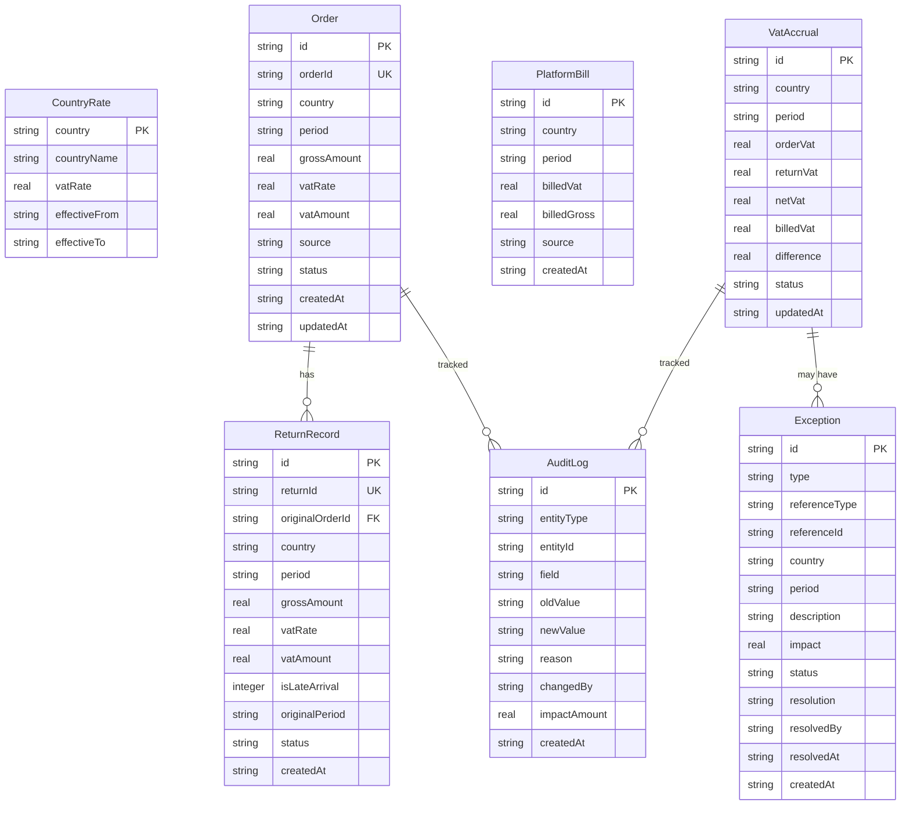

## 1. 架构设计

```mermaid
flowchart TB
    subgraph "前端层"
        "React SPA" --- "总览仪表盘"
        "React SPA" --- "订单与退货管理"
        "React SPA" --- "平台账单对账"
        "React SPA" --- "异常清单"
        "React SPA" --- "审计追踪"
        "React SPA" --- "报表与导出"
    end
    subgraph "后端API层"
        "Express Router" --- "订单API"
        "Express Router" --- "退货API"
        "Express Router" --- "账单API"
        "Express Router" --- "VAT计算引擎"
        "Express Router" --- "异常检测引擎"
        "Express Router" --- "审计日志API"
        "Express Router" --- "报表API"
    end
    subgraph "数据层"
        "SQLite" --- "业务数据表"
        "SQLite" --- "审计日志表"
        "better-sqlite3" --- "SQLite"
    end
    "React SPA" -->|"REST API"| "Express Router"
    "Express Router" -->|"SQL"| "better-sqlite3"
```

## 2. 技术说明

- 前端：React@18 + TailwindCSS@3 + Vite + Recharts（图表）+ React Router@6
- 初始化工具：Vite
- 后端：Express@4 + better-sqlite3（同步SQLite驱动，零配置持久化）
- 数据库：SQLite（文件级持久化，重启不丢失，无需外部数据库服务）
- CSV解析：papaparse（前端导入解析）
- PDF导出：jspdf + jspdf-autotable

## 3. 路由定义

| 路由 | 用途 |
|------|------|
| / | 总览仪表盘，按国家/期间展示VAT汇总和异常预警 |
| /orders | 订单与退货管理，导入、查看、调整国家归集 |
| /reconciliation | 平台账单对账，差异比对和分类 |
| /exceptions | 待确认与异常清单，异常处理和确认 |
| /audit | 审计追踪，变更日志和改动影响分析 |
| /reports | 报表与导出，预览和下载 |

## 4. API定义

### 4.1 订单相关

```typescript
interface Order {
  id: string;
  orderId: string;
  country: string;
  period: string;
  grossAmount: number;
  vatRate: number;
  vatAmount: number;
  source: "import" | "manual";
  status: "normal" | "adjusted" | "exception";
  createdAt: string;
  updatedAt: string;
}

// POST /api/orders/import  - 批量导入订单（CSV解析后）
// GET  /api/orders         - 查询订单列表（支持国家/期间/状态筛选）
// PUT  /api/orders/:id/country - 修改国家归集（触发审计日志）
```

### 4.2 退货相关

```typescript
interface ReturnRecord {
  id: string;
  returnId: string;
  originalOrderId: string;
  country: string;
  period: string;
  grossAmount: number;
  vatRate: number;
  vatAmount: number;
  isLateArrival: boolean;
  originalPeriod: string;
  status: "pending" | "confirmed" | "exception";
  createdAt: string;
}

// POST /api/returns/import   - 批量导入退货（追加不覆盖）
// GET  /api/returns          - 查询退货列表
// PUT  /api/returns/:id/confirm - 确认退货调整
```

### 4.3 账单相关

```typescript
interface PlatformBill {
  id: string;
  country: string;
  period: string;
  billedVat: number;
  billedGross: number;
  source: string;
  createdAt: string;
}

// POST /api/bills/import - 批量导入平台账单
// GET  /api/bills        - 查询账单列表
```

### 4.4 VAT预提汇总

```typescript
interface VatAccrual {
  country: string;
  period: string;
  orderVat: number;
  returnVat: number;
  netVat: number;
  billedVat: number;
  difference: number;
  differenceRate: number;
  status: "matched" | "variance" | "pending_bill";
  adjustments: VatAdjustment[];
}

interface VatAdjustment {
  id: string;
  type: "return_adjustment" | "country_reassignment" | "rate_correction";
  description: string;
  amount: number;
  createdAt: string;
}

// GET /api/vat-accruals          - 按国家/期间查询预提汇总
// GET /api/vat-accruals/summary  - 总览数据（仪表盘用）
```

### 4.5 异常相关

```typescript
interface Exception {
  id: string;
  type: "cross_period_rate" | "late_return" | "country_mismatch" | "other";
  referenceType: "order" | "return" | "bill";
  referenceId: string;
  country: string;
  period: string;
  description: string;
  impact: number;
  status: "pending" | "confirmed" | "rejected";
  resolution: string;
  resolvedBy: string;
  resolvedAt: string;
  createdAt: string;
}

// GET    /api/exceptions           - 查询异常列表（支持类型/状态筛选）
// PUT    /api/exceptions/:id       - 处理异常（确认/退回）
// GET    /api/exceptions/stats     - 异常统计数据
```

### 4.6 审计日志

```typescript
interface AuditLog {
  id: string;
  entityType: "order" | "return" | "bill" | "accrual";
  entityId: string;
  field: string;
  oldValue: string;
  newValue: string;
  reason: string;
  changedBy: string;
  impactAmount: number;
  createdAt: string;
}

// GET /api/audit-logs          - 查询审计日志（支持实体类型/时间筛选）
// GET /api/audit-logs/:id/impact - 查询特定变更的影响分析
```

### 4.7 报表相关

```typescript
// GET /api/reports/preview    - 获取报表预览数据
// GET /api/reports/export?format=csv  - 导出CSV
// GET /api/reports/export?format=pdf  - 导出PDF
```

## 5. 服务端架构图

```mermaid
flowchart LR
    "Router" --> "OrderController"
    "Router" --> "ReturnController"
    "Router" --> "BillController"
    "Router" --> "VatController"
    "Router" --> "ExceptionController"
    "Router" --> "AuditController"
    "Router" --> "ReportController"
    "OrderController" --> "OrderService"
    "ReturnController" --> "ReturnService"
    "BillController" --> "BillService"
    "VatController" --> "VatEngine"
    "ExceptionController" --> "ExceptionDetector"
    "AuditController" --> "AuditService"
    "ReportController" --> "ReportService"
    "OrderService" --> "Database"
    "ReturnService" --> "Database"
    "BillService" --> "Database"
    "VatEngine" --> "Database"
    "ExceptionDetector" --> "Database"
    "AuditService" --> "Database"
    "ReportService" --> "Database"
```

## 6. 数据模型

### 6.1 数据模型定义



### 6.2 数据定义语言

```sql
CREATE TABLE IF NOT EXISTS country_rates (
    country TEXT PRIMARY KEY,
    country_name TEXT NOT NULL,
    vat_rate REAL NOT NULL,
    effective_from TEXT NOT NULL,
    effective_to TEXT
);

CREATE TABLE IF NOT EXISTS orders (
    id TEXT PRIMARY KEY,
    order_id TEXT UNIQUE NOT NULL,
    country TEXT NOT NULL,
    period TEXT NOT NULL,
    gross_amount REAL NOT NULL,
    vat_rate REAL NOT NULL,
    vat_amount REAL NOT NULL,
    source TEXT NOT NULL DEFAULT 'import',
    status TEXT NOT NULL DEFAULT 'normal',
    created_at TEXT NOT NULL,
    updated_at TEXT NOT NULL
);

CREATE INDEX IF NOT EXISTS idx_orders_country ON orders(country);
CREATE INDEX IF NOT EXISTS idx_orders_period ON orders(period);
CREATE INDEX IF NOT EXISTS idx_orders_status ON orders(status);

CREATE TABLE IF NOT EXISTS returns (
    id TEXT PRIMARY KEY,
    return_id TEXT UNIQUE NOT NULL,
    original_order_id TEXT,
    country TEXT NOT NULL,
    period TEXT NOT NULL,
    gross_amount REAL NOT NULL,
    vat_rate REAL NOT NULL,
    vat_amount REAL NOT NULL,
    is_late_arrival INTEGER NOT NULL DEFAULT 0,
    original_period TEXT,
    status TEXT NOT NULL DEFAULT 'pending',
    created_at TEXT NOT NULL,
    FOREIGN KEY (original_order_id) REFERENCES orders(order_id)
);

CREATE INDEX IF NOT EXISTS idx_returns_country ON returns(country);
CREATE INDEX IF NOT EXISTS idx_returns_period ON returns(period);
CREATE INDEX IF NOT EXISTS idx_returns_status ON returns(status);

CREATE TABLE IF NOT EXISTS platform_bills (
    id TEXT PRIMARY KEY,
    country TEXT NOT NULL,
    period TEXT NOT NULL,
    billed_vat REAL NOT NULL,
    billed_gross REAL NOT NULL,
    source TEXT NOT NULL DEFAULT 'import',
    created_at TEXT NOT NULL
);

CREATE UNIQUE INDEX IF NOT EXISTS idx_bills_country_period ON platform_bills(country, period);

CREATE TABLE IF NOT EXISTS vat_accruals (
    id TEXT PRIMARY KEY,
    country TEXT NOT NULL,
    period TEXT NOT NULL,
    order_vat REAL NOT NULL DEFAULT 0,
    return_vat REAL NOT NULL DEFAULT 0,
    net_vat REAL NOT NULL DEFAULT 0,
    billed_vat REAL NOT NULL DEFAULT 0,
    difference REAL NOT NULL DEFAULT 0,
    status TEXT NOT NULL DEFAULT 'pending_bill',
    updated_at TEXT NOT NULL
);

CREATE UNIQUE INDEX IF NOT EXISTS idx_accruals_country_period ON vat_accruals(country, period);

CREATE TABLE IF NOT EXISTS exceptions (
    id TEXT PRIMARY KEY,
    type TEXT NOT NULL,
    reference_type TEXT NOT NULL,
    reference_id TEXT NOT NULL,
    country TEXT NOT NULL,
    period TEXT NOT NULL,
    description TEXT NOT NULL,
    impact REAL NOT NULL DEFAULT 0,
    status TEXT NOT NULL DEFAULT 'pending',
    resolution TEXT,
    resolved_by TEXT,
    resolved_at TEXT,
    created_at TEXT NOT NULL
);

CREATE INDEX IF NOT EXISTS idx_exceptions_type ON exceptions(type);
CREATE INDEX IF NOT EXISTS idx_exceptions_status ON exceptions(status);

CREATE TABLE IF NOT EXISTS audit_logs (
    id TEXT PRIMARY KEY,
    entity_type TEXT NOT NULL,
    entity_id TEXT NOT NULL,
    field TEXT NOT NULL,
    old_value TEXT NOT NULL,
    new_value TEXT NOT NULL,
    reason TEXT NOT NULL,
    changed_by TEXT NOT NULL DEFAULT 'operator',
    impact_amount REAL NOT NULL DEFAULT 0,
    created_at TEXT NOT NULL
);

CREATE INDEX IF NOT EXISTS idx_audit_entity ON audit_logs(entity_type, entity_id);
CREATE INDEX IF NOT EXISTS idx_audit_created ON audit_logs(created_at);

-- 初始欧洲国家VAT税率
INSERT OR IGNORE INTO country_rates (country, country_name, vat_rate, effective_from) VALUES
    ('DE', '德国', 19.0, '2024-01-01'),
    ('FR', '法国', 20.0, '2024-01-01'),
    ('IT', '意大利', 22.0, '2024-01-01'),
    ('ES', '西班牙', 21.0, '2024-01-01'),
    ('NL', '荷兰', 21.0, '2024-01-01'),
    ('BE', '比利时', 21.0, '2024-01-01'),
    ('AT', '奥地利', 20.0, '2024-01-01'),
    ('PL', '波兰', 23.0, '2024-01-01'),
    ('SE', '瑞典', 25.0, '2024-01-01'),
    ('PT', '葡萄牙', 23.0, '2024-01-01'),
    ('IE', '爱尔兰', 23.0, '2024-01-01'),
    ('DK', '丹麦', 25.0, '2024-01-01'),
    ('FI', '芬兰', 24.0, '2024-01-01'),
    ('CZ', '捷克', 21.0, '2024-01-01'),
    ('HU', '匈牙利', 27.0, '2024-01-01');
```
