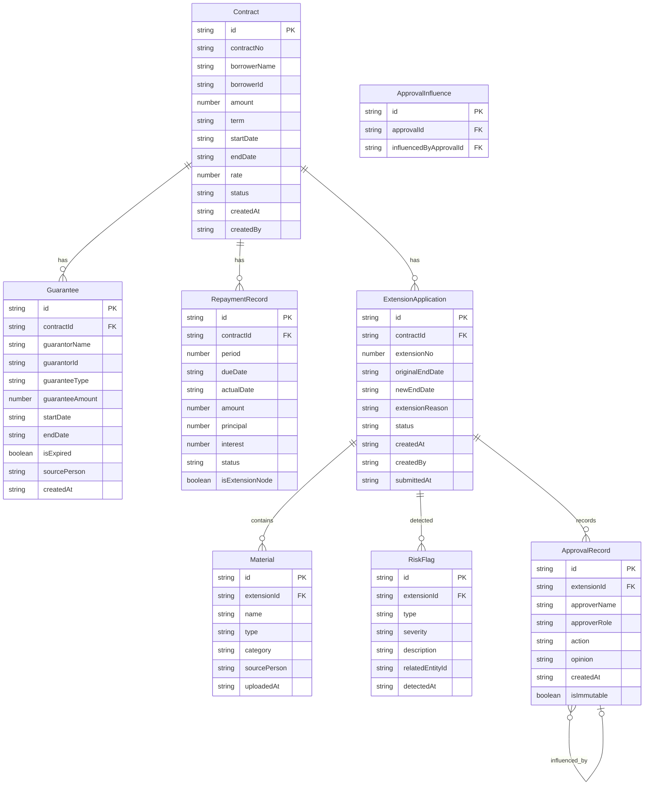

## 1. 架构设计

```mermaid
graph TB
    subgraph "前端层"
        "React 18 + TypeScript"
        "Tailwind CSS"
        "Zustand 状态管理"
        "React Router DOM"
    end
    subgraph "后端层"
        "Express 4 + TypeScript"
        "REST API"
        "业务逻辑层"
        "风险检测引擎"
    end
    subgraph "数据层"
        "SQLite (better-sqlite3)"
        "WAL模式"
    end
    "React 18 + TypeScript" --> "REST API"
    "REST API" --> "业务逻辑层"
    "业务逻辑层" --> "风险检测引擎"
    "业务逻辑层" --> "SQLite (better-sqlite3)"
    "风险检测引擎" --> "SQLite (better-sqlite3)"
```

## 2. 技术说明

- **前端**：React@18 + TypeScript + Tailwind CSS@3 + Vite
- **初始化工具**：vite-init (react-express-ts 模板)
- **后端**：Express@4 + TypeScript (ESM)
- **数据库**：SQLite (better-sqlite3)，WAL模式提升并发性能
- **状态管理**：Zustand（前端）
- **图标库**：lucide-react

## 3. 路由定义

| 路由 | 用途 |
|------|------|
| `/` | 工作台首页，待办汇总与风险预警 |
| `/contracts` | 借款合同列表 |
| `/contracts/:id` | 合同详情（含担保、还款、展期历史） |
| `/extensions` | 展期申请列表 |
| `/extensions/new` | 新建展期申请 |
| `/extensions/:id` | 展期详情与审批 |
| `/audit-trail` | 审批留痕时间线 |
| `/risk-detection` | 风险检测中心 |
| `/export` | 导出中心 |

## 4. API定义

### 4.1 借款合同

```typescript
interface Contract {
  id: string;
  contractNo: string;
  borrowerName: string;
  borrowerId: string;
  amount: number;
  term: string;
  startDate: string;
  endDate: string;
  rate: number;
  status: "active" | "completed" | "overdue" | "extended";
  guaranteeId: string;
  createdAt: string;
  createdBy: string;
}

interface Guarantee {
  id: string;
  contractId: string;
  guarantorName: string;
  guarantorId: string;
  guaranteeType: "mortgage" | "pledge" | "guarantee" | "combined";
  guaranteeAmount: number;
  startDate: string;
  endDate: string;
  isExpired: boolean;
  sourcePerson: string;
  createdAt: string;
}

interface RepaymentRecord {
  id: string;
  contractId: string;
  period: number;
  dueDate: string;
  actualDate: string | null;
  amount: number;
  principal: number;
  interest: number;
  status: "paid" | "overdue" | "pending";
  isExtensionNode: boolean;
}
```

### 4.2 展期申请

```typescript
interface ExtensionApplication {
  id: string;
  contractId: string;
  extensionNo: number;
  originalEndDate: string;
  newEndDate: string;
  extensionReason: string;
  status: "draft" | "submitted" | "approved" | "rejected" | "cancelled";
  riskFlags: RiskFlag[];
  materials: Material[];
  approvals: ApprovalRecord[];
  createdAt: string;
  createdBy: string;
  submittedAt: string | null;
}

interface RiskFlag {
  id: string;
  extensionId: string;
  type: "repeated_extension" | "overdue_covering" | "guarantee_expired";
  severity: "high" | "medium" | "low";
  description: string;
  relatedEntityId: string;
  detectedAt: string;
}

interface Material {
  id: string;
  extensionId: string;
  name: string;
  type: "contract" | "guarantee" | "extension_application" | "approval_opinion";
  category: "original" | "processing_result";
  sourcePerson: string;
  uploadedAt: string;
}

interface ApprovalRecord {
  id: string;
  extensionId: string;
  approverName: string;
  approverRole: string;
  action: "approved" | "rejected" | "returned" | "commented";
  opinion: string;
  influencedBy: string[];
  createdAt: string;
  isImmutable: boolean;
}
```

### 4.3 API端点

| 方法 | 路径 | 用途 |
|------|------|------|
| GET | `/api/contracts` | 获取合同列表(支持分页/筛选) |
| GET | `/api/contracts/:id` | 获取合同详情 |
| POST | `/api/contracts` | 创建借款合同 |
| GET | `/api/contracts/:id/guarantees` | 获取合同关联担保 |
| GET | `/api/contracts/:id/repayments` | 获取还款流水 |
| GET | `/api/contracts/:id/extensions` | 获取展期历史 |
| GET | `/api/extensions` | 获取展期列表(支持筛选) |
| GET | `/api/extensions/:id` | 获取展期详情 |
| POST | `/api/extensions` | 创建展期申请 |
| PUT | `/api/extensions/:id` | 更新展期草稿 |
| POST | `/api/extensions/:id/submit` | 提交展期审批 |
| POST | `/api/extensions/:id/approve` | 审批通过 |
| POST | `/api/extensions/:id/reject` | 审批驳回 |
| POST | `/api/extensions/:id/materials` | 上传材料 |
| GET | `/api/extensions/:id/risks` | 获取风险标记 |
| POST | `/api/extensions/:id/detect-risks` | 触发风险检测 |
| GET | `/api/audit-trail` | 获取审批留痕 |
| GET | `/api/audit-trail/:extensionId/influence` | 获取影响链路 |
| GET | `/api/risk-detection` | 获取风险检测汇总 |
| GET | `/api/risk-detection/repeated-extensions` | 重复展期检测 |
| GET | `/api/risk-detection/overdue-covering` | 逾期遮盖检测 |
| GET | `/api/risk-detection/guarantee-expired` | 担保过期检测 |
| GET | `/api/export/approval-list` | 导出审批清单(CSV) |
| GET | `/api/export/review-report` | 导出复核报告(CSV) |
| GET | `/api/export/consistency-check` | 口径一致性校验 |

## 5. 服务端架构图

```mermaid
graph LR
    subgraph "Controller层"
        "ContractController"
        "ExtensionController"
        "AuditTrailController"
        "RiskDetectionController"
        "ExportController"
    end
    subgraph "Service层"
        "ContractService"
        "ExtensionService"
        "RiskDetectionService"
        "AuditTrailService"
        "ExportService"
    end
    subgraph "Repository层"
        "ContractRepository"
        "ExtensionRepository"
        "ApprovalRepository"
        "RiskFlagRepository"
        "MaterialRepository"
    end
    "ContractController" --> "ContractService"
    "ExtensionController" --> "ExtensionService"
    "AuditTrailController" --> "AuditTrailService"
    "RiskDetectionController" --> "RiskDetectionService"
    "ExportController" --> "ExportService"
    "ContractService" --> "ContractRepository"
    "ExtensionService" --> "ExtensionRepository"
    "ExtensionService" --> "RiskDetectionService"
    "AuditTrailService" --> "ApprovalRepository"
    "RiskDetectionService" --> "RiskFlagRepository"
    "RiskDetectionService" --> "ContractRepository"
    "ExportService" --> "ExtensionRepository"
    "ExportService" --> "RiskFlagRepository"
    "ExportService" --> "ApprovalRepository"
```

## 6. 数据模型

### 6.1 数据模型定义



### 6.2 数据定义语言

```sql
CREATE TABLE contracts (
    id TEXT PRIMARY KEY,
    contract_no TEXT NOT NULL UNIQUE,
    borrower_name TEXT NOT NULL,
    borrower_id TEXT NOT NULL,
    amount REAL NOT NULL,
    term TEXT NOT NULL,
    start_date TEXT NOT NULL,
    end_date TEXT NOT NULL,
    rate REAL NOT NULL,
    status TEXT NOT NULL DEFAULT 'active',
    created_at TEXT NOT NULL DEFAULT (datetime('now')),
    created_by TEXT NOT NULL
);

CREATE TABLE guarantees (
    id TEXT PRIMARY KEY,
    contract_id TEXT NOT NULL REFERENCES contracts(id),
    guarantor_name TEXT NOT NULL,
    guarantor_id TEXT NOT NULL,
    guarantee_type TEXT NOT NULL,
    guarantee_amount REAL NOT NULL,
    start_date TEXT NOT NULL,
    end_date TEXT NOT NULL,
    is_expired INTEGER NOT NULL DEFAULT 0,
    source_person TEXT NOT NULL,
    created_at TEXT NOT NULL DEFAULT (datetime('now'))
);

CREATE TABLE repayment_records (
    id TEXT PRIMARY KEY,
    contract_id TEXT NOT NULL REFERENCES contracts(id),
    period INTEGER NOT NULL,
    due_date TEXT NOT NULL,
    actual_date TEXT,
    amount REAL NOT NULL,
    principal REAL NOT NULL,
    interest REAL NOT NULL,
    status TEXT NOT NULL DEFAULT 'pending',
    is_extension_node INTEGER NOT NULL DEFAULT 0
);

CREATE TABLE extension_applications (
    id TEXT PRIMARY KEY,
    contract_id TEXT NOT NULL REFERENCES contracts(id),
    extension_no INTEGER NOT NULL DEFAULT 1,
    original_end_date TEXT NOT NULL,
    new_end_date TEXT NOT NULL,
    extension_reason TEXT NOT NULL,
    status TEXT NOT NULL DEFAULT 'draft',
    created_at TEXT NOT NULL DEFAULT (datetime('now')),
    created_by TEXT NOT NULL,
    submitted_at TEXT
);

CREATE TABLE materials (
    id TEXT PRIMARY KEY,
    extension_id TEXT NOT NULL REFERENCES extension_applications(id),
    name TEXT NOT NULL,
    type TEXT NOT NULL,
    category TEXT NOT NULL,
    source_person TEXT NOT NULL,
    uploaded_at TEXT NOT NULL DEFAULT (datetime('now'))
);

CREATE TABLE risk_flags (
    id TEXT PRIMARY KEY,
    extension_id TEXT NOT NULL REFERENCES extension_applications(id),
    type TEXT NOT NULL,
    severity TEXT NOT NULL,
    description TEXT NOT NULL,
    related_entity_id TEXT,
    detected_at TEXT NOT NULL DEFAULT (datetime('now'))
);

CREATE TABLE approval_records (
    id TEXT PRIMARY KEY,
    extension_id TEXT NOT NULL REFERENCES extension_applications(id),
    approver_name TEXT NOT NULL,
    approver_role TEXT NOT NULL,
    action TEXT NOT NULL,
    opinion TEXT,
    created_at TEXT NOT NULL DEFAULT (datetime('now')),
    is_immutable INTEGER NOT NULL DEFAULT 1
);

CREATE TABLE approval_influences (
    id TEXT PRIMARY KEY,
    approval_id TEXT NOT NULL REFERENCES approval_records(id),
    influenced_by_approval_id TEXT NOT NULL REFERENCES approval_records(id)
);

CREATE INDEX idx_contracts_status ON contracts(status);
CREATE INDEX idx_contracts_borrower ON contracts(borrower_name);
CREATE INDEX idx_guarantees_contract ON guarantees(contract_id);
CREATE INDEX idx_repayments_contract ON repayment_records(contract_id);
CREATE INDEX idx_extensions_contract ON extension_applications(contract_id);
CREATE INDEX idx_extensions_status ON extension_applications(status);
CREATE INDEX idx_risk_flags_extension ON risk_flags(extension_id);
CREATE INDEX idx_risk_flags_type ON risk_flags(type);
CREATE INDEX idx_approvals_extension ON approval_records(extension_id);
CREATE INDEX idx_materials_extension ON materials(extension_id);
```
