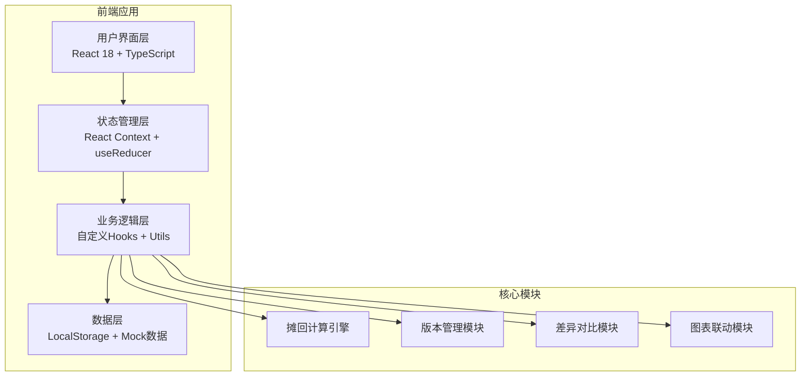
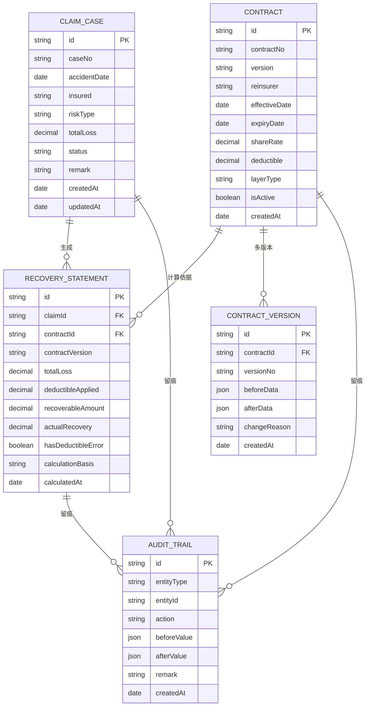

## 1. 架构设计



## 2. 技术描述

- **前端框架**: React@18.2.0 + TypeScript@5.3.3
- **构建工具**: Vite@5.0.8
- **样式方案**: TailwindCSS@3.4.1 + SCSS
- **路由管理**: React Router@6.21.1
- **图表库**: Recharts@2.10.3
- **状态管理**: React Context + useReducer
- **数据持久化**: LocalStorage
- **UI组件**: 自定义组件 + Lucide React图标

## 3. 路由定义

| 路由 | 页面 | 功能描述 |
|------|------|----------|
| / | 首页仪表盘 | 数据概览、关键指标、快速操作 |
| /claims | 赔案单管理 | 赔案列表、新增、编辑、详情 |
| /contracts | 分保合同管理 | 合同列表、版本管理、对比 |
| /calculation | 摊回计算 | 计算引擎、差异检测 |
| /statements | 摊回表 | 明细报表、图表、筛选联动 |
| /history | 历史追溯 | 变更记录、版本差异、时间线 |

## 4. 数据模型

### 4.1 ER图



### 4.2 核心数据结构定义

```typescript
// 赔案单
interface ClaimCase {
  id: string;
  caseNo: string;
  accidentDate: string;
  insured: string;
  riskType: string;
  totalLoss: number;
  status: 'pending' | 'confirmed' | 'closed';
  remark: string;
  createdAt: string;
  updatedAt: string;
}

// 分保合同
interface Contract {
  id: string;
  contractNo: string;
  version: string;
  reinsurer: string;
  effectiveDate: string;
  expiryDate: string;
  shareRate: number;
  deductible: number;
  layerType: 'quota' | 'excess';
  isActive: boolean;
  createdAt: string;
}

// 摊回计算结果
interface RecoveryStatement {
  id: string;
  claimId: string;
  contractId: string;
  contractVersion: string;
  totalLoss: number;
  deductibleApplied: number;
  recoverableAmount: number;
  actualRecovery: number;
  hasDeductibleError: boolean;
  errorMessage?: string;
  calculationBasis: string;
  calculatedAt: string;
}

// 审计追踪
interface AuditTrail {
  id: string;
  entityType: 'claim' | 'contract' | 'recovery';
  entityId: string;
  action: 'create' | 'update' | 'delete' | 'recalculate';
  beforeValue: any;
  afterValue: any;
  remark: string;
  createdAt: string;
}
```

## 5. 核心模块设计

### 5.1 摊回计算引擎

```typescript
// 计算规则：
// 1. 成数分保: 摊回金额 = (赔款金额 - 免赔额) × 分保比例
// 2. 溢额分保: 摊回金额 = max(0, 赔款金额 - 免赔额) × 分保比例
// 3. 免赔错用检测: 检查免赔额是否符合合同约定层级

class RecoveryCalculator {
  calculate(claim: ClaimCase, contract: Contract): CalculationResult {
    // 核心计算逻辑
  }
  
  detectDeductibleError(claim: ClaimCase, contract: Contract, history: AuditTrail[]): boolean {
    // 免赔错用检测逻辑
  }
}
```

### 5.2 版本管理模块

- 合同修改自动生成新版本
- 保留所有历史版本数据
- 支持任意版本对比
- 修改原因强制录入

### 5.3 差异对比模块

- JSON对象深度对比
- 差异高亮显示
- 自动生成差异说明
- 支持导出差异报告

### 5.4 图表联动模块

- 筛选条件变化触发图表重绘
- 支持多维度聚合
- 图表与表格数据双向联动
- 支持数据下钻

## 6. Mock数据设计

- **赔案单样例**: 5条记录，包含缺字段、晚补、备注修改
- **分保合同样例**: 3个合同，每个2-3个版本
- **摊回表样例**: 8条计算记录，包含2条免赔错用标记
- **审计记录**: 15条历史变更记录
