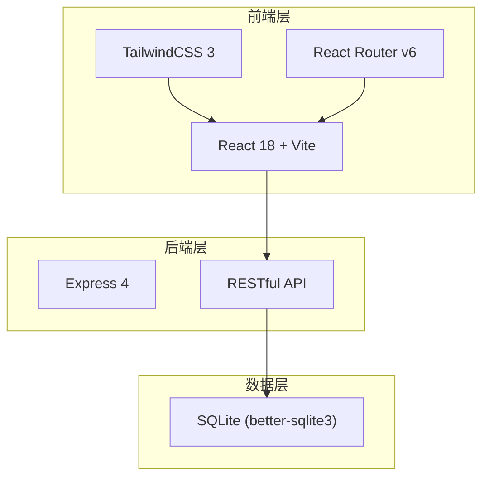
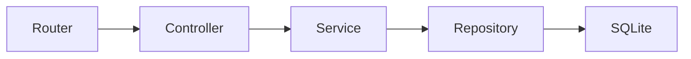
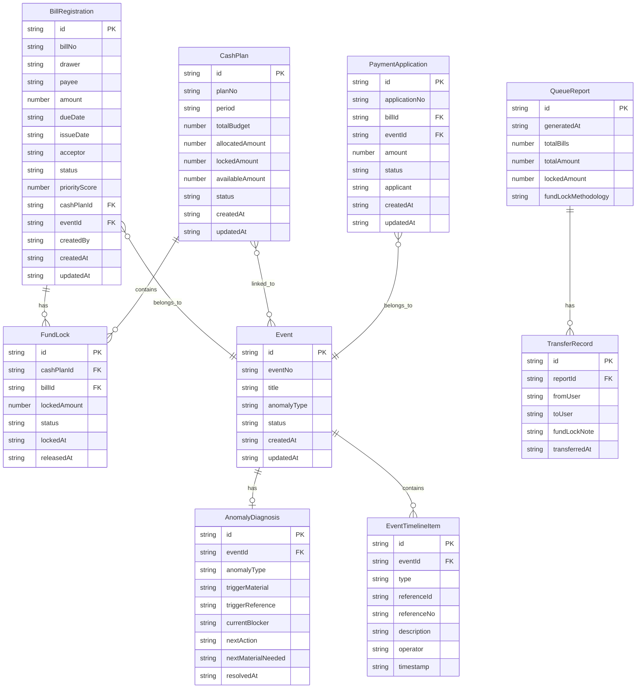

## 1. 架构设计



## 2. 技术说明

- 前端：React@18 + TailwindCSS@3 + Vite
- 初始化工具：Vite (react-ts template)
- 后端：Express@4
- 数据库：SQLite (better-sqlite3)，本地文件存储，无需外部数据库服务
- 跨域处理：开发环境 Vite proxy 转发 /api 至 Express
- 导出：exceljs 生成 Excel，jspdf 生成 PDF

## 3. 路由定义

| 路由 | 用途 |
|------|------|
| / | 重定向至 /queue |
| /queue | 兑付队列看板——优先队列总览、状态推进、重复预警、争议标记、资金锁定 |
| /event/:id | 事件追踪——单事件的时间线、异常诊断、全链路追溯 |
| /events | 事件列表——搜索与浏览所有事件 |
| /report | 报告与导出——队列报告生成、导出、转交 |

## 4. API 定义

### 4.1 商票登记相关

```typescript
interface BillRegistration {
  id: string;
  billNo: string;
  drawer: string;
  payee: string;
  amount: number;
  dueDate: string;
  issueDate: string;
  acceptor: string;
  status: "pending_review" | "reviewed" | "pending_payment" | "paid" | "rejected";
  priorityScore: number;
  cashPlanId: string | null;
  eventId: string;
  createdBy: string;
  createdAt: string;
  updatedAt: string;
}

// POST /api/bills - 新增商票登记
// GET /api/bills - 获取商票列表（支持筛选）
// GET /api/bills/:id - 获取商票详情
// PUT /api/bills/:id/status - 推进商票状态
// GET /api/bills/duplicates - 检测重复票据
```

### 4.2 现金计划相关

```typescript
interface CashPlan {
  id: string;
  planNo: string;
  period: string;
  totalBudget: number;
  allocatedAmount: number;
  lockedAmount: number;
  availableAmount: number;
  status: "draft" | "active" | "closed";
  createdAt: string;
  updatedAt: string;
}

interface FundLock {
  id: string;
  cashPlanId: string;
  billId: string;
  lockedAmount: number;
  status: "locked" | "pending" | "shortfall";
  lockedAt: string;
  releasedAt: string | null;
}

// GET /api/cash-plans - 获取现金计划列表
// GET /api/cash-plans/:id - 获取现金计划详情
// POST /api/fund-locks - 创建资金锁定
// PUT /api/fund-locks/:id - 更新资金锁定状态
// GET /api/fund-locks/shortfalls - 获取缺口预警列表
```

### 4.3 事件与追溯相关

```typescript
interface Event {
  id: string;
  eventNo: string;
  title: string;
  linkedBillIds: string[];
  linkedCashPlanIds: string[];
  linkedApplicationIds: string[];
  anomalyType: "duplicate" | "dispute" | "shortfall" | null;
  status: "open" | "in_progress" | "resolved" | "closed";
  createdAt: string;
  updatedAt: string;
}

interface EventTimelineItem {
  id: string;
  eventId: string;
  type: "bill_registration" | "cash_plan" | "payment_application" | "status_change" | "anomaly_detected" | "fund_lock";
  referenceId: string;
  referenceNo: string;
  description: string;
  operator: string;
  timestamp: string;
}

interface AnomalyDiagnosis {
  id: string;
  eventId: string;
  anomalyType: "duplicate" | "dispute" | "shortfall";
  triggerMaterial: string;
  triggerReference: string;
  currentBlocker: string;
  nextAction: string;
  nextMaterialNeeded: string;
  resolvedAt: string | null;
}

// GET /api/events - 获取事件列表
// GET /api/events/:id - 获取事件详情（含时间线、异常诊断）
// GET /api/events/search?q= - 按线索号搜索事件
// GET /api/events/:id/timeline - 获取事件时间线
// GET /api/events/:id/diagnosis - 获取异常诊断
// POST /api/events/:id/diagnosis - 更新异常诊断
```

### 4.4 队列与报告相关

```typescript
interface QueueItem {
  billId: string;
  billNo: string;
  drawer: string;
  amount: number;
  dueDate: string;
  status: string;
  priorityScore: number;
  fundLockStatus: "locked" | "pending" | "shortfall";
  hasDispute: boolean;
  hasDuplicate: boolean;
  eventId: string;
}

interface QueueReport {
  id: string;
  generatedAt: string;
  totalBills: number;
  totalAmount: number;
  lockedAmount: number;
  shortfalls: number;
  duplicates: number;
  disputes: number;
  fundLockMethodology: string;
  items: QueueItem[];
}

interface TransferRecord {
  id: string;
  reportId: string;
  fromUser: string;
  toUser: string;
  fundLockNote: string;
  transferredAt: string;
}

// GET /api/queue - 获取兑付队列
// POST /api/queue/dispute/:billId - 标记争议
// GET /api/reports/generate - 生成队列报告
// GET /api/reports/:id/export?format=xlsx|pdf - 导出报告
// POST /api/reports/:id/transfer - 转交报告
```

## 5. 服务端架构图



## 6. 数据模型

### 6.1 数据模型定义



### 6.2 数据定义语言

```sql
CREATE TABLE bill_registrations (
  id TEXT PRIMARY KEY,
  bill_no TEXT NOT NULL UNIQUE,
  drawer TEXT NOT NULL,
  payee TEXT NOT NULL,
  amount REAL NOT NULL,
  due_date TEXT NOT NULL,
  issue_date TEXT NOT NULL,
  acceptor TEXT NOT NULL,
  status TEXT NOT NULL DEFAULT 'pending_review',
  priority_score REAL NOT NULL DEFAULT 0,
  cash_plan_id TEXT,
  event_id TEXT NOT NULL,
  created_by TEXT NOT NULL,
  created_at TEXT NOT NULL DEFAULT (datetime('now')),
  updated_at TEXT NOT NULL DEFAULT (datetime('now')),
  FOREIGN KEY (cash_plan_id) REFERENCES cash_plans(id),
  FOREIGN KEY (event_id) REFERENCES events(id)
);

CREATE TABLE cash_plans (
  id TEXT PRIMARY KEY,
  plan_no TEXT NOT NULL UNIQUE,
  period TEXT NOT NULL,
  total_budget REAL NOT NULL,
  allocated_amount REAL NOT NULL DEFAULT 0,
  locked_amount REAL NOT NULL DEFAULT 0,
  available_amount REAL NOT NULL DEFAULT 0,
  status TEXT NOT NULL DEFAULT 'draft',
  created_at TEXT NOT NULL DEFAULT (datetime('now')),
  updated_at TEXT NOT NULL DEFAULT (datetime('now'))
);

CREATE TABLE fund_locks (
  id TEXT PRIMARY KEY,
  cash_plan_id TEXT NOT NULL,
  bill_id TEXT NOT NULL,
  locked_amount REAL NOT NULL,
  status TEXT NOT NULL DEFAULT 'pending',
  locked_at TEXT,
  released_at TEXT,
  FOREIGN KEY (cash_plan_id) REFERENCES cash_plans(id),
  FOREIGN KEY (bill_id) REFERENCES bill_registrations(id)
);

CREATE TABLE payment_applications (
  id TEXT PRIMARY KEY,
  application_no TEXT NOT NULL UNIQUE,
  bill_id TEXT NOT NULL,
  event_id TEXT NOT NULL,
  amount REAL NOT NULL,
  status TEXT NOT NULL DEFAULT 'pending',
  applicant TEXT NOT NULL,
  created_at TEXT NOT NULL DEFAULT (datetime('now')),
  updated_at TEXT NOT NULL DEFAULT (datetime('now')),
  FOREIGN KEY (bill_id) REFERENCES bill_registrations(id),
  FOREIGN KEY (event_id) REFERENCES events(id)
);

CREATE TABLE events (
  id TEXT PRIMARY KEY,
  event_no TEXT NOT NULL UNIQUE,
  title TEXT NOT NULL,
  anomaly_type TEXT,
  status TEXT NOT NULL DEFAULT 'open',
  created_at TEXT NOT NULL DEFAULT (datetime('now')),
  updated_at TEXT NOT NULL DEFAULT (datetime('now'))
);

CREATE TABLE event_timeline_items (
  id TEXT PRIMARY KEY,
  event_id TEXT NOT NULL,
  type TEXT NOT NULL,
  reference_id TEXT NOT NULL,
  reference_no TEXT NOT NULL,
  description TEXT NOT NULL,
  operator TEXT NOT NULL,
  timestamp TEXT NOT NULL DEFAULT (datetime('now')),
  FOREIGN KEY (event_id) REFERENCES events(id)
);

CREATE TABLE event_links (
  id TEXT PRIMARY KEY,
  event_id TEXT NOT NULL,
  target_type TEXT NOT NULL,
  target_id TEXT NOT NULL,
  FOREIGN KEY (event_id) REFERENCES events(id)
);

CREATE TABLE anomaly_diagnoses (
  id TEXT PRIMARY KEY,
  event_id TEXT NOT NULL UNIQUE,
  anomaly_type TEXT NOT NULL,
  trigger_material TEXT NOT NULL,
  trigger_reference TEXT NOT NULL,
  current_blocker TEXT NOT NULL,
  next_action TEXT NOT NULL,
  next_material_needed TEXT NOT NULL,
  resolved_at TEXT,
  FOREIGN KEY (event_id) REFERENCES events(id)
);

CREATE TABLE queue_reports (
  id TEXT PRIMARY KEY,
  generated_at TEXT NOT NULL DEFAULT (datetime('now')),
  total_bills INTEGER NOT NULL,
  total_amount REAL NOT NULL,
  locked_amount REAL NOT NULL,
  shortfalls INTEGER NOT NULL DEFAULT 0,
  duplicates INTEGER NOT NULL DEFAULT 0,
  disputes INTEGER NOT NULL DEFAULT 0,
  fund_lock_methodology TEXT NOT NULL
);

CREATE TABLE transfer_records (
  id TEXT PRIMARY KEY,
  report_id TEXT NOT NULL,
  from_user TEXT NOT NULL,
  to_user TEXT NOT NULL,
  fund_lock_note TEXT NOT NULL,
  transferred_at TEXT NOT NULL DEFAULT (datetime('now')),
  FOREIGN KEY (report_id) REFERENCES queue_reports(id)
);

CREATE INDEX idx_bills_status ON bill_registrations(status);
CREATE INDEX idx_bills_due_date ON bill_registrations(due_date);
CREATE INDEX idx_bills_event ON bill_registrations(event_id);
CREATE INDEX idx_fund_locks_bill ON fund_locks(bill_id);
CREATE INDEX idx_fund_locks_status ON fund_locks(status);
CREATE INDEX idx_events_status ON events(status);
CREATE INDEX idx_events_anomaly ON events(anomaly_type);
CREATE INDEX idx_timeline_event ON event_timeline_items(event_id);
CREATE INDEX idx_event_links_event ON event_links(event_id);
```
