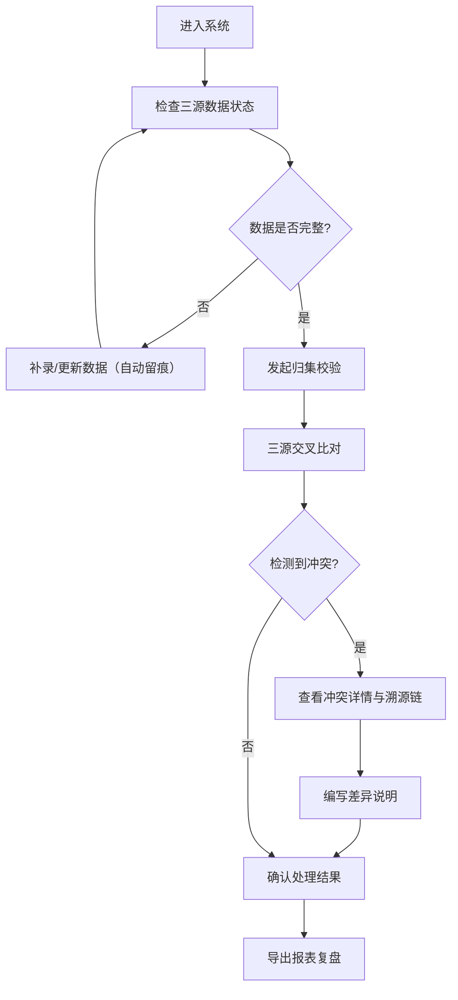

## 1. 产品概述

企业年金归集校验系统——为人力与财务团队解决"员工档案齐、缴费比例晚到一版"的归集混乱问题，提供三源（员工档案、工资表、缴费比例）交叉校验、冲突留痕、差异溯源与报表导出的一站式工具。

- 核心痛点：人力财务每次做企业年金归集校验都要重新解释缴费归集逻辑，比例版本错还晚到，离职未停缴与补缴跨月等复杂场景无迹可查
- 目标价值：让缴费归集主线清晰、状态校验与差异说明来源统一、改过什么谁影响了谁一目了然，最终用报表导出复盘

## 2. 核心功能

### 2.1 用户角色

| 角色 | 进入方式 | 核心权限 |
|------|----------|----------|
| 人力专员 | 直接使用 | 录入/编辑员工档案、工资表、发起归集校验 |
| 财务专员 | 直接使用 | 录入/编辑缴费比例、发起归集校验、导出报表 |

### 2.2 功能模块

1. **归集校验主页**：三源数据总览、归集校验执行入口、校验结果摘要
2. **员工档案管理**：员工主信息 CRUD、在职/离职状态管理
3. **工资表管理**：月度工资数据录入、与员工档案关联校验
4. **缴费比例管理**：比例版本时间线、生效/失效区间、延迟到版标注
5. **校验结果与留痕**：冲突检测、差异说明、变更时间线、溯源链
6. **报表导出**：归集校验报告下载、工资表结论与页面摘要一致性保证

### 2.3 页面详情

| 页面名称 | 模块名称 | 功能描述 |
|----------|----------|----------|
| 归集校验主页 | 三源数据状态卡 | 显示员工档案、工资表、缴费比例三源的数据完整度与最新版本时间 |
| 归集校验主页 | 归集校验执行面板 | 一键发起校验，显示校验进度与结果摘要（通过/冲突/待确认） |
| 归集校验主页 | 冲突摘要列表 | 列出三源冲突项，点击可展开差异详情与溯源链 |
| 员工档案管理 | 员工列表 | 支持搜索/筛选/排序，显示工号、姓名、部门、状态、最近变更时间 |
| 员工档案管理 | 员工详情编辑 | 编辑主信息与状态，变更自动记入变更时间线 |
| 员工档案管理 | 变更时间线 | 按时间倒序展示该员工所有字段变更记录 |
| 工资表管理 | 月度工资表列表 | 按月份列出工资表，显示关联员工数、数据完整度 |
| 工资表管理 | 工资明细编辑 | 逐员工录入/编辑月度工资数据，实时标记与档案不一致项 |
| 缴费比例管理 | 比例版本时间线 | 可视化展示比例版本生效/失效区间，标注延迟到版 |
| 缴费比例管理 | 比例版本编辑 | 新增/编辑比例版本，设置生效月份，标注是否延迟到版 |
| 校验结果与留痕 | 冲突详情面板 | 展示冲突的三源数据对比，溯源链显示数据来源与影响关系 |
| 校验结果与留痕 | 差异说明编辑 | 对冲突项编写差异说明，说明与校验结果关联存储 |
| 校验结果与留痕 | 变更影响图谱 | 可视化展示"谁影响了谁"的变更传播关系 |
| 报表导出 | 报表配置 | 选择导出范围（月份/员工/冲突类型），预览摘要 |
| 报表导出 | 导出下载 | 生成 CSV/JSON 报表，工资表结论与页面摘要一致 |

## 3. 核心流程

用户进入系统 → 检查三源数据状态（员工档案、工资表、缴费比例） → 补录/更新缺失或过时数据（变更自动留痕） → 发起归集校验 → 系统交叉比对三源数据，检测冲突（含离职未停缴、补缴跨月、比例版本错还晚到等复杂场景） → 展示校验结果与冲突摘要 → 用户查看冲突详情、编写差异说明 → 确认处理结果 → 导出报表复盘

## 4. 用户界面设计

### 4.1 设计风格

- 主色调：深石板蓝 (#1B2A4A) + 琥珀金 (#D4A843) 强调色，传达专业与严谨
- 辅助色：浅灰蓝 (#E8ECF1) 背景、柔白 (#F7F8FA) 卡片、状态红 (#E74C3C) / 状态绿 (#27AE60)
- 按钮风格：圆角矩形 (6px)，主操作用琥珀金填充，次操作用描边
- 字体：思源黑体 / Noto Sans SC 作为主字体，等宽字体用于数据表格
- 布局风格：左侧固定导航 + 右侧内容区，卡片式模块布局
- 图标风格：线性图标，2px 描边，与专业金融工具风格一致

### 4.2 页面设计概览

| 页面名称 | 模块名称 | UI 元素 |
|----------|----------|---------|
| 归集校验主页 | 三源数据状态卡 | 三张横向卡片，各含进度环与版本时间标签，琥珀金强调关键数字 |
| 归集校验主页 | 归集校验执行面板 | 居中大按钮，点击后进度条动画，完成后切换为结果摘要面板 |
| 归集校验主页 | 冲突摘要列表 | 分组列表，冲突类型标签着色，展开箭头动画，悬停高亮行 |
| 员工档案管理 | 员工列表 | 表格布局，顶栏搜索框+筛选下拉，行内状态徽章，右键操作菜单 |
| 员工档案管理 | 变更时间线 | 左侧竖线+节点圆点，右侧变更卡片，时间戳与操作人标注 |
| 工资表管理 | 月度工资表列表 | 月份卡片网格，每卡含完整度进度条，缺漏项红色标记 |
| 缴费比例管理 | 比例版本时间线 | 横向甘特图样式，版本条带颜色区分，延迟到版用虚线+警示标记 |
| 校验结果与留痕 | 变更影响图谱 | 有向图节点+连线，节点按数据源着色，悬停显示影响路径 |
| 报表导出 | 报表配置 | 表单区+右侧预览面板，选项组联动，底部导出按钮 |

### 4.3 响应式策略

桌面优先设计，最小宽度 1280px；平板端 (768-1279px) 侧边栏折叠为汉堡菜单，卡片由横排改为竖排；移动端 (<768px) 仅保留核心校验与浏览功能，编辑操作引导至桌面端

### 4.4 3D 场景

不适用
