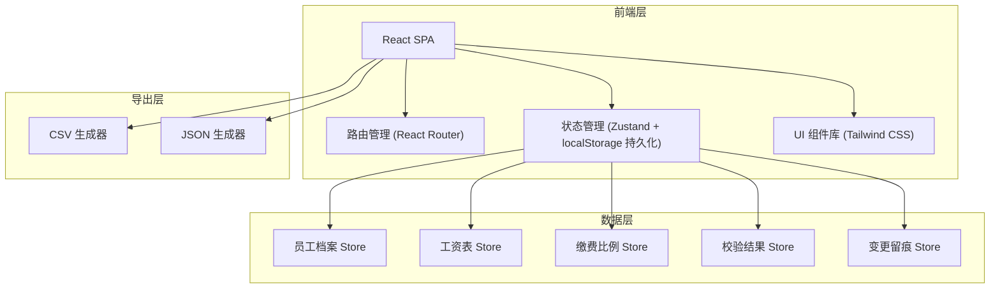
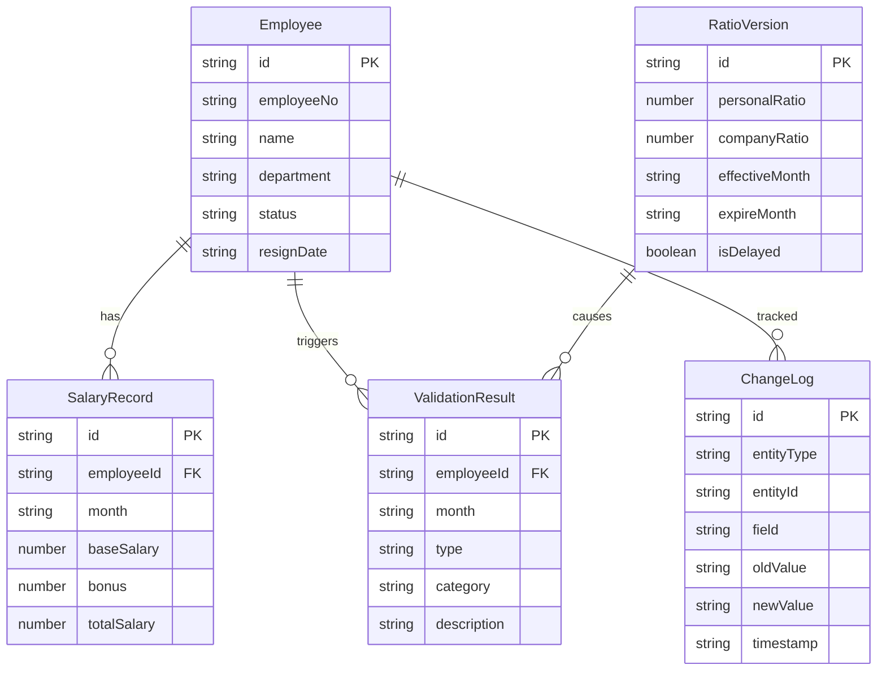

## 1. 架构设计



纯前端架构，数据持久化依赖 localStorage，确保刷新后不丢数据。

## 2. 技术说明

- 前端：React@18 + Tailwind CSS@3 + Vite
- 初始化工具：Vite (react-ts 模板)
- 后端：无（纯前端，localStorage 持久化）
- 数据库：无（localStorage + 内存状态管理）
- 状态管理：Zustand（含 persist 中间件自动同步 localStorage）
- 路由：React Router v6
- 图表/可视化：纯 SVG + CSS 动画（不引入重型图表库）
- 导出：原生 JS 生成 CSV / JSON，Blob + URL.createObjectURL 下载
- 日期处理：dayjs

## 3. 路由定义

| 路由 | 用途 |
|------|------|
| / | 归集校验主页，三源数据状态总览与校验执行入口 |
| /employees | 员工档案管理，员工列表与 CRUD |
| /employees/:id | 员工详情，包含变更时间线 |
| /salary | 工资表管理，月度工资表列表 |
| /salary/:month | 指定月份工资明细编辑 |
| /ratio | 缴费比例管理，版本时间线与编辑 |
| /validation | 校验结果与留痕，冲突详情与差异说明 |
| /export | 报表导出，配置与下载 |

## 4. API 定义

无后端 API。所有数据操作通过 Zustand Store 完成，Store 自动持久化到 localStorage。

### 核心 Store 接口

```typescript
interface Employee {
  id: string;
  employeeNo: string;
  name: string;
  department: string;
  status: "active" | "resigned";
  resignDate?: string;
  baseInfo: Record<string, string>;
}

interface SalaryRecord {
  id: string;
  employeeId: string;
  month: string;
  baseSalary: number;
  bonus: number;
  totalSalary: number;
}

interface RatioVersion {
  id: string;
  personalRatio: number;
  companyRatio: number;
  effectiveMonth: string;
  expireMonth?: string;
  isDelayed: boolean;
  delayedMonths?: number;
  description?: string;
}

interface ValidationResult {
  id: string;
  employeeId: string;
  month: string;
  type: "conflict" | "warning" | "info";
  category: "resign_not_stop" | "backpay_cross_month" | "ratio_version_mismatch" | "data_inconsistency";
  description: string;
  sources: {
    archive?: string;
    salary?: string;
    ratio?: string;
  };
  timeline: Array<{
    time: string;
    event: string;
    source: string;
  }>;
  resolution?: string;
  resolvedAt?: string;
}

interface ChangeLog {
  id: string;
  entityType: "employee" | "salary" | "ratio";
  entityId: string;
  field: string;
  oldValue: string;
  newValue: string;
  operator: string;
  timestamp: string;
  relatedValidationId?: string;
}
```

## 5. 服务端架构

不适用（纯前端项目）

## 6. 数据模型

### 6.1 数据模型定义



### 6.2 数据初始化

系统内置示例数据集，包含：
- 10 名员工档案（含 2 名已离职）
- 3 个月工资表数据
- 3 个缴费比例版本（含 1 个延迟到版）
- 预置校验结果示例（含离职未停缴、补缴跨月、比例版本错配等场景）
