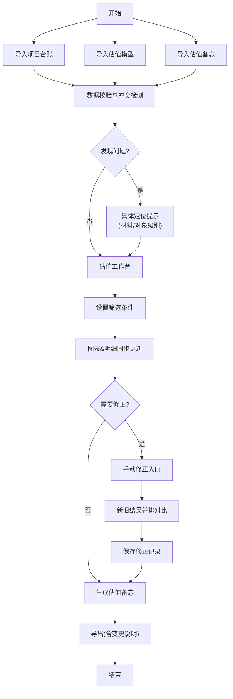

## 1. 产品概述

基金投后估值备忘系统是专为投后经理设计的专业工具，解决估值口径变更、报表缺期等复杂场景下的估值记录与追踪问题。系统支持多源数据输入比对、口径变更追溯、人工修正对比等核心功能，确保估值过程可追溯、可审计。

- 解决核心痛点：估值口径不一致、报表缺期、调整重复等易遗漏问题
- 目标用户：基金投后经理、财务分析人员
- 核心价值：确保估值口径可追溯、材料冲突透明化、人工改动留痕

## 2. 核心功能

### 2.1 用户角色

| 角色 | 注册方式 | 核心权限 |
|------|----------|----------|
| 投后经理 | 企业账号登录 | 数据导入、估值比对、口径调整、导出备忘 |
| 审核人员 | 企业账号登录 | 查看估值记录、审核变更申请 |

### 2.2 功能模块

1. **数据导入台**：项目台账上传、估值模型导入、估值备忘录入
2. **估值工作台**：多口径对比、缺期检测、冲突预警、筛选联动
3. **变更追踪器**：口径变更历史、人工修改记录、影响范围分析
4. **修正对比室**：手动修正入口、新旧结果并排对比、差异高亮
5. **导出中心**：估值备忘导出、变更说明附件、审计报告生成

### 2.3 页面详情

| 页面名称 | 模块名称 | 功能描述 |
|----------|----------|----------|
| 数据导入台 | 上传区域 | 支持Excel/CSV拖拽上传，实时解析预览 |
| 数据导入台 | 数据校验 | 自动检测字段缺失、格式错误、数据冲突 |
| 数据导入台 | 来源管理 | 标记数据来源（台账/模型/备忘），保留原始版本 |
| 估值工作台 | 筛选面板 | 按基金、项目、期间、口径多维度筛选 |
| 估值工作台 | 估值概览 | 趋势图表、关键指标卡片、异常高亮 |
| 估值工作台 | 明细表格 | 可编辑数据表格，支持列配置、排序、分组 |
| 估值工作台 | 冲突预警 | 具体到材料/对象的错误提示，定位问题行 |
| 变更追踪器 | 口径历史 | 版本对比、变更时间线、修改人记录 |
| 变更追踪器 | 影响分析 | 改动影响范围可视化，关联数据高亮 |
| 修正对比室 | 双栏对比 | 原始值/修正值并排显示，差异百分比标注 |
| 修正对比室 | 修正记录 | 保存修正理由，支持审批流 |
| 导出中心 | 备忘生成 | 自动生成估值备忘Word/PDF，嵌入变更说明 |
| 导出中心 | 审计导出 | 导出完整操作日志，支持追溯 |

## 3. 核心流程

投后经理导入三类数据 → 系统自动检测冲突与缺期 → 筛选条件联动更新图表与明细 → 人工修正财务报表 → 双栏对比确认差异 → 生成带变更说明的估值备忘

## 4. 用户界面设计

### 4.1 设计风格

- 主色调：深蓝 (#1e3a5f) - 专业稳重，金融行业属性
- 辅助色：金色 (#d4af37) - 强调关键操作，琥珀橙 (#ff9500) - 预警提示
- 成功色：翠绿 (#22c55e)，错误色：赤红 (#ef4444)
- 按钮风格：圆角6px，轻微阴影，hover时上浮效果
- 字体：思源黑体 (Source Han Sans) - 中文专业易读
- 布局：顶部导航 + 左侧筛选 + 主内容区三栏结构
- 图标：线性图标，保持简洁专业

### 4.2 页面设计概述

| 页面名称 | 模块名称 | UI元素 |
|----------|----------|--------|
| 数据导入台 | 上传区域 | 大尺寸拖拽区，文件图标，进度条动画 |
| 估值工作台 | 概览卡片 | 渐变背景卡片，指标数值放大，趋势小图表 |
| 估值工作台 | 冲突预警 | 红色边框卡片，具体定位链接，一键跳转 |
| 变更追踪器 | 时间线 | 垂直时间轴，版本节点，差异对比色块 |
| 修正对比室 | 双栏布局 | 左右分割线，可拖拽调整宽度，差异行高亮 |
| 导出中心 | 预览区 | 文档缩略图，下载按钮，格式选择器 |

### 4.3 响应式

- 桌面端优先设计，1440px以上最优体验
- 平板端适配：左侧筛选可折叠，表格横向滚动
- 移动端：卡片堆叠布局，核心功能优先展示

### 4.4 交互细节

- 筛选条件变更时，图表数据平滑过渡动画
- 冲突行悬停时显示详细问题描述
- 修正对比时，差异单元格闪烁高亮
- 导入进度实时更新，成功/失败状态动画反馈
