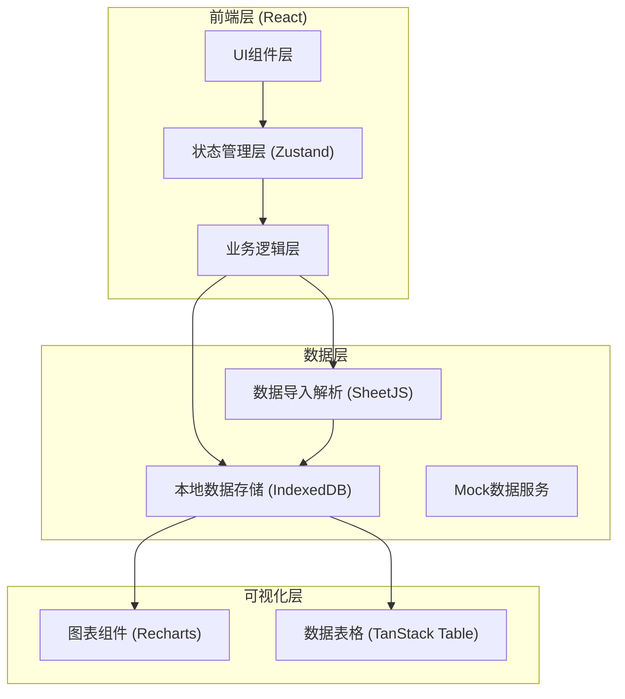
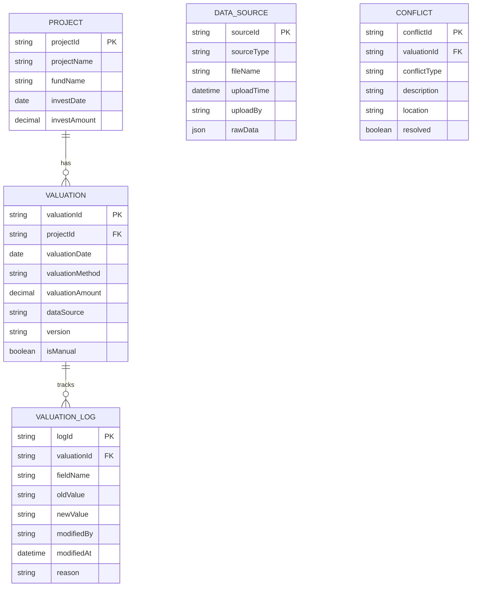

## 1. 架构设计



## 2. 技术描述

- 前端框架：React@18 + TypeScript
- 构建工具：Vite@5
- 样式方案：TailwindCSS@3
- 状态管理：Zustand
- 数据导入：xlsx (SheetJS)
- 数据表格：@tanstack/react-table
- 图表库：recharts
- 文件导出：file-saver + jspdf
- 本地存储：IndexedDB (dexie.js)
- UI组件：radix-ui + lucide-react

## 3. 路由定义

| 路由 | 页面 | 目的 |
|------|------|------|
| / | 数据导入台 | 项目台账、估值模型、估值备忘导入 |
| /valuation | 估值工作台 | 估值概览、筛选联动、明细查看 |
| /changes | 变更追踪器 | 口径变更历史、人工修改记录 |
| /compare | 修正对比室 | 手动修正、新旧结果对比 |
| /export | 导出中心 | 估值备忘生成与导出 |

## 4. 数据模型

### 4.1 数据模型定义



### 4.2 TypeScript 类型定义

```typescript
// 项目信息
interface Project {
  projectId: string;
  projectName: string;
  fundName: string;
  investDate: string;
  investAmount: number;
  industry?: string;
}

// 估值记录
interface Valuation {
  valuationId: string;
  projectId: string;
  valuationDate: string;
  valuationMethod: string;
  valuationAmount: number;
  sharePrice?: number;
  shareNumber?: number;
  dataSource: 'ledger' | 'model' | 'memo';
  version: string;
  isManual: boolean;
  createdAt: string;
  updatedAt: string;
}

// 变更日志
interface ValuationLog {
  logId: string;
  valuationId: string;
  fieldName: string;
  oldValue: string | number;
  newValue: string | number;
  modifiedBy: string;
  modifiedAt: string;
  reason: string;
  impactScope: string[];
}

// 冲突记录
interface Conflict {
  conflictId: string;
  valuationId: string;
  conflictType: 'caliber_mismatch' | 'missing_period' | 'duplicate_adjustment' | 'data_inconsistency';
  description: string;
  location: {
    source: string;
    row?: number;
    field?: string;
  };
  resolved: boolean;
  resolvedAt?: string;
}

// 筛选条件
interface FilterState {
  fundNames: string[];
  projectIds: string[];
  dateRange: { start: string; end: string };
  valuationMethods: string[];
  dataSources: string[];
}
```

## 5. 核心功能模块

### 5.1 数据导入模块

- 支持Excel/CSV文件解析 (xlsx库)
- 自动识别表头和数据类型
- 原始数据备份，支持版本回溯
- 导入进度实时反馈

### 5.2 估值计算与联动

- 筛选条件变化时自动重算关联数据
- 图表与明细表单向数据流同步
- 估值口径一致性校验
- 缺期自动检测与提示

### 5.3 变更追踪模块

- 字段级变更记录
- 人工修改标记与理由保存
- 影响范围自动分析
- 版本对比与差异高亮

### 5.4 对比与导出

- 双栏数据对比视图
- 差异百分比计算
- 导出Word/PDF格式备忘
- 变更说明自动嵌入文档
