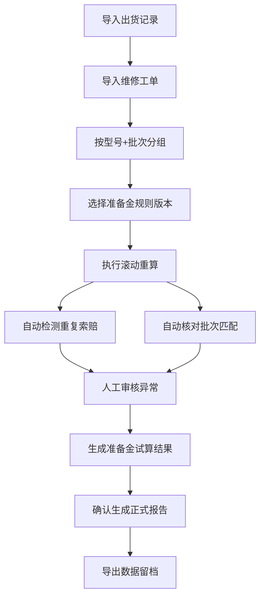

## 1. 产品概述

售后质保准备金管理系统是面向制造业财务部门的专业分析工具，解决设备出货后维修索赔分批回款时，质保准备金按型号和批次滚动重算过程中重复索赔识别难、批次错配核对繁、规则版本追溯难等核心痛点。系统确保图表、明细和下载文件来自同一批数据，准备金试算与报表导出口径完全一致，为日常处理和事后复盘提供完整证据链。

## 2. 核心功能

### 2.1 用户角色

| 角色 | 注册方式 | 核心权限 |
|------|----------|----------|
| 财务分析师 | 系统账号登录 | 准备金试算、数据查询、报表导出、版本查看 |
| 财务主管 | 系统账号登录 | 规则配置、批次核对、审计留痕、完整报告查看 |

### 2.2 功能模块

1. **概览仪表盘**：准备金滚动趋势、批次分布、索赔去重统计
2. **准备金试算**：按型号+批次滚动重算、实时预览计算结果
3. **索赔去重分析**：重复索赔检测、批次错配核对、人工审核留痕
4. **规则版本管理**：准备金规则历史、版本对比、规则证据留存
5. **滚动报告**：完整计算链路展示、试算与去重过程追溯
6. **数据导出**：Excel/CSV导出，与图表明细数据完全一致

### 2.3 页面详情

| 页面名称 | 模块名称 | 功能描述 |
|---------|---------|----------|
| 概览仪表盘 | 趋势图表 | 准备金余额滚动趋势、月度索赔金额、批次覆盖率 |
| 概览仪表盘 | 关键指标 | 应计提准备金、已冲回金额、重复索赔金额、批次错配数量 |
| 概览仪表盘 | 预警列表 | 高风险批次、规则过期提醒、待核对项 |
| 准备金试算 | 计算参数 | 选择型号、批次区间、计算日期、规则版本 |
| 准备金试算 | 计算过程 | 滚动重算步骤展示、每批次计提/冲回明细 |
| 准备金试算 | 结果预览 | 试算结果表格、差异分析、一键确认 |
| 索赔去重分析 | 重复索赔检测 | 按设备编号+故障类型自动匹配疑似重复项 |
| 索赔去重分析 | 批次核对 | 出货记录与维修工单批次自动比对、错配标记 |
| 索赔去重分析 | 人工审核 | 审核意见录入、审核人留痕、审核时间戳 |
| 规则版本管理 | 规则列表 | 历史规则版本、生效时间、创建人 |
| 规则版本管理 | 规则详情 | 准备金计提比例、质保期限、例外条款 |
| 规则版本管理 | 版本对比 | 相邻版本差异高亮、变更原因记录 |
| 滚动报告 | 计算链路 | 从出货→索赔→准备金→去重的完整追溯 |
| 滚动报告 | 证据留存 | 规则快照、审核记录、版本号、数据时间戳 |
| 滚动报告 | 导出报告 | PDF/Excel导出，含完整计算说明 |

## 3. 核心流程

### 主业务流程
财务人员导入出货记录和维修工单数据 → 系统按型号+批次分组 → 选择准备金规则版本 → 执行滚动重算 → 自动检测重复索赔和批次错配 → 人工审核异常项 → 生成准备金试算结果 → 确认后生成正式报告 → 导出数据留档。

## 4. 用户界面设计

### 4.1 设计风格
- **主色调**：专业深蓝 (#1e3a5f)，体现财务系统的严谨和可信赖
- **辅助色**：琥珀橙 (#d97706) 用于预警，翡翠绿 (#059669) 用于确认，玫瑰红 (#dc2626) 用于错误
- **中性色**：石板灰系列 (#f8fafc, #f1f5f9, #e2e8f0, #64748b, #1e293b)
- **按钮风格**：直角微圆角 (4px)，2px边框，悬停时背景色加深，点击时有轻微下沉效果
- **字体**：标题使用 "Noto Serif SC" 衬线体体现专业感，正文使用 "Noto Sans SC" 无衬线体保证可读性
- **布局风格**：侧边导航 + 顶部信息栏 + 主内容区，卡片式布局，清晰的功能分区
- **图标**：使用 Lucide 线性图标，保持简洁专业

### 4.2 页面设计概述

| 页面名称 | 模块名称 | UI 元素 |
|---------|---------|---------|
| 概览仪表盘 | 趋势图表 | 面积图展示准备金滚动趋势，柱状图对比月度索赔，支持hover显示明细 |
| 概览仪表盘 | 关键指标 | 大号数字卡片，带环比变化箭头，背景使用渐变增加层次感 |
| 准备金试算 | 计算过程 | 步骤指示器，每步可展开查看明细公式，当前步骤高亮 |
| 索赔去重分析 | 检测结果 | 表格行分组展示，疑似重复项用橙底标注，点击展开比对详情 |
| 规则版本管理 | 版本对比 | 左右分栏对比，差异部分用背景色高亮 |
| 滚动报告 | 计算链路 | 时间线式布局，每节点可展开查看证据文件 |

### 4.3 响应式
- 桌面端优先设计，主内容区最小宽度1280px
- 平板端侧边栏可折叠，图表自适应宽度
- 移动端简化为关键指标列表和基础查询功能

### 4.4 数据可视化
- 使用 Recharts 图表库，自定义主题色
- 准备金趋势图：面积图，不同型号用不同深浅的蓝色系
- 索赔分布图：堆叠柱状图，正常索赔/重复索赔/错配索赔分层显示
- 批次分布图：环形图，显示各批次准备金占比
- 所有图表支持点击下钻查看明细数据
