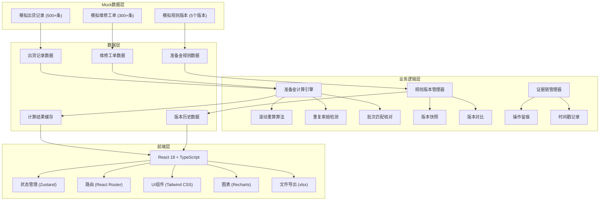
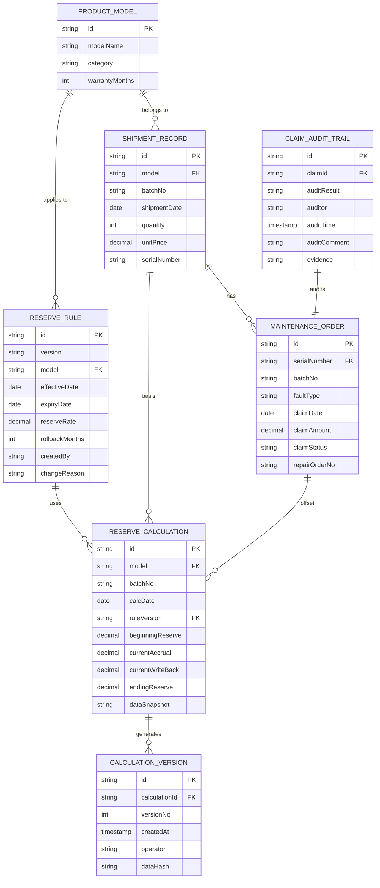

## 1. 架构设计



## 2. 技术描述

- **前端框架**: React@18 + TypeScript@5 + Vite@5
- **状态管理**: Zustand@4，集中管理准备金计算状态和规则版本
- **路由**: React Router DOM@6
- **样式**: Tailwind CSS@3，自定义设计Token
- **图表**: Recharts@2，自定义主题配色
- **图标**: Lucide React@0.344
- **文件导出**: xlsx@0.18，支持Excel和CSV格式
- **后端**: 无后端，纯前端应用，使用Mock数据
- **数据持久化**: LocalStorage存储用户操作记录和计算结果
- **初始化工具**: vite-init

## 3. 路由定义

| 路由 | 页面组件 | 用途 |
|------|---------|------|
| / | Dashboard | 概览仪表盘，展示核心指标和趋势图表 |
| /trial-calculation | TrialCalculation | 准备金试算页面，按型号批次滚动重算 |
| /claim-deduplication | ClaimDeduplication | 索赔去重分析，检测重复索赔和批次错配 |
| /rule-versions | RuleVersions | 规则版本管理，查看历史版本和对比差异 |
| /rolling-report | RollingReport | 滚动报告，展示完整计算链路和证据链 |

## 4. 数据模型

### 4.1 ER图



### 4.2 核心数据类型定义

```typescript
// 出货记录
interface ShipmentRecord {
  id: string;
  model: string;
  batchNo: string;
  shipmentDate: string;
  quantity: number;
  unitPrice: number;
  serialNumber: string;
  warrantyMonths: number;
}

// 维修工单
interface MaintenanceOrder {
  id: string;
  serialNumber: string;
  batchNo: string;
  faultType: string;
  claimDate: string;
  claimAmount: number;
  claimStatus: 'pending' | 'approved' | 'rejected' | 'duplicate';
  repairOrderNo: string;
  isDuplicate?: boolean;
  duplicateGroupId?: string;
  batchMismatch?: boolean;
}

// 准备金规则
interface ReserveRule {
  id: string;
  version: string;
  model: string;
  effectiveDate: string;
  expiryDate: string;
  reserveRate: number;
  rollbackMonths: number;
  createdBy: string;
  changeReason: string;
  isActive: boolean;
}

// 准备金计算结果
interface ReserveCalculation {
  id: string;
  model: string;
  batchNo: string;
  calcDate: string;
  ruleVersion: string;
  beginningReserve: number;
  currentAccrual: number;
  currentWriteBack: number;
  endingReserve: number;
  calculationSteps: CalculationStep[];
  dataSnapshot: DataSnapshot;
}

// 计算步骤
interface CalculationStep {
  stepNo: number;
  description: string;
  formula: string;
  result: number;
  evidence?: string;
}

// 数据快照（用于一致性保证）
interface DataSnapshot {
  shipmentCount: number;
  claimCount: number;
  timestamp: string;
  dataHash: string;
}

// 审核留痕
interface AuditTrail {
  id: string;
  claimId: string;
  auditResult: 'confirmed' | 'rejected' | 'pending';
  auditor: string;
  auditTime: string;
  auditComment: string;
  evidence: string;
}

// 重复索赔组
interface DuplicateClaimGroup {
  id: string;
  serialNumber: string;
  faultType: string;
  claims: MaintenanceOrder[];
  detectedDate: string;
  status: 'pending' | 'resolved';
}

// 批次错配
interface BatchMismatch {
  id: string;
  serialNumber: string;
  shipmentBatch: string;
  claimBatch: string;
  shipmentRecord: ShipmentRecord;
  maintenanceOrder: MaintenanceOrder;
  status: 'pending' | 'resolved';
}
```

## 5. 核心算法定义

### 5.1 准备金滚动重算算法

```
输入：
- 型号 model
- 批次 batchNo
- 计算日期 calcDate
- 准备金规则 rule

计算步骤：
1. 获取该批次历史准备金余额（期初余额）
2. 获取该批次本期出货金额
   本期出货金额 = Σ(出货数量 × 单价)
3. 计算本期应计提准备金
   本期计提 = 本期出货金额 × 规则.计提比例
4. 获取该批次本期索赔金额（已去重）
   本期索赔 = Σ(有效索赔金额) - Σ(重复索赔金额)
5. 计算本期应冲回准备金
   本期冲回 = 本期索赔金额 × 规则.冲回比例
6. 计算期末准备金余额
   期末余额 = 期初余额 + 本期计提 - 本期冲回
7. 滚动至下一批次重复计算

输出：
- 期初余额、本期计提、本期冲回、期末余额
- 每批次明细计算过程
- 数据一致性校验哈希
```

### 5.2 重复索赔检测算法

```
输入：维修工单列表

检测维度：
1. 设备编号相同 + 故障类型相同 + 索赔日期相差≤30天
2. 维修单号关联重复（同一维修单多次索赔）
3. 设备编号相同 + 相同故障代码 + 索赔金额相同

算法步骤：
1. 按设备编号分组所有维修工单
2. 对每组内的工单按索赔日期排序
3. 滑动窗口检测相邻工单是否满足重复条件
4. 生成重复索赔组，标记疑似重复项
5. 计算置信度评分（0-100）

输出：重复索赔组列表，含置信度和检测依据
```

### 5.3 批次匹配核对算法

```
输入：出货记录、维修工单

核对逻辑：
1. 通过设备编号关联出货记录和维修工单
2. 比对出货批次与索赔批次是否一致
3. 检查索赔日期是否在质保期内
4. 标记批次错配和超质保期索赔

输出：批次错配列表，含出货记录和索赔记录详情
```

### 5.4 数据一致性保证机制

```
1. 图表、明细、导出文件使用同一数据源对象
2. 每次计算生成数据快照哈希
3. 导出文件中嵌入数据哈希和版本号
4. 图表点击下钻时校验数据哈希一致性
5. 版本留痕保存完整计算上下文
```
