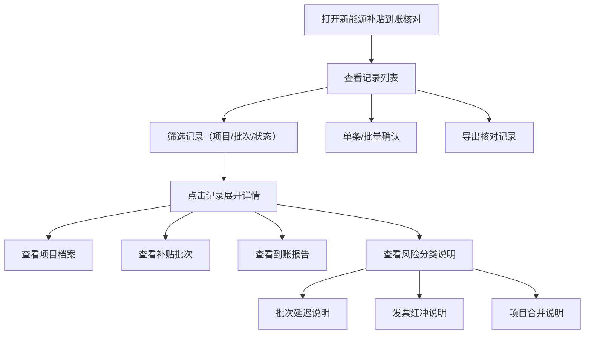

## 1. 产品概述
新能源补贴到账核对系统，解决新能源财务人员核对补贴到账时需要反复查阅项目档案、并网证明和银行流水的痛点。通过系统化的到账匹配、批次状态管理和补录影响追踪，让复核工作清晰可追溯。

### 1.1 主要目标
- 解决发票红冲、项目合并等特殊场景的核对问题
- 保留数据来源痕迹，避免信息压缩丢失
- 分类展示风险类型，而非笼统汇总

### 1.2 目标用户
- 新能源财务人员
- 补贴核算专员
- 财务复核人员

---

## 2. 核心功能

### 2.1 功能模块
1. **到账记录列表**：多维度筛选、批量确认、导出功能
2. **详情面板**：项目档案、补贴批次、到账报告分开展示
3. **风险分析**：批次延迟、发票红冲、项目合并分类说明
4. **操作记录**：到账匹配、批次状态、补录影响可追溯

### 2.2 页面详情
| 页面名称 | 模块名称 | 功能描述 |
|-----------|-------------|---------------------|
| 到账核对首页 | 筛选区域 | 按项目、批次、状态、时间范围筛选记录 |
| 到账核对首页 | 记录列表 | 展示核心信息，支持展开查看详情 |
| 到账核对首页 | 操作栏 | 单条确认、批量确认、导出Excel |
| 到账核对首页 | 风险标签 | 分类标记不同风险类型，点击查看详情 |
| 详情面板 | 项目档案 | 展示项目名称、并网时间、装机容量等基础信息 |
| 详情面板 | 补贴批次 | 批次号、申报时间、应补贴金额、发票信息 |
| 详情面板 | 到账报告 | 到账时间、到账金额、银行流水号、付款方 |
| 详情面板 | 风险说明 | 分类型详细说明问题原因和处理建议 |

---

## 3. 核心流程

---

## 4. 用户界面设计

### 4.1 设计风格
- **主色调**：深青色（#1e40af）- 传达专业、稳重的财务系统感
- **辅助色**：
  - 正常状态：深绿色（#166534）
  - 延迟风险：琥珀色（#b45309）
  - 红冲风险：玫红色（#be123c）
  - 合并风险：蓝紫色（#6d28d9）
- **中性色**：深灰背景（#0f172a）、浅灰文字（#94a3b8）、白色正文（#f1f5f9）
- **按钮风格**：圆角小（4px）、直角边框、点击有按压反馈
- **字体**：系统无衬线字体，数字使用等宽字体
- **布局风格**：密集型数据表格，专业B端风格，卡片式详情面板

### 4.2 页面设计概述
| 页面名称 | 模块名称 | UI元素 |
|-----------|-------------|-------------|
| 到账核对首页 | 顶部筛选区 | 下拉选择器、日期范围、重置按钮、搜索框 |
| 到账核对首页 | 数据表格 | 斑马纹行、风险标签、展开/收起箭头、复选框 |
| 到账核对首页 | 展开详情 | 三栏布局（项目/批次/到账），带来源标识 |
| 到账核对首页 | 底部操作栏 | 选中计数、确认按钮、导出按钮 |

### 4.3 响应式
- 桌面端优先（1280px以上）
- 平板端（768-1279px）：详情面板改为上下布局
- 移动端（768px以下）：表格改为卡片列表形式

### 4.4 微交互
- 行展开时平滑过渡动画
- 风险标签hover时显示预览提示
- 确认操作有loading状态和成功反馈
- 导出时有进度提示
