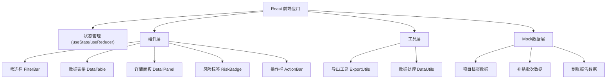
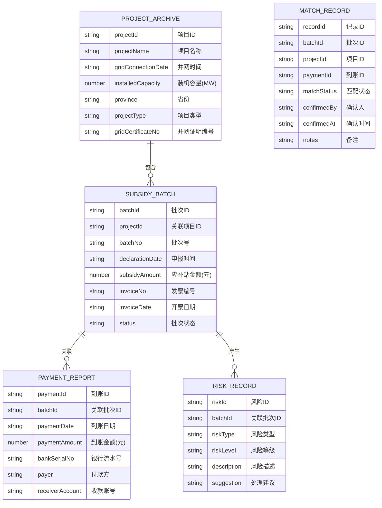

## 1. 架构设计



---

## 2. 技术描述

- **前端框架**: React@18 + TypeScript
- **构建工具**: Vite@5
- **样式方案**: TailwindCSS@3
- **图标库**: Lucide React
- **导出功能**: 原生 CSV 导出（无第三方依赖）
- **数据**: 前端 Mock 数据，支持本地状态持久化

---

## 3. 路由定义

| 路由 | 用途 |
|-------|---------|
| / | 到账核对首页（唯一页面） |

---

## 4. 数据模型

### 4.1 数据结构定义



### 4.2 TypeScript 类型定义

```typescript
// 项目档案
interface ProjectArchive {
  projectId: string;
  projectName: string;
  gridConnectionDate: string;
  installedCapacity: number;
  province: string;
  projectType: string;
  gridCertificateNo: string;
}

// 补贴批次
interface SubsidyBatch {
  batchId: string;
  projectId: string;
  batchNo: string;
  declarationDate: string;
  subsidyAmount: number;
  invoiceNo: string;
  invoiceDate: string;
  status: 'pending' | 'processing' | 'paid' | 'delayed' | 'reversed' | 'merged';
  isInvoiceReversed: boolean;
  reverseReason?: string;
}

// 到账报告
interface PaymentReport {
  paymentId: string;
  batchId: string;
  paymentDate: string;
  paymentAmount: number;
  bankSerialNo: string;
  payer: string;
  receiverAccount: string;
}

// 风险类型
type RiskType = 'delay' | 'invoice_reverse' | 'project_merge';

interface RiskRecord {
  riskId: string;
  batchId: string;
  riskType: RiskType;
  riskLevel: 'low' | 'medium' | 'high';
  description: string;
  suggestion: string;
  relatedBatches?: string[];
}

// 匹配记录（主记录）
interface MatchRecord {
  recordId: string;
  batchId: string;
  projectId: string;
  paymentId: string;
  matchStatus: 'unmatched' | 'matched' | 'confirmed' | 'exception';
  confirmedBy?: string;
  confirmedAt?: string;
  notes?: string;
  risks: RiskRecord[];
  project: ProjectArchive;
  batch: SubsidyBatch;
  payment: PaymentReport;
}

// 筛选条件
interface FilterConditions {
  projectName?: string;
  batchNo?: string;
  matchStatus?: string;
  riskType?: string;
  dateRange?: [string, string];
}
```

---

## 5. 核心功能实现思路

### 5.1 筛选功能
- 使用 React useState 管理筛选条件
- 实时过滤匹配记录列表
- 支持多条件组合筛选

### 5.2 确认功能
- 单条确认：更新单条记录状态
- 批量确认：更新选中记录状态
- 状态持久化：localStorage 存储确认结果

### 5.3 导出功能
- 生成 CSV 格式文件
- 包含完整记录信息和风险标记
- 支持导出筛选结果或全部数据

### 5.4 详情展开
- 三栏布局：项目档案 / 补贴批次 / 到账报告
- 风险分类展示：批次延迟 / 发票红冲 / 项目合并
- 数据来源可追溯，保留原始字段

---

## 6. 目录结构

```
src/
├── components/
│   ├── FilterBar.tsx      # 筛选栏
│   ├── DataTable.tsx      # 数据表格
│   ├── DetailPanel.tsx    # 详情面板
│   ├── RiskBadge.tsx      # 风险标签
│   └── ActionBar.tsx      # 操作栏
├── data/
│   └── mockData.ts        # Mock 数据
├── types/
│   └── index.ts           # 类型定义
├── utils/
│   ├── export.ts          # 导出工具
│   └── dataUtils.ts       # 数据处理
├── App.tsx                # 主应用
├── main.tsx               # 入口文件
└── index.css              # 全局样式
```
