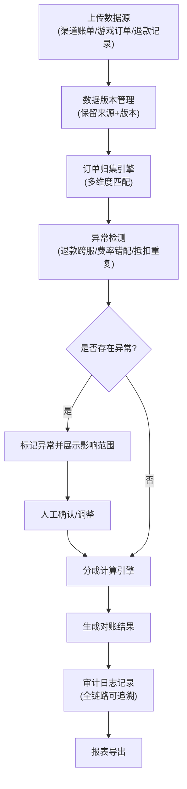
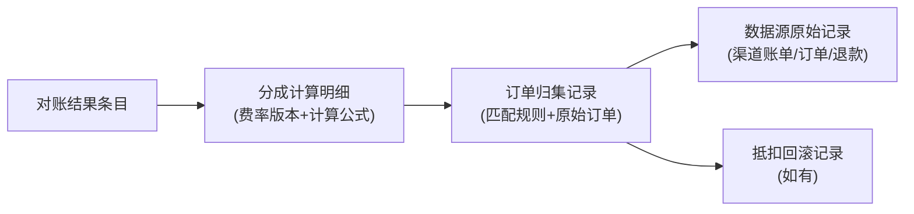

## 1. 产品概述

游戏渠道分成对账系统，解决游戏订单与合同费率冲突导致的财务对账难题。通过完整的数据链路追踪和异常检测机制，实现从渠道账单到报表导出的全流程可追溯、可审计。

- **核心目标**：稳定订单归集链路，确保分成计算准确可追溯
- **目标用户**：游戏发行财务人员、运营人员
- **核心价值**：数据不丢失、变更可追溯、异常可解释、链路可追踪

## 2. 核心功能

### 2.1 用户角色

| 角色 | 注册方式 | 核心权限 |
|------|----------|----------|
| 财务管理员 | 系统内置 | 完整权限：数据源管理、对账计算、异常处理、报表导出、审计查看 |
| 运营人员 | 系统内置 | 数据源上传、对账结果查看、异常标记 |

### 2.2 功能模块

1. **数据看板**：对账概览、关键指标、异常统计、进度追踪
2. **数据源管理**：渠道账单、游戏订单、退款记录的上传、版本控制、来源追踪
3. **订单归集**：多维度订单匹配、归集规则配置、归集结果查看
4. **分成计算**：费率版本管理、分成引擎、计算过程追踪
5. **异常检测**：退款跨服检测、费率版本错配、抵扣重复检测、异常影响分析
6. **审计追踪**：操作日志、数据变更历史、链路追溯（从结果到源头）
7. **报表导出**：对账单生成、导出格式支持

### 2.3 页面详情

| 页面名称 | 模块名称 | 功能描述 |
|---------|----------|----------|
| 数据看板 | 概览卡片 | 显示本期对账进度、异常数量、金额差异、关键指标趋势 |
| 数据看板 | 快捷操作 | 一键发起对账、导出报表、查看待处理异常 |
| 数据源管理 | 渠道账单 | 上传/查看渠道账单，支持版本管理和来源标记 |
| 数据源管理 | 游戏订单 | 上传/查看游戏订单，保留来源和版本信息 |
| 数据源管理 | 退款记录 | 上传/查看退款记录，关联原始订单 |
| 订单归集 | 归集配置 | 配置订单匹配规则、归集维度 |
| 订单归集 | 归集结果 | 查看归集明细，支持按订单号追溯 |
| 分成计算 | 费率管理 | 管理不同渠道、不同时段的费率版本 |
| 分成计算 | 计算结果 | 查看分成计算明细，展示计算公式和过程 |
| 异常检测 | 异常列表 | 展示所有检测到的异常，按类型分类 |
| 异常检测 | 异常详情 | 展示异常影响的结果条目，提供解释说明 |
| 审计追踪 | 操作日志 | 记录所有用户操作和数据变更 |
| 审计追踪 | 链路追溯 | 从一条结果追溯到订单归集、分成计算、抵扣回滚的完整链路 |
| 报表导出 | 报表生成 | 生成对账单，支持多格式导出 |

## 3. 核心流程

### 3.1 对账主流程

### 3.2 链路追溯流程

## 4. 用户界面设计

### 4.1 设计风格

- **主色调**：深邃蓝 `#1e3a5f`，体现专业财务系统的稳重感
- **辅助色**：警示红 `#e74c3c`（异常）、成功绿 `#27ae60`（正常）、警告橙 `#f39c12`（待处理）、信息蓝 `#3498db`（追踪）
- **字体**：标题使用 `Charter`（专业衬线），正文使用 `Inter`（清晰无衬线），等宽数据使用 `JetBrains Mono`
- **布局**：左侧导航 + 顶部操作栏 + 主内容区的经典企业级布局
- **视觉风格**：精致卡片化设计，细微阴影层次，数据高亮显示，表格支持固定表头和列冻结
- **动效**：页面加载渐入，数据行悬停高亮，异常条目呼吸动画，追溯链路连接动画

### 4.2 页面设计概述

| 页面名称 | 模块名称 | UI 元素 |
|---------|----------|---------|
| 数据看板 | 概览卡片 | 渐变背景卡片、大数字展示、趋势迷你图、状态指示灯 |
| 数据看板 | 异常统计 | 环形图、异常类型分类、点击跳转异常列表 |
| 数据源管理 | 数据列表 | 版本标签、来源徽标、上传时间线、版本对比按钮 |
| 订单归集 | 归集结果 | 可展开表格、匹配度标识、追溯快捷入口 |
| 分成计算 | 计算详情 | 公式展开面板、费率版本高亮、计算步骤时间线 |
| 异常检测 | 异常列表 | 类型色标、影响条数统计、异常严重程度徽章 |
| 异常检测 | 异常详情 | 影响范围高亮、异常原因解释、关联数据跳转 |
| 审计追踪 | 链路追溯 | 时间线 + 节点卡片 + 连接线动画、数据对比面板 |
| 审计追踪 | 操作日志 | 操作人、时间、操作类型、变更前后对比 |
| 报表导出 | 报表生成 | 导出进度条、格式选择、预览面板 |

### 4.3 响应式

- **桌面优先**：针对宽屏优化，支持多面板并排展示
- **平板适配**：导航折叠，表格可横向滚动
- **移动端**：卡片堆叠展示，重点数据优先

### 4.4 交互细节

- 数据表格支持行点击展开详情，展示该条数据的完整链路
- 异常条目有明显的视觉区分，悬停时显示影响范围预览
- 链路追溯采用可视化时间线，点击节点可跳转对应详情
- 所有数据变更均有确认弹窗，并记录操作原因
- 支持快捷键：`Ctrl+S` 保存、`Ctrl+Z` 撤销（限本次会话）、`Ctrl+E` 导出
