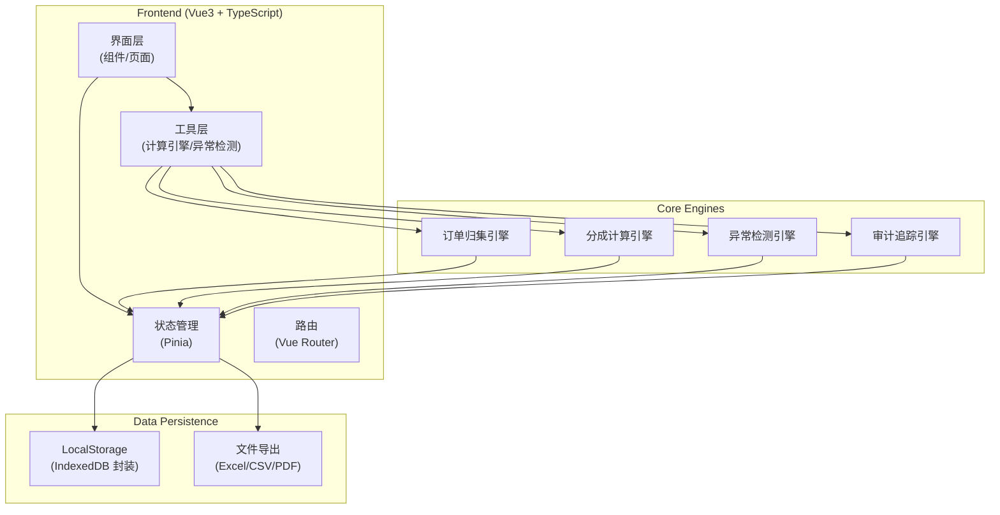
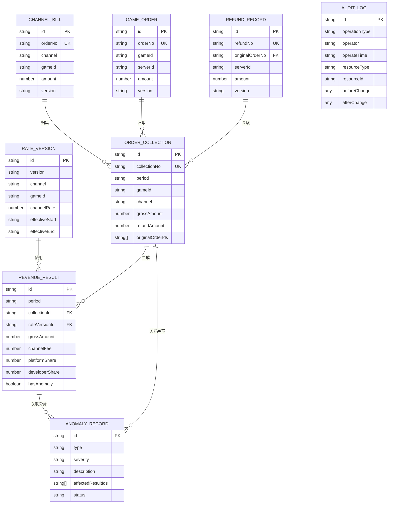

## 1. 架构设计



## 2. 技术描述

- **前端**：Vue@3.4 + TypeScript@5.4 + Vite@5.2 + Pinia@2.1 + Vue Router@4.3
- **UI 组件**：Element Plus@2.7 + Tailwind CSS@3.4
- **图表**：ECharts@5.5
- **数据持久化**：IndexedDB (Dexie.js@4.0) + LocalStorage
- **文件处理**：xlsx@0.18 (Excel 导入导出), jspdf@2.5 (PDF 导出)
- **工具库**：dayjs@1.11, lodash-es@4.17
- **后端**：纯前端架构，无后端服务，数据持久化到浏览器
- **数据库**：IndexedDB 作为本地数据存储

## 3. 路由定义

| 路由 | 页面名称 | 说明 |
|------|----------|------|
| /dashboard | 数据看板 | 首页，展示对账概览和关键指标 |
| /datasource/channel | 渠道账单管理 | 渠道账单上传、版本管理 |
| /datasource/orders | 游戏订单管理 | 游戏订单上传、查看 |
| /datasource/refunds | 退款记录管理 | 退款记录上传、查看 |
| /collection | 订单归集 | 归集规则配置、归集结果查看 |
| /revenue | 分成计算 | 费率管理、计算结果查看 |
| /anomaly | 异常检测 | 异常列表、异常详情、影响分析 |
| /audit/trace | 链路追溯 | 从结果追溯完整处理链路 |
| /audit/logs | 操作日志 | 所有操作和变更记录 |
| /export | 报表导出 | 对账单生成和导出 |

## 4. 核心数据结构定义

### 4.1 基础类型定义

```typescript
// 数据源类型
type DataSourceType = 'channel_bill' | 'game_order' | 'refund_record';

// 异常类型
type AnomalyType = 'cross_server_refund' | 'rate_version_mismatch' | 'duplicate_deduction';

// 异常严重程度
type Severity = 'critical' | 'warning' | 'info';

// 操作类型
type OperationType = 'upload' | 'update' | 'delete' | 'calculate' | 'export' | 'adjust';

// 版本状态
type VersionStatus = 'active' | 'archived' | 'draft';

// 数据源基础
interface DataSourceBase {
  id: string;
  type: DataSourceType;
  source: string;
  version: string;
  versionStatus: VersionStatus;
  uploadTime: string;
  uploadBy: string;
  period: string;
  remark?: string;
}

// 渠道账单
interface ChannelBill extends DataSourceBase {
  type: 'channel_bill';
  channel: string;
  gameId: string;
  orderNo: string;
  amount: number;
  currency: string;
  transactionTime: string;
  channelFee: number;
  channelOrderNo: string;
}

// 游戏订单
interface GameOrder extends DataSourceBase {
  type: 'game_order';
  gameId: string;
  serverId: string;
  orderNo: string;
  userId: string;
  amount: number;
  currency: string;
  payTime: string;
  itemId: string;
  itemName: string;
  channel: string;
  channelOrderNo?: string;
}

// 退款记录
interface RefundRecord extends DataSourceBase {
  type: 'refund_record';
  refundNo: string;
  originalOrderNo: string;
  gameId: string;
  serverId: string;
  userId: string;
  amount: number;
  currency: string;
  refundTime: string;
  refundReason: string;
  channel: string;
}

// 费率版本
interface RateVersion {
  id: string;
  version: string;
  channel: string;
  gameId: string;
  effectiveStart: string;
  effectiveEnd: string;
  channelRate: number;
  platformRate: number;
  developerRate: number;
  isActive: boolean;
  createTime: string;
  createBy: string;
}

// 订单归集记录
interface OrderCollection {
  id: string;
  collectionNo: string;
  period: string;
  gameId: string;
  channel: string;
  originalOrderIds: string[];
  refundIds: string[];
  grossAmount: number;
  refundAmount: number;
  netAmount: number;
  matchRule: string;
  matchConfidence: number;
  createTime: string;
  status: 'matched' | 'mismatch' | 'pending';
}

// 分成计算结果
interface RevenueResult {
  id: string;
  period: string;
  gameId: string;
  channel: string;
  collectionId: string;
  rateVersionId: string;
  grossAmount: number;
  refundAmount: number;
  channelFee: number;
  platformShare: number;
  developerShare: number;
  calculationFormula: string;
  createTime: string;
  hasAnomaly: boolean;
  anomalyIds: string[];
}

// 异常记录
interface AnomalyRecord {
  id: string;
  type: AnomalyType;
  severity: Severity;
  period: string;
  description: string;
  affectedResultIds: string[];
  affectedCollectionIds: string[];
  sourceDataIds: string[];
  detail: Record<string, any>;
  detectedTime: string;
  status: 'open' | 'confirmed' | 'resolved' | 'ignored';
  handledBy?: string;
  handledTime?: string;
  handleRemark?: string;
}

// 审计日志
interface AuditLog {
  id: string;
  operationType: OperationType;
  operator: string;
  operateTime: string;
  module: string;
  resourceId: string;
  resourceType: string;
  beforeChange?: any;
  afterChange?: any;
  changeReason?: string;
  ip?: string;
}

// 链路追踪节点
interface TraceNode {
  id: string;
  type: 'datasource' | 'collection' | 'revenue' | 'adjustment' | 'deduction';
  title: string;
  data: any;
  timestamp: string;
  operator?: string;
}

// 完整链路
interface TraceChain {
  resultId: string;
  nodes: TraceNode[];
  edges: { from: string; to: string; label?: string }[];
}
```

## 5. 数据模型 ER 图



## 6. 存储设计

### 6.1 IndexedDB 表结构

| 表名 | 主键 | 索引 | 说明 |
|------|------|------|------|
| channel_bills | id | period, channel, gameId, orderNo, uploadTime | 渠道账单 |
| game_orders | id | period, gameId, serverId, orderNo, uploadTime | 游戏订单 |
| refund_records | id | period, originalOrderNo, serverId, uploadTime | 退款记录 |
| rate_versions | id | channel, gameId, effectiveStart, version | 费率版本 |
| order_collections | id | period, gameId, channel, collectionNo | 订单归集记录 |
| revenue_results | id | period, gameId, channel, collectionId | 分成计算结果 |
| anomaly_records | id | period, type, severity, status | 异常记录 |
| audit_logs | id | operateTime, operator, operationType, resourceId | 审计日志 |

### 6.2 数据持久化策略

1. **全量持久化**：所有业务数据实时写入 IndexedDB，刷新不丢失
2. **版本控制**：每次上传新版本数据时，旧版本自动归档，保留完整历史
3. **操作回滚**：关键操作记录变更前后快照，支持查看历史版本对比
4. **数据导出**：支持一键导出完整数据备份（JSON 格式）
5. **数据导入**：支持从备份文件恢复数据

## 7. 核心引擎设计

### 7.1 订单归集引擎

```typescript
interface MatchRule {
  fields: string[];           // 匹配字段
  tolerance: number;          // 金额容差
  timeWindow: number;         // 时间窗口(小时)
}

interface MatchResult {
  confidence: number;         // 匹配置信度
  matchedPairs: Array<{
    channelBill: ChannelBill;
    gameOrder: GameOrder;
    matchScore: number;
  }>;
  unmatched: {
    channelBills: ChannelBill[];
    gameOrders: GameOrder[];
  };
}

class OrderCollectionEngine {
  match(
    channelBills: ChannelBill[],
    gameOrders: GameOrder[],
    refunds: RefundRecord[],
    rule: MatchRule
  ): MatchResult;
  
  collect(
    matchResult: MatchResult,
    period: string
  ): OrderCollection[];
}
```

### 7.2 分成计算引擎

```typescript
class RevenueCalculationEngine {
  calculate(
    collections: OrderCollection[],
    rateVersions: RateVersion[],
    period: string
  ): {
    results: RevenueResult[];
    rateMismatches: Array<{
      collection: OrderCollection;
      reason: string;
    }>;
  };
  
  buildFormula(
    collection: OrderCollection,
    rate: RateVersion
  ): string;
}
```

### 7.3 异常检测引擎

```typescript
interface DetectionRule {
  type: AnomalyType;
  enabled: boolean;
  config: Record<string, any>;
}

class AnomalyDetectionEngine {
  detect(
    collections: OrderCollection[],
    refunds: RefundRecord[],
    rateVersions: RateVersion[],
    results: RevenueResult[],
    rules: DetectionRule[]
  ): AnomalyRecord[];
  
  analyzeImpact(
    anomaly: AnomalyRecord,
    allResults: RevenueResult[]
  ): {
    affectedCount: number;
    affectedAmount: number;
    affectedItems: RevenueResult[];
  };
}
```

### 7.4 审计追踪引擎

```typescript
class AuditTrailEngine {
  log(
    operationType: OperationType,
    resourceType: string,
    resourceId: string,
    operator: string,
    beforeChange?: any,
    afterChange?: any,
    changeReason?: string
  ): AuditLog;
  
  trace(resultId: string): TraceChain;
  
  getHistory(resourceType: string, resourceId: string): AuditLog[];
}
```

## 8. 项目结构

```
src/
├── components/          # 通用组件
│   ├── common/         # 基础组件
│   ├── tables/         # 表格组件
│   └── charts/         # 图表组件
├── composables/        # 组合式函数
│   ├── useDatasource.ts
│   ├── useCollection.ts
│   ├── useRevenue.ts
│   ├── useAnomaly.ts
│   └── useAudit.ts
├── engines/            # 核心引擎
│   ├── collectionEngine.ts
│   ├── revenueEngine.ts
│   ├── anomalyEngine.ts
│   └── auditEngine.ts
├── pages/              # 页面
│   ├── Dashboard.vue
│   ├── datasource/
│   ├── Collection.vue
│   ├── Revenue.vue
│   ├── Anomaly.vue
│   ├── audit/
│   └── Export.vue
├── router/             # 路由
│   └── index.ts
├── stores/             # 状态管理
│   ├── datasource.ts
│   ├── collection.ts
│   ├── revenue.ts
│   ├── anomaly.ts
│   └── audit.ts
├── types/              # 类型定义
│   └── index.ts
├── utils/              # 工具函数
│   ├── db.ts          # IndexedDB 封装
│   ├── export.ts      # 导出工具
│   └── format.ts      # 格式化工具
└── mock/               # 模拟数据
    └── index.ts
```
