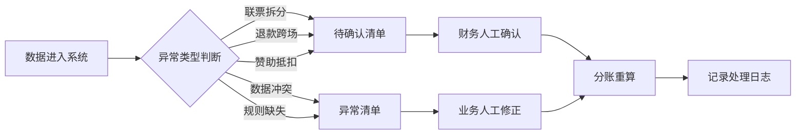

# 艺术展票务分账系统 PRD

## 1. 产品概述

艺术展票务分账系统是面向展览主办财务部门的业务工具，用于处理复杂的票务收入分账场景，解决联票拆分、退款跨场、赞助抵扣等日常"脏数据"问题，确保收入归集的准确性和可追溯性。

- **核心问题**：联票拆分、退款跨场、后补协议导致分账混乱，异常数据混入正常明细
- **目标用户**：展览主办财务、业务同事
- **产品价值**：提供规则化、可追溯、双向可查的分账能力，异常数据显性化处理

## 2. 核心功能

### 2.1 用户角色

| 角色 | 注册方式 | 核心权限 |
|------|----------|----------|
| 财务人员 | 内部账号 | 分账规则配置、异常处理、收入归集、数据导出 |
| 业务人员 | 内部账号 | 订单录入、衍生品销售录入、协议补录、查询统计 |

### 2.2 功能模块

1. **票务订单管理**：订单录入、订单查询、状态追踪
2. **衍生品销售管理**：销售录入、关联订单、补录支持
3. **分账规则引擎**：规则配置、版本管理、瀑布式分账
4. **异常处理中心**：待确认清单、异常清单、处理记录
5. **收入归集报表**：分账结果、规则版本对比、差异说明
6. **双向追溯查询**：订单→结果、结果→衍生品的全链路追踪

### 2.3 页面详情

| 页面名称 | 模块名称 | 功能描述 |
|----------|----------|----------|
| 工作台概览 | 数据看板 | 今日订单数、待处理异常、分账进度统计 |
| 票务订单管理 | 订单列表 | 订单查询、筛选、详情查看、状态标记 |
| 票务订单管理 | 订单录入 | 手工录入票务订单，支持批量导入 |
| 衍生品销售 | 销售列表 | 衍生品销售记录管理，支持后补录入 |
| 衍生品销售 | 关联管理 | 衍生品与票务订单的关联与解绑 |
| 分账规则 | 规则列表 | 分账规则配置、版本管理、启用停用 |
| 分账规则 | 规则编辑 | 瀑布式分账配置、分成比例、触发条件 |
| 异常中心 | 待确认清单 | 联票拆分、退款跨场、赞助抵扣待确认项 |
| 异常中心 | 异常清单 | 数据冲突、规则不匹配、金额异常等 |
| 收入归集 | 分账结果 | 按场次、按合作方展示分账明细 |
| 收入归集 | 版本对比 | 规则版本变更前后的分账差异对比 |
| 追溯查询 | 正向追溯 | 从票务订单追踪到分账结果的全链路 |
| 追溯查询 | 反向追溯 | 从分账结果反查关联的衍生品销售 |

## 3. 核心流程

### 3.1 主业务流程

### 3.2 异常处理流程

## 4. 用户界面设计

### 4.1 设计风格

- **主色调**：深靛蓝 (#1e3a5f) - 专业、稳重
- **辅助色**：琥珀橙 (#f59e0b) - 待确认/警告
- **状态色**：翡翠绿 (#10b981) - 正常，玫瑰红 (#f43f5e) - 异常
- **中性色**：石板灰系列 - 层次分明
- **按钮风格**：微圆角、悬停阴影、按压反馈
- **字体**：使用 Noto Sans SC 中文显示字体 + JetBrains Mono 等宽数字
- **布局风格**：左侧导航 + 右侧内容区，卡片式模块布局
- **图标风格**：线性图标，统一24px尺寸

### 4.2 页面设计概述

| 页面名称 | 模块名称 | UI 元素 |
|----------|----------|---------|
| 工作台 | 数据看板 | 4个统计卡片（今日订单、待处理、异常数、分账完成率），折线图展示7日趋势 |
| 订单管理 | 列表页 | 高级筛选栏，表格支持列配置，行展开查看详情，状态标签 |
| 异常中心 | 清单页 | 标签页切换（待确认/异常），卡片式列表展示，快速处理按钮，处理时间线 |
| 收入归集 | 结果页 | 分账瀑布图，版本切换器，差异高亮，导出按钮 |
| 追溯查询 | 链路图 | 时间线+节点图展示全链路，点击节点跳转详情 |

### 4.3 响应式设计

- **桌面优先**：1440px 宽度设计，适配主流办公显示器
- **平板适配**：1024px 时导航折叠，表格横向滚动
- **触控优化**：按钮最小高度44px，点击区域放大

### 4.4 交互动效

- **页面加载**：骨架屏占位，内容淡入
- **数据提交**：按钮加载态，成功/失败toast提示
- **异常标记**：数字徽章脉冲动画，吸引注意
- **分账瀑布**：条形图增长动画，版本切换平滑过渡
- **追溯链路**：节点连线绘制动画，节点悬停放大

## 5. 非功能性需求

### 5.1 数据一致性

- 后补数据不覆盖已有分账判断，仅影响未处理订单
- 所有操作留痕，支持审计回溯
- 规则版本化，变更需记录差异说明

### 5.2 可追溯性

- 订单ID作为主链路ID，贯穿全流程
- 每笔分账结果记录使用的规则版本
- 支持正向和反向双向查询

### 5.3 异常显性化

- 异常数据不能混入正常明细
- 待确认项必须人工处理才能完成分账
- 处理结果需备注说明
