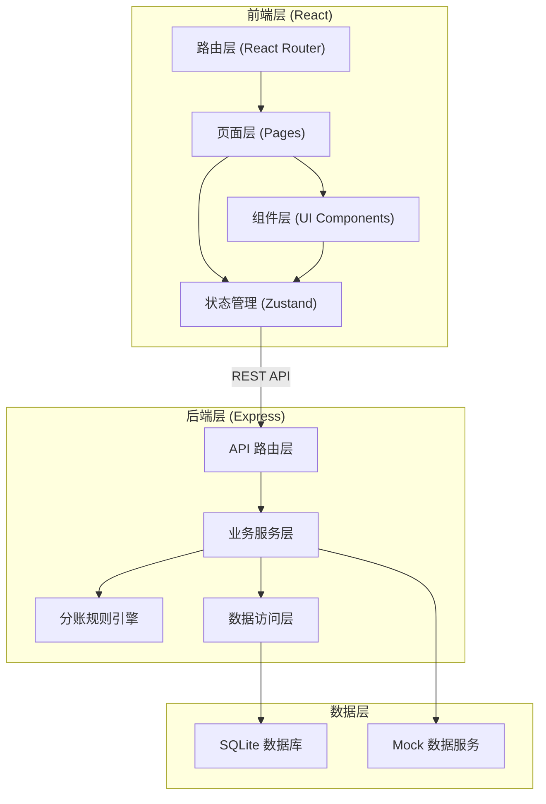
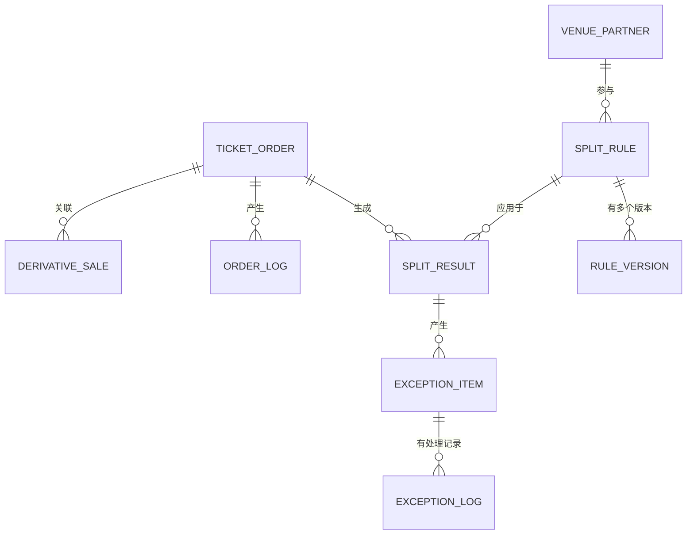

# 艺术展票务分账系统 技术架构文档

## 1. 架构设计



## 2. 技术栈描述

- **前端框架**：React@18 + TypeScript@5
- **构建工具**：Vite@5
- **样式方案**：TailwindCSS@3
- **状态管理**：Zustand@4
- **路由方案**：React Router@6
- **图标库**：Lucide React
- **图表库**：Recharts
- **后端框架**：Express@4 + TypeScript
- **数据库**：SQLite (本地文件)
- **初始化工具**：vite-init (react-express-ts 模板)

## 3. 路由定义

| 路由路径 | 页面名称 | 功能说明 |
|----------|----------|----------|
| `/` | 工作台概览 | 数据看板、统计图表、快捷入口 |
| `/orders` | 票务订单列表 | 订单查询、筛选、状态管理 |
| `/orders/new` | 订单录入 | 新增票务订单 |
| `/orders/:id` | 订单详情 | 查看订单详细信息 |
| `/derivatives` | 衍生品销售 | 衍生品销售记录管理 |
| `/derivatives/new` | 销售录入 | 新增/补录衍生品销售 |
| `/rules` | 分账规则列表 | 规则配置、版本管理 |
| `/rules/new` | 规则编辑 | 新建分账规则 |
| `/rules/:id` | 规则详情 | 查看规则版本历史 |
| `/exceptions` | 异常处理中心 | 待确认/异常清单管理 |
| `/revenue` | 收入归集 | 分账结果、版本对比 |
| `/trace` | 追溯查询 | 双向追溯查询入口 |
| `/trace/forward/:orderId` | 正向追溯 | 订单→结果全链路追踪 |
| `/trace/backward/:resultId` | 反向追溯 | 结果→衍生品反查 |

## 4. 数据模型设计

### 4.1 ER 图



### 4.2 核心数据表设计

#### 票务订单表 (ticket_order)
```sql
CREATE TABLE ticket_order (
  id VARCHAR(32) PRIMARY KEY,
  order_no VARCHAR(64) UNIQUE NOT NULL,
  exhibition_id VARCHAR(32) NOT NULL,
  exhibition_name VARCHAR(128) NOT NULL,
  ticket_type VARCHAR(32) NOT NULL COMMENT 'SINGLE-单场, COMBO-联票',
  total_amount DECIMAL(10,2) NOT NULL,
  ticket_count INT NOT NULL DEFAULT 1,
  buyer_name VARCHAR(64),
  buyer_phone VARCHAR(32),
  order_time DATETIME NOT NULL,
  status VARCHAR(32) NOT NULL COMMENT 'PENDING-待处理, PROCESSED-已分账, EXCEPTION-异常',
  split_rule_id VARCHAR(32),
  is_combo_split TINYINT DEFAULT 0 COMMENT '是否需要联票拆分',
  has_refund TINYINT DEFAULT 0 COMMENT '是否有退款',
  refund_cross_exhibition TINYINT DEFAULT 0 COMMENT '是否跨场退款',
  created_at DATETIME DEFAULT CURRENT_TIMESTAMP,
  updated_at DATETIME DEFAULT CURRENT_TIMESTAMP ON UPDATE CURRENT_TIMESTAMP,
  INDEX idx_order_time (order_time),
  INDEX idx_status (status),
  INDEX idx_exhibition (exhibition_id)
);
```

#### 衍生品销售表 (derivative_sale)
```sql
CREATE TABLE derivative_sale (
  id VARCHAR(32) PRIMARY KEY,
  sale_no VARCHAR(64) UNIQUE NOT NULL,
  order_id VARCHAR(32) COMMENT '关联票务订单ID',
  product_id VARCHAR(32) NOT NULL,
  product_name VARCHAR(128) NOT NULL,
  quantity INT NOT NULL,
  unit_price DECIMAL(10,2) NOT NULL,
  total_amount DECIMAL(10,2) NOT NULL,
  sale_time DATETIME NOT NULL,
  is_supplementary TINYINT DEFAULT 0 COMMENT '是否后补录入',
  supplementary_note TEXT,
  created_at DATETIME DEFAULT CURRENT_TIMESTAMP,
  INDEX idx_order_id (order_id),
  INDEX idx_sale_time (sale_time)
);
```

#### 分账规则表 (split_rule)
```sql
CREATE TABLE split_rule (
  id VARCHAR(32) PRIMARY KEY,
  rule_name VARCHAR(128) NOT NULL,
  exhibition_id VARCHAR(32) NOT NULL,
  current_version INT NOT NULL DEFAULT 1,
  is_active TINYINT DEFAULT 1,
  created_by VARCHAR(64),
  created_at DATETIME DEFAULT CURRENT_TIMESTAMP,
  updated_at DATETIME DEFAULT CURRENT_TIMESTAMP ON UPDATE CURRENT_TIMESTAMP
);
```

#### 分账规则版本表 (rule_version)
```sql
CREATE TABLE rule_version (
  id VARCHAR(32) PRIMARY KEY,
  rule_id VARCHAR(32) NOT NULL,
  version INT NOT NULL,
  waterfall_config JSON NOT NULL COMMENT '瀑布式分账配置',
  change_note TEXT NOT NULL COMMENT '版本变更说明',
  effective_time DATETIME NOT NULL COMMENT '生效时间',
  created_by VARCHAR(64),
  created_at DATETIME DEFAULT CURRENT_TIMESTAMP,
  UNIQUE KEY uk_rule_version (rule_id, version)
);
```

#### 分账结果表 (split_result)
```sql
CREATE TABLE split_result (
  id VARCHAR(32) PRIMARY KEY,
  order_id VARCHAR(32) NOT NULL,
  rule_id VARCHAR(32) NOT NULL,
  rule_version INT NOT NULL,
  total_amount DECIMAL(10,2) NOT NULL,
  split_details JSON NOT NULL COMMENT '分账明细',
  has_sponsorship_deduction TINYINT DEFAULT 0,
  sponsorship_amount DECIMAL(10,2) DEFAULT 0,
  final_amount DECIMAL(10,2) NOT NULL,
  split_time DATETIME NOT NULL,
  status VARCHAR(32) NOT NULL COMMENT 'CONFIRMED-已确认, PENDING-待确认',
  created_at DATETIME DEFAULT CURRENT_TIMESTAMP,
  INDEX idx_order_id (order_id),
  INDEX idx_split_time (split_time)
);
```

#### 异常项表 (exception_item)
```sql
CREATE TABLE exception_item (
  id VARCHAR(32) PRIMARY KEY,
  order_id VARCHAR(32) NOT NULL,
  result_id VARCHAR(32),
  type VARCHAR(32) NOT NULL COMMENT 'COMBO_SPLIT-联票拆分, REFUND_CROSS-退款跨场, SPONSORSHIP-赞助抵扣, DATA_CONFLICT-数据冲突, RULE_MISSING-规则缺失',
  severity VARCHAR(32) NOT NULL COMMENT 'PENDING-待确认, ERROR-异常',
  title VARCHAR(256) NOT NULL,
  description TEXT,
  status VARCHAR(32) NOT NULL COMMENT 'OPEN-待处理, PROCESSING-处理中, RESOLVED-已解决',
  assignee VARCHAR(64),
  resolved_at DATETIME,
  resolution_note TEXT,
  created_at DATETIME DEFAULT CURRENT_TIMESTAMP,
  updated_at DATETIME DEFAULT CURRENT_TIMESTAMP ON UPDATE CURRENT_TIMESTAMP,
  INDEX idx_status (status),
  INDEX idx_order_id (order_id)
);
```

## 5. API 接口定义

### 5.1 票务订单接口

```typescript
// 获取订单列表
GET /api/orders?page=1&pageSize=20&status=PENDING
Response: {
  list: TicketOrder[],
  total: number,
  page: number,
  pageSize: number
}

// 创建订单
POST /api/orders
Request: {
  exhibitionId: string,
  exhibitionName: string,
  ticketType: 'SINGLE' | 'COMBO',
  totalAmount: number,
  ticketCount: number,
  buyerName?: string,
  buyerPhone?: string,
  orderTime: string
}
Response: TicketOrder

// 触发分账
POST /api/orders/:id/split
Response: SplitResult
```

### 5.2 异常处理接口

```typescript
// 获取异常列表
GET /api/exceptions?type=PENDING&status=OPEN

// 处理异常
POST /api/exceptions/:id/resolve
Request: {
  resolutionNote: string,
  shouldRecalculate: boolean
}
Response: ExceptionItem
```

### 5.3 分账规则接口

```typescript
// 创建规则新版本
POST /api/rules/:id/version
Request: {
  waterfallConfig: WaterfallConfig,
  changeNote: string,
  effectiveTime: string
}
Response: RuleVersion
```

## 6. 前端状态管理

### 6.1 Store 结构

```typescript
interface AppStore {
  // 订单状态
  orders: TicketOrder[]
  currentOrder: TicketOrder | null
  orderFilters: OrderFilters
  
  // 异常状态
  pendingExceptions: ExceptionItem[]
  errorExceptions: ExceptionItem[]
  
  // 分账规则
  activeRules: SplitRule[]
  
  // 操作方法
  fetchOrders: (filters?: OrderFilters) => Promise<void>
  createOrder: (data: CreateOrderData) => Promise<void>
  processSplit: (orderId: string) => Promise<void>
  resolveException: (id: string, data: ResolveData) => Promise<void>
}
```

## 7. 目录结构

```
/
├── src/                    # 前端代码
│   ├── components/         # 通用组件
│   │   ├── Layout/         # 布局组件
│   │   ├── Table/          # 表格组件
│   │   ├── StatusTag/      # 状态标签
│   │   └── charts/         # 图表组件
│   ├── pages/              # 页面组件
│   │   ├── Dashboard/      # 工作台
│   │   ├── Orders/         # 订单管理
│   │   ├── Derivatives/    # 衍生品
│   │   ├── Rules/          # 分账规则
│   │   ├── Exceptions/     # 异常中心
│   │   ├── Revenue/        # 收入归集
│   │   └── Trace/          # 追溯查询
│   ├── store/              # Zustand 状态
│   ├── types/              # TypeScript 类型
│   ├── utils/              # 工具函数
│   └── App.tsx
├── api/                    # 后端代码
│   ├── routes/             # API 路由
│   ├── services/           # 业务服务
│   │   └── SplitEngine.ts  # 分账规则引擎
│   ├── models/             # 数据模型
│   └── index.ts
├── shared/                 # 共享类型
├── migrations/             # 数据库迁移
└── .trae/documents/        # 项目文档
```
