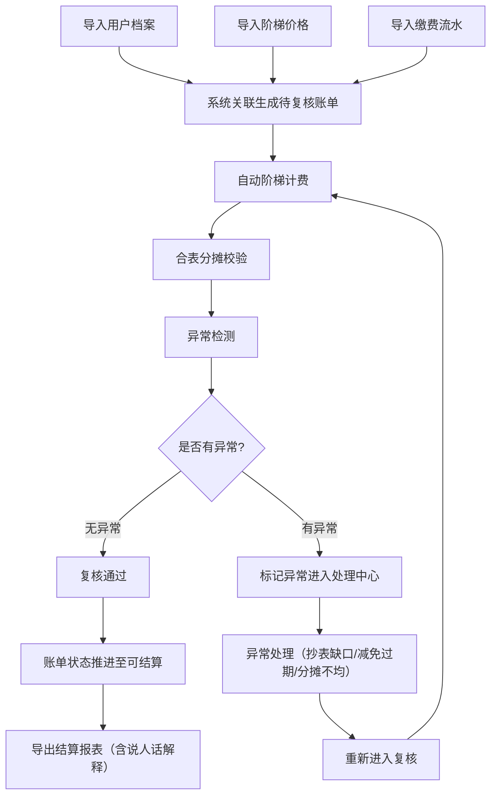
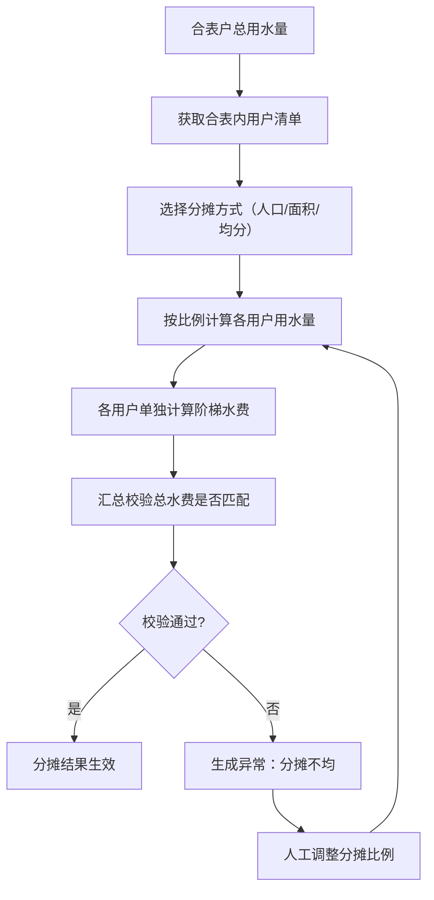

## 1. 产品概述

水务阶梯账单复核系统是一款面向水务公司结算部门的本地桌面级应用，解决居民合表、商业户和临时减免混合数据的阶梯水价复核难题。系统围绕阶梯计费主线，打通数据导入、自动复核、异常处理、状态推进和报表导出全流程，确保每一笔账单都有迹可循，复核结果可追溯、可解释。

- **核心问题**：混合用户类型（居民合表/商业户/临时减免）的阶梯计费复核效率低，异常情况（合表分摊不均、抄表缺口、减免过期）处理无留痕，结算时易被投诉。
- **目标用户**：水务公司结算复核员、业务主管、财务人员。
- **产品价值**：将复核效率提升80%，异常处理全程留痕，导出报告支持"说人话"解释，让非技术同事也能看懂复核不通过的原因。

## 2. 核心功能

### 2.1 用户角色
| 角色 | 注册方式 | 核心权限 |
|------|----------|----------|
| 复核员 | 本地账号登录 | 数据导入、账单复核、异常处理、状态推进 |
| 主管 | 本地账号登录 | 复核审批、报表导出、数据统计查看 |
| 管理员 | 本地账号登录 | 系统配置、用户管理、价格维护 |

### 2.2 功能模块
1. **工作台首页**：待办概览、复核统计、异常预警、快捷操作入口
2. **数据导入中心**：用户档案、阶梯价格、缴费流水三类数据独立导入，支持原始材料留痕
3. **账单复核工作台**：阶梯计费自动计算、合表分摊校验、异常标记、状态流转
4. **异常处理中心**：抄表缺口、减免过期、分摊不均三类异常的专门处理流程
5. **报表导出中心**：复核明细报表、异常分析报表、结算汇总报表，支持"说人话"解释
6. **系统配置**：阶梯价格维护、用户类型配置、异常规则设置

### 2.3 页面详情
| 页面名称 | 模块名称 | 功能描述 |
|----------|----------|----------|
| 工作台首页 | 数据概览卡片 | 展示待复核、异常中、已通过、已驳回四类账单数量，今日处理量趋势图 |
| 工作台首页 | 快捷操作区 | 快速导入数据、开始复核、导出报表三个大按钮 |
| 工作台首页 | 异常预警列表 | 高亮展示即将过期的减免、超3天未处理的异常 |
| 数据导入中心 | 导入任务列表 | 展示历史导入记录，区分原始材料列和处理结果列 |
| 数据导入中心 | 数据导入表单 | 支持Excel/CSV上传，预览数据，自动校验格式 |
| 数据导入中心 | 导入详情 | 展示导入的原始数据、系统识别结果、错误明细 |
| 账单复核工作台 | 账单列表 | 按用户类型、状态、异常类型筛选，支持批量操作 |
| 账单复核工作台 | 账单详情 | 阶梯计费明细、合表分摊计算过程、历史操作记录 |
| 账单复核工作台 | 复核操作 | 通过/驳回/标记异常/推进状态，支持添加复核意见 |
| 异常处理中心 | 异常分类列表 | 抄表缺口、减免过期、分摊不均三类异常独立Tab |
| 异常处理中心 | 异常处理表单 | 异常原因说明、处理方案、附件上传、状态流转 |
| 报表导出中心 | 报表模板选择 | 复核明细/异常分析/结算汇总三类模板 |
| 报表导出中心 | 导出参数配置 | 时间范围、用户类型、异常类型筛选，是否包含"说人话"解释 |
| 报表导出中心 | 导出预览 | 在线预览报表内容，支持Excel/PDF导出 |
| 系统配置 | 阶梯价格配置 | 按居民/商业/工业配置阶梯水量和单价 |
| 系统配置 | 合表分摊规则 | 按人口/面积/均分三种分摊方式配置 |
| 系统配置 | 用户管理 | 本地账号增删改查，角色权限分配 |

## 3. 核心流程

### 3.1 主流程描述
复核员首先在数据导入中心分别导入用户档案、阶梯价格和缴费流水，系统自动关联三类数据并生成待复核账单。复核员在账单复核工作台逐单审核，系统自动计算阶梯水费，校验合表分摊是否合理，检测抄表缺口和减免过期情况。无异常的账单可直接通过，有异常的标记后进入异常处理中心。异常处理完成后重新进入复核流程，最终所有账单处理完毕后可导出结算报表。

### 3.2 主流程图

### 3.3 合表分摊流程

## 4. 用户界面设计

### 4.1 设计风格
- **主色调**：深蓝(#1e3a5f)作为专业主色，水蓝(#3b82f6)作为操作强调色，橙红(#ef4444)标记异常，墨绿(#10b981)标记通过
- **按钮风格**：圆角8px，主按钮水蓝渐变，悬停上浮2px阴影，点击有按压动效
- **字体**：标题用思源黑体Bold，正文用思源宋体Regular，数字用等宽字体JetBrains Mono
- **布局风格**：左侧导航+右侧内容区，卡片式布局，每张卡片有微妙的阴影和圆角
- **图标风格**：Lucide线性图标，异常状态用填充图标强化视觉冲击
- **细节处理**：数据表格斑马纹，关键数字用大号字体加粗，异常行背景浅红高亮

### 4.2 页面设计概述
| 页面名称 | 模块名称 | UI元素 |
|----------|----------|----------|
| 工作台首页 | 数据概览 | 4个统计卡片，渐变背景，数字大号加粗，底部趋势小图 |
| 工作台首页 | 快捷操作 | 3个大尺寸卡片按钮，图标+文字，悬停放大动效 |
| 工作台首页 | 异常预警 | 列表行，异常类型彩色标签，倒计时红色闪烁 |
| 数据导入中心 | 导入列表 | 双列布局，左侧原始材料，右侧处理结果，时间线连接 |
| 账单复核工作台 | 账单列表 | 高级数据表格，支持多列筛选，状态标签彩色区分 |
| 账单复核工作台 | 账单详情 | 阶梯计费可视化进度条，合表分摊树形展开，操作记录时间线 |
| 异常处理中心 | 异常列表 | 三Tab切换，卡片式异常项，紧急程度角标 |
| 报表导出中心 | 导出预览 | 类Excel表格，"说人话"解释列用浅黄背景，支持折叠展开 |
| 系统配置 | 阶梯价格 | 阶梯可视化图表，可拖拽调整阶梯阈值 |

### 4.3 响应式
- 桌面端优先设计，适配1280px及以上宽度
- 左侧导航在小屏幕可折叠为图标模式
- 数据表格支持横向滚动，关键列固定
- 移动端适配（如需要）采用单列流式布局

### 4.4 交互细节
- 阶梯计费计算过程采用渐入动画展示，从第一阶梯到第三阶梯逐步显示
- 合表分摊校验不通过时，用红色波浪线标注差异值，悬停显示具体差额
- 状态推进时有流畅的过渡动画，旧状态淡出，新状态淡入
- "说人话"解释采用气泡卡片样式，点击展开时带有弹性动效
