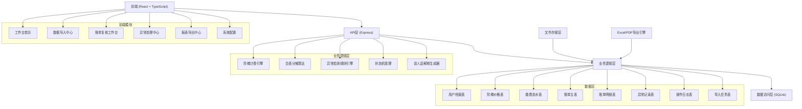
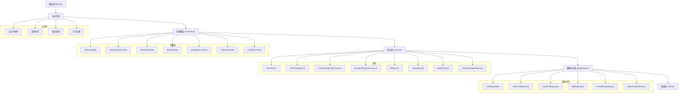
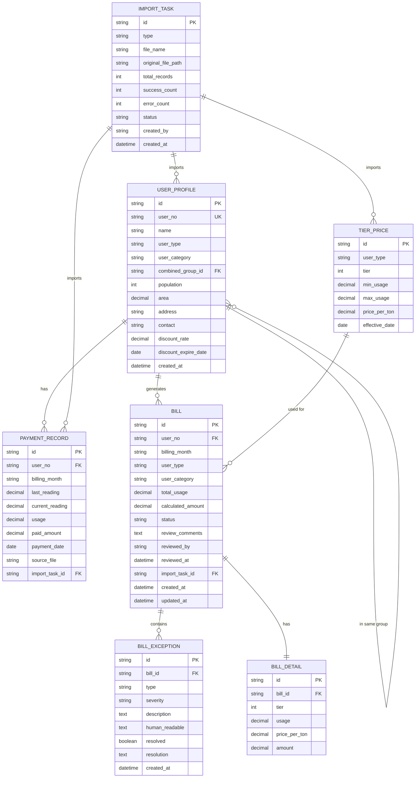

## 1. 架构设计

### 1.1 系统架构图


## 2. 技术描述

- **前端**：React@18 + TypeScript + Vite + TailwindCSS@3 + Zustand + React Router v6 + Lucide React
- **后端**：Express@4 + TypeScript + CORS + Multer（文件上传）
- **数据库**：SQLite3 + better-sqlite3（本地文件存储，无需额外部署）
- **文件处理**：xlsx（Excel导入导出）+ pdf-lib（PDF生成）
- **初始化工具**：vite-init
- **状态管理**：Zustand（前端）+ 内存状态机（后端）
- **图表**：recharts（数据可视化）

### 2.1 关键技术选型理由
- **SQLite**：本地服务场景，无需部署数据库服务器，单文件存储便于备份迁移
- **better-sqlite3**：同步API性能优异，适合本地桌面级应用
- **Zustand**：轻量状态管理，避免Redux的繁琐，适合中小规模应用
- **xlsx**：业界标准Excel处理库，支持读写多种格式

## 3. 路由定义

| 路由路径 | 页面名称 | 权限要求 |
|----------|----------|----------|
| / | 工作台首页 | 所有登录用户 |
| /import | 数据导入中心 | 复核员/主管/管理员 |
| /review | 账单复核工作台 | 复核员/主管/管理员 |
| /exception | 异常处理中心 | 复核员/主管/管理员 |
| /report | 报表导出中心 | 主管/管理员 |
| /config | 系统配置 | 管理员 |
| /login | 登录页 | 公开 |

## 4. API 定义

### 4.1 类型定义
```typescript
// 用户类型
type UserType = 'resident' | 'commercial' | 'industrial' | 'temporary';
type UserCategory = 'single' | 'combined'; // 单户/合表

// 账单状态
type BillStatus = 'pending' | 'reviewing' | 'approved' | 'rejected' | 'exception';

// 异常类型
type ExceptionType = 'reading_gap' | 'discount_expired' | 'allocation_error';

// 分摊方式
type AllocationMethod = 'population' | 'area' | 'equal';

interface UserProfile {
  id: string;
  userNo: string;
  name: string;
  userType: UserType;
  userCategory: UserCategory;
  combinedGroupId?: string; // 合表组ID
  population?: number;
  area?: number;
  address: string;
  contact?: string;
  discountRate?: number;
  discountExpireDate?: string;
  createdAt: string;
}

interface TierPrice {
  id: string;
  userType: UserType;
  tier: number; // 1, 2, 3
  minUsage: number;
  maxUsage: number;
  pricePerTon: number;
  effectiveDate: string;
}

interface PaymentRecord {
  id: string;
  userNo: string;
  billingMonth: string;
  lastReading: number;
  currentReading: number;
  usage: number;
  paidAmount: number;
  paymentDate: string;
  sourceFile: string;
}

interface Bill {
  id: string;
  userNo: string;
  billingMonth: string;
  userType: UserType;
  userCategory: UserCategory;
  totalUsage: number;
  calculatedAmount: number;
  tierBreakdown: TierBreakdownItem[];
  combinedAllocation?: CombinedAllocation;
  status: BillStatus;
  exceptions: BillException[];
  reviewComments?: string;
  reviewedBy?: string;
  reviewedAt?: string;
  createdAt: string;
  updatedAt: string;
}

interface TierBreakdownItem {
  tier: number;
  usage: number;
  pricePerTon: number;
  amount: number;
}

interface CombinedAllocation {
  groupId: string;
  groupTotalUsage: number;
  groupTotalAmount: number;
  allocationMethod: AllocationMethod;
  userShare: number;
  userAllocatedUsage: number;
  userAllocatedAmount: number;
  allocationRatio: number;
}

interface BillException {
  id: string;
  type: ExceptionType;
  severity: 'low' | 'medium' | 'high';
  description: string;
  humanReadable: string; // 说人话解释
  resolved: boolean;
  resolution?: string;
  createdAt: string;
}

interface ImportTask {
  id: string;
  type: 'profile' | 'price' | 'payment';
  fileName: string;
  originalFile: string;
  totalRecords: number;
  successCount: number;
  errorCount: number;
  errorDetails: ImportError[];
  status: 'processing' | 'completed' | 'failed';
  createdBy: string;
  createdAt: string;
}

interface ImportError {
  row: number;
  field: string;
  value: string;
  message: string;
}
```

### 4.2 API 接口列表

| 方法 | 路径 | 描述 |
|------|------|------|
| POST | /api/auth/login | 用户登录 |
| GET | /api/auth/profile | 获取当前用户信息 |
| GET | /api/dashboard/stats | 获取工作台统计数据 |
| GET | /api/dashboard/trend | 获取处理趋势数据 |
| GET | /api/dashboard/warnings | 获取异常预警列表 |
| GET | /api/import/tasks | 获取导入任务列表 |
| POST | /api/import/upload | 上传数据文件 |
| GET | /api/import/:id | 获取导入任务详情 |
| GET | /api/bills | 获取账单列表（支持筛选） |
| GET | /api/bills/:id | 获取账单详情 |
| PUT | /api/bills/:id/status | 更新账单状态 |
| POST | /api/bills/:id/review | 提交复核意见 |
| POST | /api/bills/:id/recalculate | 重新计算账单 |
| GET | /api/exceptions | 获取异常列表 |
| PUT | /api/exceptions/:id/resolve | 处理异常 |
| GET | /api/report/preview | 报表预览 |
| POST | /api/report/export | 导出报表（Excel/PDF） |
| GET | /api/config/prices | 获取阶梯价格配置 |
| PUT | /api/config/prices/:id | 更新阶梯价格 |
| GET | /api/config/users | 获取用户列表 |
| POST | /api/config/users | 新增用户 |
| PUT | /api/config/users/:id | 更新用户 |

## 5. 服务端架构图



## 6. 数据模型

### 6.1 ER图



### 6.2 DDL语句

```sql
-- 用户档案表
CREATE TABLE user_profile (
  id TEXT PRIMARY KEY,
  user_no TEXT UNIQUE NOT NULL,
  name TEXT NOT NULL,
  user_type TEXT NOT NULL CHECK (user_type IN ('resident', 'commercial', 'industrial', 'temporary')),
  user_category TEXT NOT NULL CHECK (user_category IN ('single', 'combined')),
  combined_group_id TEXT,
  population INTEGER,
  area REAL,
  address TEXT,
  contact TEXT,
  discount_rate REAL,
  discount_expire_date TEXT,
  created_at TEXT NOT NULL DEFAULT CURRENT_TIMESTAMP,
  FOREIGN KEY (combined_group_id) REFERENCES user_profile(id)
);

-- 阶梯价格表
CREATE TABLE tier_price (
  id TEXT PRIMARY KEY,
  user_type TEXT NOT NULL,
  tier INTEGER NOT NULL,
  min_usage REAL NOT NULL,
  max_usage REAL NOT NULL,
  price_per_ton REAL NOT NULL,
  effective_date TEXT NOT NULL
);

-- 缴费流水表
CREATE TABLE payment_record (
  id TEXT PRIMARY KEY,
  user_no TEXT NOT NULL,
  billing_month TEXT NOT NULL,
  last_reading REAL NOT NULL,
  current_reading REAL NOT NULL,
  usage REAL NOT NULL,
  paid_amount REAL NOT NULL,
  payment_date TEXT,
  source_file TEXT,
  import_task_id TEXT,
  created_at TEXT NOT NULL DEFAULT CURRENT_TIMESTAMP,
  FOREIGN KEY (user_no) REFERENCES user_profile(user_no),
  FOREIGN KEY (import_task_id) REFERENCES import_task(id)
);

-- 账单主表
CREATE TABLE bill (
  id TEXT PRIMARY KEY,
  user_no TEXT NOT NULL,
  billing_month TEXT NOT NULL,
  user_type TEXT NOT NULL,
  user_category TEXT NOT NULL,
  total_usage REAL NOT NULL,
  calculated_amount REAL NOT NULL,
  status TEXT NOT NULL DEFAULT 'pending' CHECK (status IN ('pending', 'reviewing', 'approved', 'rejected', 'exception')),
  combined_group_id TEXT,
  allocation_method TEXT,
  review_comments TEXT,
  reviewed_by TEXT,
  reviewed_at TEXT,
  import_task_id TEXT,
  created_at TEXT NOT NULL DEFAULT CURRENT_TIMESTAMP,
  updated_at TEXT NOT NULL DEFAULT CURRENT_TIMESTAMP,
  FOREIGN KEY (user_no) REFERENCES user_profile(user_no),
  FOREIGN KEY (import_task_id) REFERENCES import_task(id)
);

-- 账单明细表
CREATE TABLE bill_detail (
  id TEXT PRIMARY KEY,
  bill_id TEXT NOT NULL,
  tier INTEGER NOT NULL,
  usage REAL NOT NULL,
  price_per_ton REAL NOT NULL,
  amount REAL NOT NULL,
  FOREIGN KEY (bill_id) REFERENCES bill(id)
);

-- 异常记录表
CREATE TABLE bill_exception (
  id TEXT PRIMARY KEY,
  bill_id TEXT NOT NULL,
  type TEXT NOT NULL CHECK (type IN ('reading_gap', 'discount_expired', 'allocation_error')),
  severity TEXT NOT NULL CHECK (severity IN ('low', 'medium', 'high')),
  description TEXT NOT NULL,
  human_readable TEXT NOT NULL,
  resolved INTEGER NOT NULL DEFAULT 0,
  resolution TEXT,
  created_at TEXT NOT NULL DEFAULT CURRENT_TIMESTAMP,
  FOREIGN KEY (bill_id) REFERENCES bill(id)
);

-- 导入任务表
CREATE TABLE import_task (
  id TEXT PRIMARY KEY,
  type TEXT NOT NULL CHECK (type IN ('profile', 'price', 'payment')),
  file_name TEXT NOT NULL,
  original_file_path TEXT NOT NULL,
  total_records INTEGER NOT NULL DEFAULT 0,
  success_count INTEGER NOT NULL DEFAULT 0,
  error_count INTEGER NOT NULL DEFAULT 0,
  error_details TEXT,
  status TEXT NOT NULL DEFAULT 'processing' CHECK (status IN ('processing', 'completed', 'failed')),
  created_by TEXT NOT NULL,
  created_at TEXT NOT NULL DEFAULT CURRENT_TIMESTAMP
);

-- 操作日志表
CREATE TABLE operation_log (
  id TEXT PRIMARY KEY,
  user_id TEXT NOT NULL,
  action TEXT NOT NULL,
  target_type TEXT,
  target_id TEXT,
  details TEXT,
  ip_address TEXT,
  created_at TEXT NOT NULL DEFAULT CURRENT_TIMESTAMP
);

-- 系统用户表
CREATE TABLE system_user (
  id TEXT PRIMARY KEY,
  username TEXT UNIQUE NOT NULL,
  password_hash TEXT NOT NULL,
  name TEXT NOT NULL,
  role TEXT NOT NULL CHECK (role IN ('reviewer', 'supervisor', 'admin')),
  created_at TEXT NOT NULL DEFAULT CURRENT_TIMESTAMP
);

-- 索引
CREATE INDEX idx_bill_user_no ON bill(user_no);
CREATE INDEX idx_bill_status ON bill(status);
CREATE INDEX idx_bill_billing_month ON bill(billing_month);
CREATE INDEX idx_exception_bill_id ON bill_exception(bill_id);
CREATE INDEX idx_exception_resolved ON bill_exception(resolved);
CREATE INDEX idx_payment_user_month ON payment_record(user_no, billing_month);

-- 初始数据 - 系统用户（密码: 123456）
INSERT INTO system_user (id, username, password_hash, name, role) VALUES
('admin_001', 'admin', '$2b$10$N9qo8uLOickgx2ZMRZoMyeIjZAgcfl7p92ldGxad68LJZdL17lhWy', '系统管理员', 'admin'),
('reviewer_001', 'reviewer', '$2b$10$N9qo8uLOickgx2ZMRZoMyeIjZAgcfl7p92ldGxad68LJZdL17lhWy', '张复核', 'reviewer'),
('supervisor_001', 'supervisor', '$2b$10$N9qo8uLOickgx2ZMRZoMyeIjZAgcfl7p92ldGxad68LJZdL17lhWy', '李主管', 'supervisor');

-- 初始数据 - 阶梯价格（2024年标准）
INSERT INTO tier_price (id, user_type, tier, min_usage, max_usage, price_per_ton, effective_date) VALUES
('tp_res_1', 'resident', 1, 0, 15, 3.5, '2024-01-01'),
('tp_res_2', 'resident', 2, 15, 25, 5.25, '2024-01-01'),
('tp_res_3', 'resident', 3, 25, 99999, 7.0, '2024-01-01'),
('tp_com_1', 'commercial', 1, 0, 30, 4.5, '2024-01-01'),
('tp_com_2', 'commercial', 2, 30, 50, 6.75, '2024-01-01'),
('tp_com_3', 'commercial', 3, 50, 99999, 9.0, '2024-01-01'),
('tp_ind_1', 'industrial', 1, 0, 100, 4.0, '2024-01-01'),
('tp_ind_2', 'industrial', 2, 100, 200, 6.0, '2024-01-01'),
('tp_ind_3', 'industrial', 3, 200, 99999, 8.0, '2024-01-01');
```
