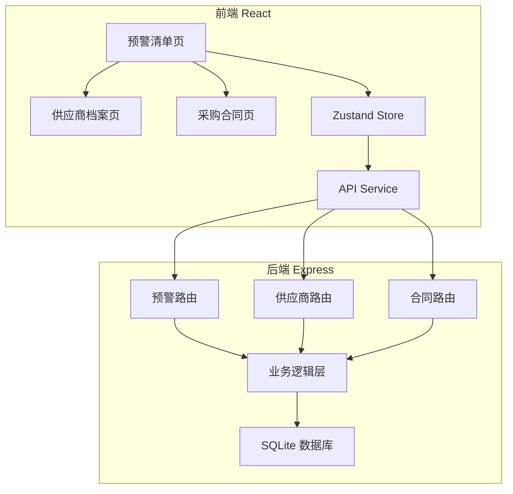
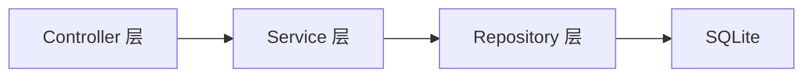
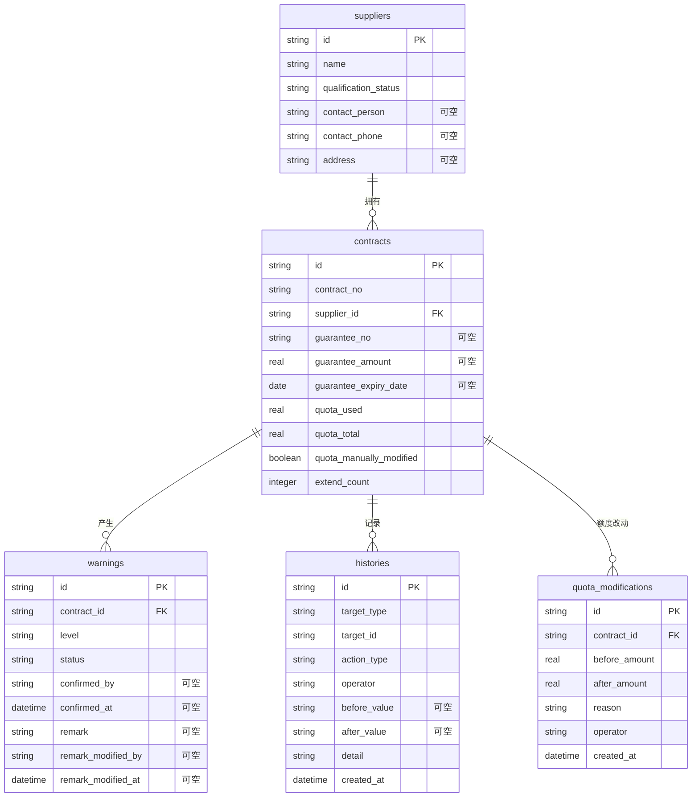

## 1. 架构设计



## 2. 技术说明

- 前端：React@18 + TailwindCSS@3 + Vite + Zustand + React Router
- 初始化工具：vite-init
- 后端：Express@4 + TypeScript (ESM)
- 数据库：SQLite (better-sqlite3)，样例数据内置

## 3. 路由定义

| 路由 | 用途 |
|------|------|
| / | 重定向到 /warnings |
| /warnings | 预警清单页（主页） |
| /suppliers | 供应商档案页 |
| /contracts | 采购合同页 |

## 4. API 定义

### 4.1 预警相关

| 方法 | 路径 | 说明 | 请求体 | 响应 |
|------|------|------|--------|------|
| GET | /api/warnings | 获取预警列表 | query: supplierId, status, daysLeft | Warning[] |
| PATCH | /api/warnings/:id/confirm | 确认预警 | { confirmedBy } | Warning |
| PATCH | /api/warnings/:id/remark | 修改备注 | { remark, modifiedBy } | Warning |
| GET | /api/warnings/export | 导出预警报告 | query: 同筛选参数 | CSV文件 |

### 4.2 供应商相关

| 方法 | 路径 | 说明 | 请求体 | 响应 |
|------|------|------|--------|------|
| GET | /api/suppliers | 获取供应商列表 | query: keyword | Supplier[] |
| GET | /api/suppliers/:id | 获取供应商详情 | - | SupplierDetail |

### 4.3 合同相关

| 方法 | 路径 | 说明 | 请求体 | 响应 |
|------|------|------|--------|------|
| GET | /api/contracts | 获取合同列表 | query: supplierId, status | Contract[] |
| GET | /api/contracts/:id | 获取合同详情 | - | ContractDetail |
| POST | /api/contracts/:id/extend | 合同延期 | { extendDays, reason, operator } | Contract（保函过期时返回403） |
| PATCH | /api/contracts/:id/quota | 修改额度占用 | { newAmount, reason, operator } | Contract + 改动记录 |

### 4.4 操作历史相关

| 方法 | 路径 | 说明 | 请求体 | 响应 |
|------|------|------|--------|------|
| GET | /api/histories | 获取操作历史 | query: targetType, targetId, actionType | History[] |

### 4.5 TypeScript 类型定义

```typescript
interface Supplier {
  id: string;
  name: string;
  qualificationStatus: string;
  contactPerson: string | null;
  contactPhone: string | null;
  address: string | null;
  missingFields: string[];
}

interface Contract {
  id: string;
  contractNo: string;
  supplierId: string;
  supplierName: string;
  guaranteeNo: string | null;
  guaranteeAmount: number | null;
  guaranteeExpiryDate: string | null;
  guaranteeStatus: 'valid' | 'expiring_soon' | 'expired' | 'none';
  quotaUsed: number;
  quotaTotal: number;
  quotaManuallyModified: boolean;
  extendCount: number;
  extendBlocked: boolean;
  createdAt: string;
}

interface Warning {
  id: string;
  contractId: string;
  contractNo: string;
  supplierId: string;
  supplierName: string;
  guaranteeNo: string;
  guaranteeExpiryDate: string;
  daysLeft: number;
  level: 'expired' | 'urgent' | 'warning' | 'normal';
  status: 'pending' | 'confirmed';
  confirmedBy: string | null;
  confirmedAt: string | null;
  remark: string | null;
  remarkModifiedBy: string | null;
  remarkModifiedAt: string | null;
  createdAt: string;
}

interface History {
  id: string;
  targetType: 'warning' | 'contract' | 'supplier';
  targetId: string;
  actionType: 'confirm' | 'remark_modify' | 'extend' | 'extend_blocked' | 'quota_modify';
  operator: string;
  beforeValue: string | null;
  afterValue: string | null;
  detail: string;
  createdAt: string;
}
```

## 5. 服务器架构图



## 6. 数据模型

### 6.1 数据模型定义



### 6.2 数据定义语言

```sql
CREATE TABLE suppliers (
  id TEXT PRIMARY KEY,
  name TEXT NOT NULL,
  qualification_status TEXT NOT NULL DEFAULT 'valid',
  contact_person TEXT,
  contact_phone TEXT,
  address TEXT
);

CREATE TABLE contracts (
  id TEXT PRIMARY KEY,
  contract_no TEXT NOT NULL UNIQUE,
  supplier_id TEXT NOT NULL REFERENCES suppliers(id),
  guarantee_no TEXT,
  guarantee_amount REAL,
  guarantee_expiry_date TEXT,
  quota_used REAL NOT NULL DEFAULT 0,
  quota_total REAL NOT NULL DEFAULT 0,
  quota_manually_modified INTEGER NOT NULL DEFAULT 0,
  extend_count INTEGER NOT NULL DEFAULT 0,
  created_at TEXT NOT NULL DEFAULT (datetime('now'))
);

CREATE TABLE warnings (
  id TEXT PRIMARY KEY,
  contract_id TEXT NOT NULL REFERENCES contracts(id),
  level TEXT NOT NULL CHECK(level IN ('expired','urgent','warning','normal')),
  status TEXT NOT NULL DEFAULT 'pending' CHECK(status IN ('pending','confirmed')),
  confirmed_by TEXT,
  confirmed_at TEXT,
  remark TEXT,
  remark_modified_by TEXT,
  remark_modified_at TEXT,
  created_at TEXT NOT NULL DEFAULT (datetime('now'))
);

CREATE TABLE histories (
  id TEXT PRIMARY KEY,
  target_type TEXT NOT NULL CHECK(target_type IN ('warning','contract','supplier')),
  target_id TEXT NOT NULL,
  action_type TEXT NOT NULL CHECK(action_type IN ('confirm','remark_modify','extend','extend_blocked','quota_modify')),
  operator TEXT NOT NULL,
  before_value TEXT,
  after_value TEXT,
  detail TEXT NOT NULL,
  created_at TEXT NOT NULL DEFAULT (datetime('now'))
);

CREATE TABLE quota_modifications (
  id TEXT PRIMARY KEY,
  contract_id TEXT NOT NULL REFERENCES contracts(id),
  before_amount REAL NOT NULL,
  after_amount REAL NOT NULL,
  reason TEXT NOT NULL,
  operator TEXT NOT NULL,
  created_at TEXT NOT NULL DEFAULT (datetime('now'))
);

CREATE INDEX idx_warnings_contract ON warnings(contract_id);
CREATE INDEX idx_warnings_status ON warnings(status);
CREATE INDEX idx_warnings_level ON warnings(level);
CREATE INDEX idx_contracts_supplier ON contracts(supplier_id);
CREATE INDEX idx_histories_target ON histories(target_type, target_id);
CREATE INDEX idx_quota_mods_contract ON quota_modifications(contract_id);
```
