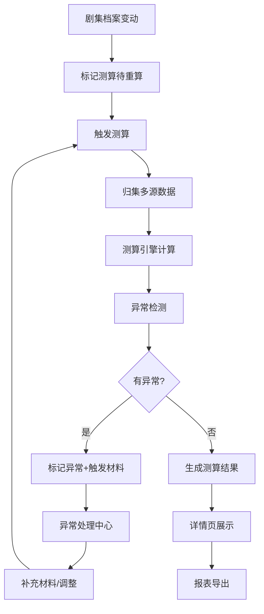

## 1. 产品概述

短剧投流回收测算系统，解决剧集档案变动频繁导致财务重复测算、数据散落难追溯、异常情况难定位的痛点。目标用户为短剧发行财务、运营人员，帮助其高效完成投流回收测算、变动追踪、异常处理和报表导出。

- 核心价值：测算口径一致、变动可追溯、异常可解释、数据不丢失
- 业务价值：减少重复劳动，提高测算准确性，方便交接与复盘

## 2. 核心功能

### 2.1 用户角色

| 角色 | 注册方式 | 核心权限 |
|------|----------|----------|
| 财务人员 | 本地系统使用 | 剧集档案维护、投流测算、异常处理、报表导出 |
| 运营人员 | 本地系统使用 | 查看测算结果、处理异常、补充材料 |

### 2.2 功能模块

1. **测算工作台**：测算列表、快速测算、状态概览
2. **剧集档案**：剧集信息维护、变动历史、影响分析
3. **投流消耗**：消耗数据录入、延迟检测、渠道对账
4. **回收测算详情**：测算明细、关联线索、变动影响链
5. **异常处理中心**：异常列表、异常解释、处理指引
6. **报表导出**：测算报表、异常报表、对账报表

### 2.3 页面详情

| 页面名称 | 模块名称 | 功能描述 |
|----------|----------|----------|
| 测算工作台 | 测算列表 | 展示所有测算记录，支持搜索、筛选、排序 |
| 测算工作台 | 快速测算 | 选择剧集一键触发测算，显示测算进度 |
| 测算工作台 | 状态概览 | 正常/异常/待处理数量统计卡片 |
| 剧集档案 | 档案列表 | 剧集基本信息，支持增删改查 |
| 剧集档案 | 变动历史 | 记录每次修改内容、修改人、修改时间 |
| 剧集档案 | 影响分析 | 显示剧集变动影响了哪些测算结果 |
| 投流消耗 | 消耗录入 | 按渠道按日期录入投放消耗数据 |
| 投流消耗 | 延迟检测 | 自动识别消耗延迟并标记 |
| 回收测算详情 | 测算明细 | 展示成本、消耗、流水、回款、回收明细 |
| 回收测算详情 | 关联线索 | 归集剧集档案、充值流水、渠道回款到同一测算 |
| 回收测算详情 | 变动影响链 | 可视化展示"谁改动了什么，影响了谁" |
| 异常处理中心 | 异常列表 | 消耗延迟、回款拆分、账号串剧等异常 |
| 异常处理中心 | 异常详情 | 触发材料、卡点位置、下一步补什么 |
| 报表导出 | 报表选择 | 选择报表类型、时间范围、剧集范围 |
| 报表导出 | 导出预览 | 预览报表内容后再导出 |

## 3. 核心流程

### 3.1 日常测算流程
用户录入/修改剧集档案 → 系统自动标记相关测算待重算 → 用户触发测算 → 系统归集投流消耗、充值流水、渠道回款 → 生成测算结果 → 检测异常 → 展示结果或标记异常

### 3.2 异常处理流程
系统检测到异常（消耗延迟/回款拆分/账号串剧） → 标记异常并关联触发材料 → 用户查看异常详情 → 系统展示卡点位置和下一步指引 → 用户补充材料或调整 → 重新测算 → 异常解除

### 3.3 报表导出流程
用户选择报表类型和范围 → 系统基于测算引擎生成报表（与日常测算口径一致） → 预览报表内容 → 导出Excel/CSV

## 4. 用户界面设计

### 4.1 设计风格
- **主色调**：深灰蓝 (#1e3a5f) 作为主色，体现专业稳重；琥珀橙 (#f59e0b) 作为异常警示色；翠绿 (#10b981) 作为正常状态色
- **按钮风格**：扁平化设计，轻微圆角 (6px)，悬停时背景色加深，点击有按压反馈
- **字体**：标题使用 "Noto Serif SC" 体现专业质感；正文使用 "Noto Sans SC" 保证可读性
- **布局风格**：左右分栏，左侧导航+右侧内容区；卡片式布局，信息分组清晰
- **图标风格**：线性图标，简洁明了，与文字间距适中

### 4.2 页面设计概述

| 页面名称 | 模块名称 | UI元素 |
|----------|----------|--------|
| 测算工作台 | 状态概览 | 四个统计卡片（正常/异常/待重算/今日测算），卡片带渐变背景和图标 |
| 测算工作台 | 测算列表 | 表格展示，行悬停高亮，状态标签带颜色区分 |
| 测算工作台 | 快速测算 | 下拉选择剧集 + 主按钮，测算进度条动画 |
| 剧集档案 | 档案列表 | 卡片网格布局，每张卡片显示剧集关键信息 |
| 剧集档案 | 变动历史 | 时间轴布局，每个节点显示变动内容和影响范围 |
| 回收测算详情 | 测算明细 | 分组展示，数据卡片带轻微阴影 |
| 回收测算详情 | 变动影响链 | 横向流程图，节点可点击展开详情 |
| 回收测算详情 | 关联线索 | 标签页切换不同数据来源，高亮关联关系 |
| 异常处理中心 | 异常列表 | 列表布局，异常类型图标区分，优先级标记 |
| 异常处理中心 | 异常详情 | 三栏展示：触发材料 → 卡点位置 → 下一步指引 |
| 报表导出 | 导出配置 | 表单项分组，导出按钮带加载状态 |

### 4.3 响应性
- 桌面端优先设计（1280px+）
- 平板端（768px-1280px）：导航收起为侧边抽屉，表格转为可横向滚动
- 移动端（<768px）：卡片堆叠布局，重要信息优先展示

### 4.4 动效设计
- 页面加载：内容区淡入，卡片依次上移出现（staggered animation）
- 测算触发：进度条平滑动画，完成时成功提示滑入
- 异常标记：异常图标轻微脉冲动画吸引注意
- 时间轴：滚动时节点依次点亮
