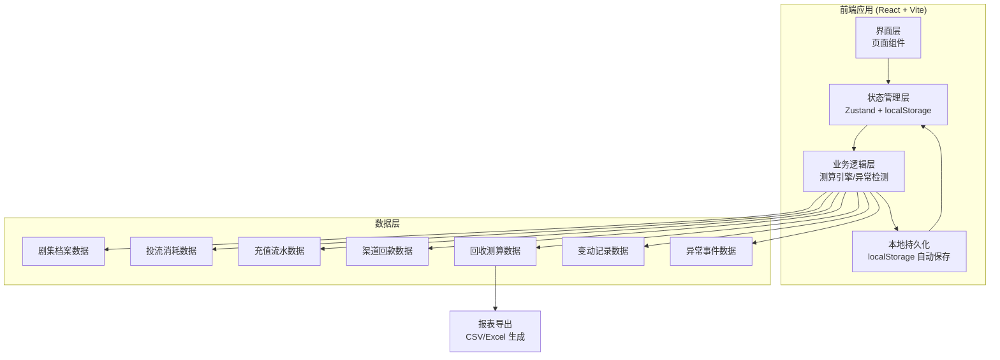
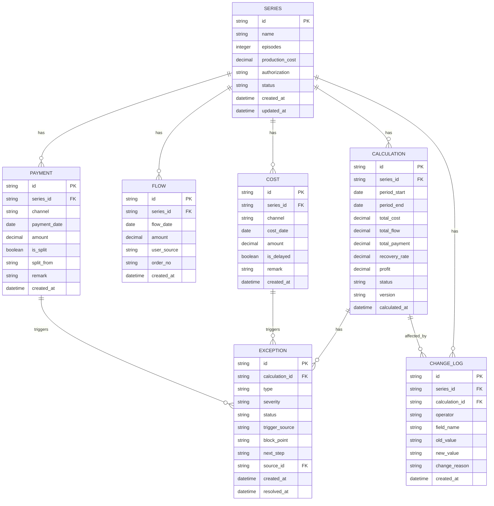

## 1. 架构设计



## 2. 技术描述

- **前端框架**：React@18 + TypeScript
- **构建工具**：Vite@5
- **样式方案**：TailwindCSS@3
- **状态管理**：Zustand（轻量级，支持持久化）
- **路由管理**：React Router@6
- **图标库**：Lucide React（线性图标）
- **日期处理**：date-fns
- **后端**：无后端，纯前端 + localStorage 持久化
- **数据库**：localStorage + IndexedDB（备选，用于大量数据）
- **数据初始化**：内置 mock 数据，首次加载自动初始化

## 3. 路由定义

| 路由 | 页面 | 用途 |
|------|------|------|
| / | 测算工作台 | 测算列表、状态概览、快速测算 |
| /series | 剧集档案 | 剧集列表、新增/编辑剧集、变动历史 |
| /series/:id | 剧集详情 | 单剧集信息、变动历史、影响分析 |
| /cost | 投流消耗 | 消耗数据录入、延迟检测 |
| /calculation/:id | 测算详情 | 测算明细、关联线索、变动影响链 |
| /exceptions | 异常处理中心 | 异常列表、异常详情、处理指引 |
| /export | 报表导出 | 报表配置、预览、导出 |

## 4. 数据模型

### 4.1 数据模型ER图



### 4.2 核心数据结构定义

```typescript
// 剧集档案
interface Series {
  id: string;
  name: string;
  episodes: number;
  productionCost: number;
  authorization: string;
  status: 'active' | 'completed' | 'pending';
  createdAt: Date;
  updatedAt: Date;
}

// 投流消耗
interface Cost {
  id: string;
  seriesId: string;
  channel: string;
  costDate: string;
  amount: number;
  isDelayed: boolean;
  remark: string;
  createdAt: Date;
}

// 充值流水
interface Flow {
  id: string;
  seriesId: string;
  flowDate: string;
  amount: number;
  userSource: string;
  orderNo: string;
  createdAt: Date;
}

// 渠道回款
interface Payment {
  id: string;
  seriesId: string;
  channel: string;
  paymentDate: string;
  amount: number;
  isSplit: boolean;
  splitFrom?: string;
  remark: string;
  createdAt: Date;
}

// 回收测算
interface Calculation {
  id: string;
  seriesId: string;
  periodStart: string;
  periodEnd: string;
  totalCost: number;
  totalFlow: number;
  totalPayment: number;
  recoveryRate: number;
  profit: number;
  status: 'normal' | 'exception' | 'pending' | 'outdated';
  version: number;
  calculatedAt: Date;
  costIds: string[];
  flowIds: string[];
  paymentIds: string[];
}

// 变动记录
interface ChangeLog {
  id: string;
  seriesId: string;
  calculationId?: string;
  operator: string;
  fieldName: string;
  oldValue: string;
  newValue: string;
  changeReason: string;
  affectedCalculations: string[];
  createdAt: Date;
}

// 异常事件
interface Exception {
  id: string;
  calculationId: string;
  type: 'cost_delay' | 'payment_split' | 'account_mismatch' | 'data_missing';
  severity: 'high' | 'medium' | 'low';
  status: 'open' | 'processing' | 'resolved';
  triggerSource: string;
  triggerSourceId: string;
  blockPoint: string;
  nextStep: string;
  remark?: string;
  createdAt: Date;
  resolvedAt?: Date;
}
```

### 4.3 测算引擎逻辑

```typescript
// 测算核心公式
function calculateRecovery(series: Series, costs: Cost[], flows: Flow[], payments: Payment[]) {
  const totalCost = sum(costs.map(c => c.amount)) + series.productionCost;
  const totalFlow = sum(flows.map(f => f.amount));
  const totalPayment = sum(payments.map(p => p.amount));
  
  // 回收率 = 已回款 / 总成本
  const recoveryRate = totalCost > 0 ? totalPayment / totalCost : 0;
  
  // 利润 = 已回款 - 总成本
  const profit = totalPayment - totalCost;
  
  return { totalCost, totalFlow, totalPayment, recoveryRate, profit };
}

// 异常检测规则
function detectExceptions(calc: Calculation, costs: Cost[], payments: Payment[]): Exception[] {
  const exceptions: Exception[] = [];
  
  // 消耗延迟：存在标记为延迟的消耗
  const delayedCosts = costs.filter(c => c.isDelayed);
  delayedCosts.forEach(cost => {
    exceptions.push({
      type: 'cost_delay',
      severity: 'high',
      triggerSource: `投流消耗 ${cost.costDate} ${cost.channel}`,
      triggerSourceId: cost.id,
      blockPoint: '消耗数据未及时到账，影响成本核算准确性',
      nextStep: '请联系渠道确认消耗数据，补录后重新测算'
    });
  });
  
  // 回款拆分：存在拆分标记的回款
  const splitPayments = payments.filter(p => p.isSplit);
  splitPayments.forEach(payment => {
    exceptions.push({
      type: 'payment_split',
      severity: 'medium',
      triggerSource: `渠道回款 ${payment.paymentDate} ${payment.channel}`,
      triggerSourceId: payment.id,
      blockPoint: '该笔回款为拆分回款，需确认对应关系',
      nextStep: '请核对拆分来源，确保回款与剧集对应正确'
    });
  });
  
  return exceptions;
}
```

### 4.4 本地存储设计

```typescript
// 存储键名
const STORAGE_KEYS = {
  SERIES: 'dramacalc_series',
  COST: 'dramacalc_cost',
  FLOW: 'dramacalc_flow',
  PAYMENT: 'dramacalc_payment',
  CALCULATION: 'dramacalc_calculation',
  CHANGE_LOG: 'dramacalc_change_log',
  EXCEPTION: 'dramacalc_exception',
  SETTINGS: 'dramacalc_settings'
};

// 自动保存机制
// - 每次数据变更后 300ms 防抖写入 localStorage
// - 页面加载时自动读取并恢复状态
// - 定期（每5分钟）自动备份到内存快照
```

## 5. 项目结构

```
src/
├── components/          # 通用组件
│   ├── Layout/          # 布局组件
│   ├── StatusBadge/     # 状态标签
│   ├── Timeline/        # 时间轴
│   ├── DataCard/        # 数据卡片
│   └── Table/           # 表格组件
├── pages/               # 页面组件
│   ├── Dashboard/       # 测算工作台
│   ├── Series/          # 剧集档案
│   ├── SeriesDetail/    # 剧集详情
│   ├── Cost/            # 投流消耗
│   ├── CalculationDetail/ # 测算详情
│   ├── Exceptions/      # 异常处理中心
│   └── Export/          # 报表导出
├── store/               # 状态管理
│   ├── useSeriesStore.ts
│   ├── useCalculationStore.ts
│   └── useExceptionStore.ts
├── engine/              # 业务引擎
│   ├── calculation.ts   # 测算引擎
│   ├── exception.ts     # 异常检测
│   └── changeTracker.ts # 变动追踪
├── types/               # 类型定义
│   └── index.ts
├── utils/               # 工具函数
│   ├── storage.ts       # 本地存储
│   ├── format.ts        # 格式化
│   └── export.ts        # 报表导出
├── data/                # Mock数据
│   └── mockData.ts
├── App.tsx
├── main.tsx
└── index.css
```
