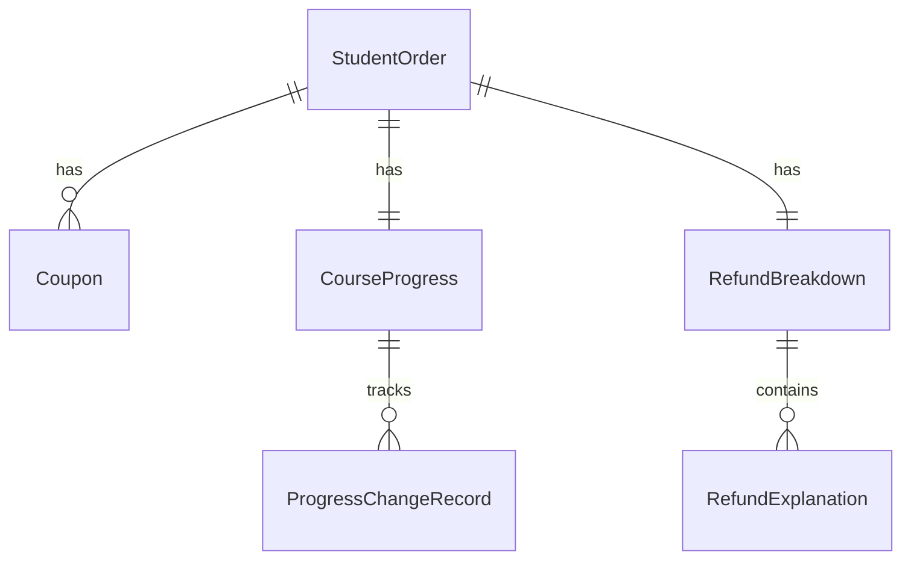

## 1. 架构设计

```mermaid
flowchart TD
    subgraph "前端层"
        "React 18 + TypeScript" --- "Tailwind CSS"
        "React 18 + TypeScript" --- "Zustand 状态管理"
        "React 18 + TypeScript" --- "Recharts 图表"
    end
    subgraph "数据层"
        "Mock 数据服务" --- "学员订单数据"
        "Mock 数据服务" --- "优惠券数据"
        "Mock 数据服务" --- "课程进度数据"
        "Mock 数据服务" --- "退款说明数据"
        "Mock 数据服务" --- "变更历史数据"
    end
    "前端层" --> "数据层"
```

## 2. 技术说明

- 前端：React@18 + TypeScript + Tailwind CSS@3 + Vite
- 初始化工具：vite-init
- 后端：无（纯前端，使用 Mock 数据）
- 状态管理：Zustand
- 图表库：Recharts
- 图标库：lucide-react
- 数据库：无（Mock 数据模拟）

## 3. 路由定义

| 路由 | 用途 |
|------|------|
| / | 退款拆分总览页，含筛选面板、图表、明细列表 |
| /refund/:id | 学员退款详情页，含订单区、优惠券区、退款说明区、变更历史 |
| /refund/:id/export | 退款说明与导出页，含分节说明和导出功能 |

## 4. API 定义

无后端 API，使用前端 Mock 数据服务。

### 数据类型定义

```typescript
interface StudentOrder {
  id: string;
  studentName: string;
  courseName: string;
  orderAmount: number;
  paidAmount: number;
  payMethod: string;
  orderDate: string;
  courseId: string;
}

interface Coupon {
  id: string;
  orderId: string;
  couponName: string;
  couponAmount: number;
  usageCondition: string;
  recoveryStatus: '待追回' | '已追回' | '无需追回';
  recoveryAmount: number;
}

interface CourseProgress {
  id: string;
  orderId: string;
  totalHours: number;
  consumedHours: number;
  remainingHours: number;
  isManuallyModified: boolean;
  lastModifiedDate: string | null;
}

interface ProgressChangeRecord {
  id: string;
  progressId: string;
  changeDate: string;
  previousConsumedHours: number;
  newConsumedHours: number;
  changeReason: string;
  refundImpactAmount: number;
  discountRollbackBefore: number;
  discountRollbackAfter: number;
}

interface RefundBreakdown {
  id: string;
  orderId: string;
  totalRefund: number;
  courseFeeRefund: number;
  materialDeduction: number;
  discountRecovery: number;
  progressAdjustment: number;
  actualRefund: number;
}

interface RefundExplanation {
  id: string;
  refundId: string;
  type: '进度补录' | '优惠追回' | '资料已发';
  title: string;
  description: string;
  amount: number;
  calculationBasis: string;
}

interface RefundRecord {
  id: string;
  studentName: string;
  courseName: string;
  order: StudentOrder;
  coupon: Coupon;
  progress: CourseProgress;
  breakdown: RefundBreakdown;
  explanations: RefundExplanation[];
  changeHistory: ProgressChangeRecord[];
  status: '待处理' | '已计算' | '已导出';
  createDate: string;
}
```

## 5. 服务器架构图

不适用（纯前端项目）

## 6. 数据模型

### 6.1 数据模型定义



### 6.2 Mock 数据结构

Mock 数据包含 10+ 条退款记录，覆盖以下场景：
- 正常退款（无人工修改）
- 课时消耗被人工修改过（有变更历史和优惠回滚影响）
- 使用优惠券的退款（优惠追回金额非零）
- 已发资料扣费的退款（资料扣费非零）
- 进度补录导致的退款调整

每条记录的学员订单、优惠券、退款说明独立存储，不在列表层合并为单行记录。
