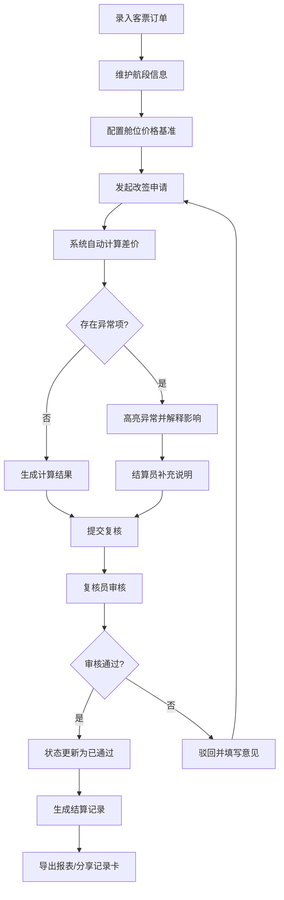

## 1. 产品概述

航司联程改签差价结算系统，专门解决联程客票改签后多航段税费、舱位价差、里程抵扣的统一重算问题。目标用户包括航司收益结算人员、客服复核人员和财务审计人员，实现从数据录入、智能计算、异常解释、状态流转到报表导出的全流程闭环管理。

通过数据版本溯源和异常规则校验，确保日常处理与事后复盘口径一致，消除"截图问财务"的低效协作模式。

## 2. 核心特性

### 2.1 用户角色

| 角色 | 登录方式 | 核心权限 |
|------|----------|----------|
| 结算员 | 本地账号 | 录入客票数据、发起改签计算、提交复核、导出报表 |
| 复核员 | 本地账号 | 审核差价结果、填写异常解释、通过/驳回申请 |
| 管理员 | 本地账号 | 用户管理、基础数据配置、系统参数设置 |

### 2.2 功能模块

1. **数据录入中心**：客票订单管理、航段信息维护、舱位价格基准、里程规则配置
2. **改签差价计算**：多航段联程计算、税费自动重算、舱位升降检测、里程退回计算
3. **复核与审批**：异常项高亮、影响范围解释、复核意见录入、状态流转
4. **数据溯源中心**：版本历史追踪、操作日志审计、数据来源标记、变更对比
5. **报表导出**：差价明细报表、异常汇总报表、月度结算报表、可分享记录卡

### 2.3 页面详情

| 页面名称 | 模块名称 | 功能描述 |
|----------|----------|----------|
| 仪表盘 | 数据概览 | 待办任务统计、近期改签趋势、异常类型分布 |
| 客票列表 | 客票管理 | 客票查询、新增、编辑、删除、批量导入 |
| 航段管理 | 航段维护 | 航班信息维护、舱位价格配置、税费标准管理 |
| 改签计算 | 差价计算 | 选择客票、输入改签信息、实时计算、异常提示 |
| 计算详情 | 结果展示 | 差价明细、航段对比、异常解释、影响分析 |
| 待我复核 | 复核列表 | 待复核任务、批量审核、填写意见 |
| 历史记录 | 数据溯源 | 版本对比、操作日志、数据来源追溯 |
| 报表中心 | 数据导出 | 多维度报表、Excel导出、记录卡生成与分享 |
| 系统设置 | 基础配置 | 用户管理、里程规则、税费配置、异常阈值设置 |

## 3. 核心流程

### 3.1 改签差价处理主流程

### 3.2 异常解释规则

当触发以下情况时，系统必须生成异常解释：
- **舱位升降**：改签后舱位等级发生变化（经济舱→商务舱等）
- **税费跨国**：改签后航段涉及不同国家/地区的税费标准
- **里程退回**：改签产生里程退还或补扣，涉及原抵扣里程的重新计算

每项异常必须说明：影响了哪几条计算结果、金额变化、规则依据。

## 4. 用户界面设计

### 4.1 设计风格

- **主色调**：深海军蓝 `#1e3a5f`，代表专业和可信赖
- **辅助色**：琥珀橙 `#f59e0b`（异常提醒）、森林绿 `#059669`（通过/正常）、珊瑚红 `#dc2626`（错误/驳回）
- **中性色**： slate 色系渐变，确保长时间使用不疲劳
- **字体**：标题使用 **Noto Sans SC Bold**，正文使用 **Noto Sans SC Regular**，数字使用 **JetBrains Mono** 等宽字体
- **布局**：左侧导航 + 右侧内容区的经典企业级布局，卡片式模块组织
- **交互**：表格行悬停高亮、异常项呼吸灯动画、平滑状态过渡
- **图标**：使用 Phosphor Icons 线性图标，保持简洁专业

### 4.2 页面设计概览

| 页面名称 | 模块名称 | UI 元素 |
|----------|----------|---------|
| 仪表盘 | 数据概览 | 统计卡片带趋势箭头、异常类型饼图、待办列表 |
| 客票列表 | 客票管理 | 搜索过滤栏、数据表格、批量操作栏、分页 |
| 改签计算 | 差价计算 | 步骤引导条、航段对比面板、实时计算结果区、异常提示条 |
| 计算详情 | 结果展示 | 金额汇总卡片、航段明细展开表、异常解释折叠面板、操作区 |
| 待我复核 | 复核列表 | 任务卡片、快速审核按钮、意见输入框 |
| 历史记录 | 数据溯源 | 版本时间轴、变更对比视图、操作日志表格 |
| 报表中心 | 数据导出 | 报表类型选择器、日期范围、预览区、导出按钮 |

### 4.3 响应式

桌面优先设计，适配 1280px 及以上宽度。侧边栏可折叠以适配较小屏幕。表格支持水平滚动查看完整数据。

### 4.4 关键交互细节

- **计算过程可视化**：差价计算时显示加载动画和计算步骤，完成后逐行淡入显示结果
- **异常强调**：异常行使用琥珀色背景，鼠标悬停显示影响范围的浮动提示
- **状态流转**：状态变更时带有顺滑的过渡动画和确认弹窗
- **版本对比**：使用左右分栏对比视图，差异处用色块高亮
