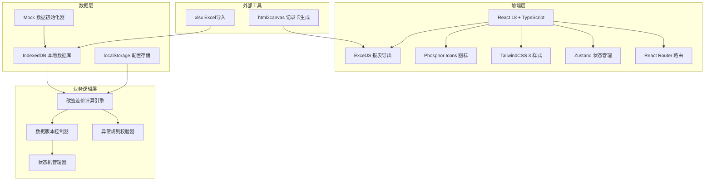
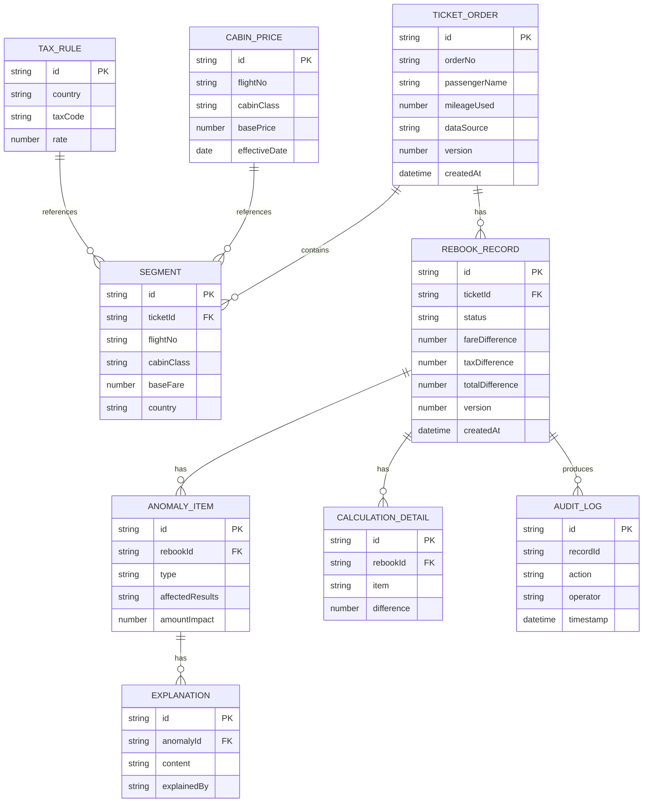
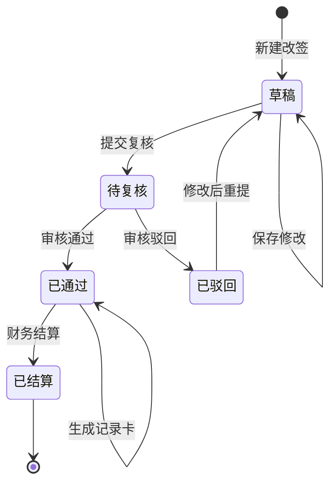

## 1. 架构设计



## 2. 技术描述

- **前端框架**：React@18.2 + TypeScript@5.3
- **构建工具**：Vite@5.0
- **路由管理**：React Router@6.20
- **状态管理**：Zustand@4.4（轻量级，适合本地应用）
- **样式方案**：TailwindCSS@3.4 + PostCSS
- **数据库**：IndexedDB（通过 dexie@3.2 封装）
- **数据导入**：xlsx@0.18
- **报表导出**：ExcelJS@4.4
- **记录卡生成**：html2canvas@1.4
- **图标库**：@phosphor-icons/react@2.1
- **日期处理**：dayjs@1.11

## 3. 路由定义

| 路由 | 页面 | 说明 |
|------|------|------|
| `/` | 仪表盘 | 数据概览和待办任务 |
| `/tickets` | 客票列表 | 客票订单管理 |
| `/segments` | 航段管理 | 航班和舱位价格配置 |
| `/rebook/new` | 改签计算 | 新建改签差价计算 |
| `/rebook/:id` | 计算详情 | 查看计算结果和异常解释 |
| `/review` | 待我复核 | 复核任务列表 |
| `/history` | 历史记录 | 数据溯源和版本对比 |
| `/reports` | 报表中心 | 报表生成和导出 |
| `/settings` | 系统设置 | 基础配置和用户管理 |

## 4. 核心类型定义

```typescript
// 客票订单
interface TicketOrder {
  id: string;
  orderNo: string;
  passengerName: string;
  passengerId: string;
  contactPhone: string;
  originalSegments: Segment[];
  mileageUsed: number;
  totalOriginalAmount: number;
  dataSource: DataSource;
  createdAt: string;
  updatedAt: string;
  version: number;
}

// 航段信息
interface Segment {
  id: string;
  flightNo: string;
  departureAirport: string;
  arrivalAirport: string;
  departureTime: string;
  arrivalTime: string;
  cabinClass: CabinClass;
  cabinCode: string;
  baseFare: number;
  taxes: TaxItem[];
  country: string;
}

// 舱位等级
type CabinClass = 'economy' | 'premium_economy' | 'business' | 'first';

// 税费项
interface TaxItem {
  code: string;
  name: string;
  amount: number;
  country: string;
  rate: number;
}

// 改签记录
interface RebookRecord {
  id: string;
  ticketId: string;
  orderNo: string;
  status: RebookStatus;
  originalSegments: Segment[];
  newSegments: Segment[];
  originalMileageUsed: number;
  newMileageUsed: number;
  mileageRefund: number;
  fareDifference: number;
  taxDifference: number;
  totalDifference: number;
  anomalies: AnomalyItem[];
  explanations: Explanation[];
  calculationDetails: CalculationDetail[];
  createdBy: string;
  reviewedBy?: string;
  reviewComment?: string;
  dataSource: DataSource;
  version: number;
  createdAt: string;
  submittedAt?: string;
  reviewedAt?: string;
}

// 改签状态
type RebookStatus = 'draft' | 'pending' | 'approved' | 'rejected' | 'settled';

// 异常项
interface AnomalyItem {
  id: string;
  type: 'cabin_change' | 'cross_country_tax' | 'mileage_refund';
  severity: 'warning' | 'error';
  segmentIndex?: number;
  description: string;
  affectedResults: string[];
  amountImpact: number;
  ruleBasis: string;
}

// 解释说明
interface Explanation {
  id: string;
  anomalyId: string;
  content: string;
  explainedBy: string;
  createdAt: string;
}

// 计算明细
interface CalculationDetail {
  id: string;
  item: string;
  originalAmount: number;
  newAmount: number;
  difference: number;
  remark: string;
}

// 数据来源
interface DataSource {
  source: string;
  file?: string;
  importedAt: string;
  importedBy: string;
}

// 操作日志
interface AuditLog {
  id: string;
  recordId: string;
  action: string;
  operator: string;
  oldValue?: string;
  newValue?: string;
  timestamp: string;
}
```

## 5. 核心数据模型

### 5.1 ER 图



### 5.2 数据库表设计（IndexedDB）

```typescript
// Dexie 数据库定义
class AppDatabase extends Dexie {
  ticketOrders: Dexie.Table<TicketOrder, string>;
  segments: Dexie.Table<Segment, string>;
  rebookRecords: Dexie.Table<RebookRecord, string>;
  anomalyItems: Dexie.Table<AnomalyItem, string>;
  explanations: Dexie.Table<Explanation, string>;
  calculationDetails: Dexie.Table<CalculationDetail, string>;
  cabinPrices: Dexie.Table<CabinPrice, string>;
  taxRules: Dexie.Table<TaxRule, string>;
  auditLogs: Dexie.Table<AuditLog, string>;
  users: Dexie.Table<User, string>;

  constructor() {
    super('AirlineRebookDB');
    
    this.version(1).stores({
      ticketOrders: 'id, orderNo, passengerName, createdAt',
      segments: 'id, ticketId, flightNo, cabinClass',
      rebookRecords: 'id, ticketId, status, createdAt, submittedAt, reviewedAt',
      anomalyItems: 'id, rebookId, type',
      explanations: 'id, anomalyId',
      calculationDetails: 'id, rebookId',
      cabinPrices: 'id, flightNo, cabinClass, effectiveDate',
      taxRules: 'id, country, taxCode',
      auditLogs: 'id, recordId, action, timestamp',
      users: 'id, username, role'
    });
  }
}
```

## 6. 核心算法设计

### 6.1 差价计算引擎

```typescript
// 改签差价计算核心函数
function calculateRebookDifference(
  originalSegments: Segment[],
  newSegments: Segment[],
  originalMileage: number,
  mileageRate: number
): CalculationResult {
  // 1. 计算舱位差价
  const fareDiff = calculateFareDifference(originalSegments, newSegments);
  
  // 2. 计算税费差价
  const taxDiff = calculateTaxDifference(originalSegments, newSegments);
  
  // 3. 计算里程退还/补扣
  const mileageResult = calculateMileageAdjustment(
    originalMileage,
    newSegments,
    mileageRate
  );
  
  // 4. 检测异常项
  const anomalies = detectAnomalies(originalSegments, newSegments, mileageResult);
  
  // 5. 生成计算明细
  const details = generateCalculationDetails(
    fareDiff,
    taxDiff,
    mileageResult
  );
  
  return {
    fareDifference: fareDiff,
    taxDifference: taxDiff,
    mileageRefund: mileageResult.refund,
    totalDifference: fareDiff + taxDiff + mileageResult.refund,
    anomalies,
    details
  };
}

// 异常检测逻辑
function detectAnomalies(
  original: Segment[],
  newSegments: Segment[],
  mileage: MileageResult
): AnomalyItem[] {
  const anomalies: AnomalyItem[] = [];
  
  // 检测舱位升降
  original.forEach((seg, idx) => {
    const newSeg = newSegments[idx];
    if (newSeg && seg.cabinClass !== newSeg.cabinClass) {
      anomalies.push({
        type: 'cabin_change',
        severity: 'warning',
        segmentIndex: idx,
        description: `第${idx + 1}航段舱位变更: ${getCabinName(seg.cabinClass)} → ${getCabinName(newSeg.cabinClass)}`,
        affectedResults: ['舱位差价', '税费计算'],
        amountImpact: newSeg.baseFare - seg.baseFare,
        ruleBasis: '航司舱位变更差价规则第3.2条'
      });
    }
  });
  
  // 检测税费跨国
  original.forEach((seg, idx) => {
    const newSeg = newSegments[idx];
    if (newSeg && seg.country !== newSeg.country) {
      anomalies.push({
        type: 'cross_country_tax',
        severity: 'warning',
        segmentIndex: idx,
        description: `第${idx + 1}航段国家变更: ${seg.country} → ${newSeg.country}`,
        affectedResults: ['税费计算', '税项明细'],
        amountImpact: sumTaxes(newSeg.taxes) - sumTaxes(seg.taxes),
        ruleBasis: '跨国税费重算规则第5.1条'
      });
    }
  });
  
  // 检测里程退回
  if (Math.abs(mileage.refund) > 0) {
    anomalies.push({
      type: 'mileage_refund',
      severity: mileage.refund > 0 ? 'warning' : 'error',
      description: `里程${mileage.refund > 0 ? '退还' : '补扣'}: ${Math.abs(mileage.refund)} 里程`,
      affectedResults: ['总差价', '里程账户'],
      amountImpact: mileage.refund,
      ruleBasis: '里程改签规则第7.3条'
    });
  }
  
  return anomalies;
}
```

## 7. 状态流转设计



## 8. Mock 数据初始化

系统首次启动时自动初始化以下测试数据：
- 3 个用户账号（结算员、复核员、管理员）
- 10 张客票订单，包含联程航段
- 20 条航段信息（经济舱、商务舱混合）
- 5 条改签记录（覆盖各种状态）
- 完整的舱位价格基准表
- 常见国家税费规则表
- 10 条操作日志示例
